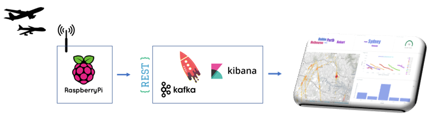
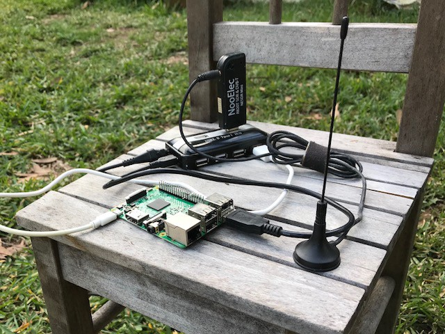
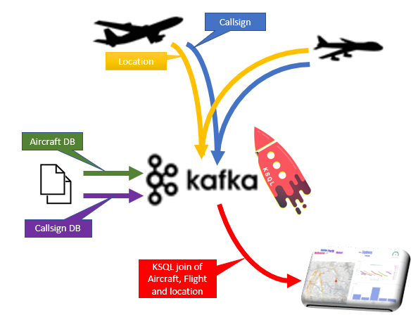
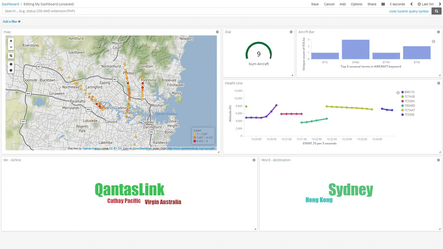
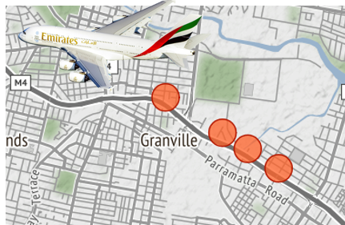

# Using KSQL, Apache Kafka, a Raspberry Pi and a software defined radio to find the plane that wakes Snowy the cat

Using open-source streaming solutions to map the correlation between aircraft traffic and cat behaviour

Aircraft determine their position using GPS; and periodically transmit that position along with identity string, altitude, speed etc as ADS-B signals.

Cats behave erratically, but generally display their displeasure by jumping on your face. The post describes how we can use open source streaming solutions (Apache Kafka), KSQL (streaming SQL engine) and a Raspberry Pi to process aircraft movements in real-time to determine which plane is upsetting my cat.

## Overview

*Planes to graphs using Kafka & KSQL*

I built a receiver to listen to aircraft transponder messages (ADS-B signals) as the planes fly overhead. These aircraft transmissions are not coordinated — the messages appear as a jumble of interwoven transmissions. Specifically I wanted to capture the *location* and *callsign* transmissions.

But unravelling these mixed streams is complex — it’s like trying to understand a conversation when everyone’s talking at the same time at a party. I decided to use a combination of Kafka and KSQL to find the plane that freaks out my cat.

## ADS-B capture using a Raspberry Pi

To capture the aircraft transmissions I used a Raspberry Pi and a RTL2832U — a USB dongle originally sold to watch digital TV on a computer. On the Pi I installed [*Dump1090 ](http://www.rtl-sdr.com/adsb-aircraft-radar-with-rtl-sdr/)*— a program which accesses ADS-B data via the RTL2832U and a small antennae

*Raspberry Pi and a RTL2832U as a software defined radio (SDR)*

## ADS-B signals to Kafka Topics

Now I’ve got a stream of raw ADS-B signals we need to have a look at the traffic. Kafka is a pretty awesome stream processing platform. I started by [separating](https://github.com/saubury/plane-kafka/blob/master/raspberry-pi/plane-kafka.py) the incoming ADS-B signals into two kafka topics, location-topic (aircraft code with height and location) and callsign-topic (aircraft code and callsign).

I wanted to understand what the planes were and what routes they were flying. Luckily I found a [database](https://openflights.org/data.html) of airframes (eg, ICAO code ‘7C6DB8’ is a Boeing 737). This [mapping ](https://github.com/saubury/plane-kafka/blob/master/scripts/02_do_load)I loaded into the *icao-to-aircraft* topic.

[KSQL ](https://www.confluent.io/product/ksql/)provides a “SQL engine” that enables real-time data processing against Apache Kafka topics. That means we can query our aircraft topic like this

    create stream icao_to_aircraft_stream 
      with (KAFKA_TOPIC='icao-to-aircraft', VALUE_FORMAT='AVRO');

    select manufacturer, aircraft, registration 
    from icao_to_aircraft_stream 
    where icao = '7C6DB8';

    Boeing | B738 | VH-VYI

Similarly, into the *callsign-details* topic I loaded callsign details (eg, ‘QFA563’ is a Qantas flight from Brisbane to Sydney).

    create stream callsign_details_stream 
      with (KAFKA_TOPIC='callsign-details', VALUE_FORMAT='AVRO');

    select operatorname, fromairport, toairport 
    from callsign_details_stream 
    where callsign = 'QFA563';

    Qantas | Brisbane | Sydney

Let’s have a peek at the “location-topic” stream. You can see a steady stream of incoming messages reporting location updates from passing aircraft.

    kafka-avro-console-consumer --bootstrap-server localhost:9092 --property --topic location-topic

    {"ico":"7C6DB8","height":"6250","location":"-33.807724,151.091495"}

The equivalent KSQL syntax is

    select timestamptostring(rowtime, 'yyyy-MM-dd HH:mm:ss')
    , ico
    , height
    , location 
    from location_stream 
    where ico = '7C6DB8';

    2018-05-19 07:13:33 | 7C6DB8 | 6250.0 | -33.807724,151.091495

## KSQL — Crossing the streams …

The real power of KSQL comes from combining the incoming stream of location data against the static details topics (see [03_ksql.sq)](https://github.com/saubury/plane-kafka/blob/master/scripts/03_ksql.sql). That is, adding useful details to the raw data stream. This is very similar to a “left join” in database language. In fact, the syntax for KSQL is indeed a left join…

    create stream location_and_details_stream as 
    select l.ico
    , l.height
    , l.location
    , t.aircraft
    from location_stream l 
    left join icao_to_aircraft t on l.ico = t.icao;

And a KSQL query the stream like this

    select timestamptostring(rowtime, 'yy-MM-dd HH:mm:ss') 
    , manufacturer 
    , aircraft 
    , registration 
    , height 
    , location 
    from location_and_details_stream;

    18-05-27 09:53:28 | Boeing | B738 | VH-YIA | 7225 | -33.821,151.052
    18-05-27 09:53:31 | Boeing | B738 | VH-YIA | 7375 | -33.819,151.049
    18-05-27 09:53:32 | Boeing | B738 | VH-YIA | 7425 | -33.818,151.048

Equally, we can combine the incoming callsign identity stream against the static callsign_details topic

    create stream ident_callsign_stream as 
    select i.ico
    , c.operatorname
    , c.callsign
    , c.fromairport
    , c.toairport 
    from ident_stream i 
    left join callsign_details c on i.indentification = c.callsign;

    select timestamptostring(rowtime, 'yy-MM-dd HH:mm:ss') \
    , operatorname \
    , callsign \
    , fromairport \
    , toairport \
    from ident_callsign_stream ;

    18-05-27 13:33:19 | Qantas          | QFA926 | Sydney  | Cairns
    18-05-27 13:44:11 | China Eastern   | CES777 | Kunming | Sydney
    18-05-27 14:00:54 | Air New Zealand | ANZ110 | Sydney | Auckland

Now we have a constantly updating topic with flight details — we can make some pretty dashboards. I used [Kafka Connect](https://www.confluent.io/product/connectors/) to pump Kafka topics into [Elastic Kibana](https://www.elastic.co/products/kibana) ([full scripts](https://github.com/saubury/plane-kafka/tree/master/scripts)).

## Kibana Dashboard

Here’s a sample of dashboards displaying aircraft location on a map. In addition a bar-chart of manufactures, an altitude line plot and a destination word-cloud.

*Kibana Display*

## Findings & Conclusion

As best as I can remember, today my cat woke me at a little past 6am. I can use KSQL to find a low flying aircraft (below 3500ft) around this time …

    select timestamptostring(rowtime, 'yyyy-MM-dd HH:mm:ss')
    , manufacturer 
    , aircraft 
    , registration 
    , height 
    from location_and_details_stream 
    where height < 3500
    and rowtime > stringtotimestamp('18-05-27 06:10', 'yy-MM-dd HH:mm') and rowtime < stringtotimestamp('18-05-27 06:20', 'yy-MM-dd HH:mm');

    2018-05-27 06:15:39 | Airbus | A388 | A6-EOD | 2100.0
    2018-05-27 06:15:58 | Airbus | A388 | A6-EOD | 3050.0

Terrific, I can locate a craft over my house at 6:15 am. It’s a A380 (which is a huge plane) on a flight to Dubai that’s waking my cat. I can confirm this by reviewing the same time period in Kibana which shows a flight path directly over my house.

*Kibana map between 6:10 and 6:20*

## Ready to try it?

Got a similar pet problem; or just curious how Kafka and KSQL work together? You can find a combined docker setup, helper images, KSQL and Elastic setup at:-

[https://github.com/saubury/plane-kafka](https://github.com/saubury/plane-kafka)
