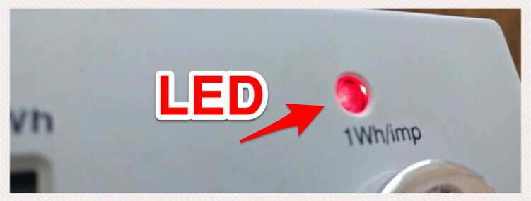
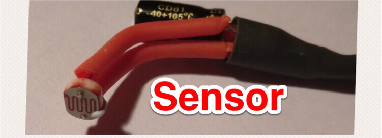
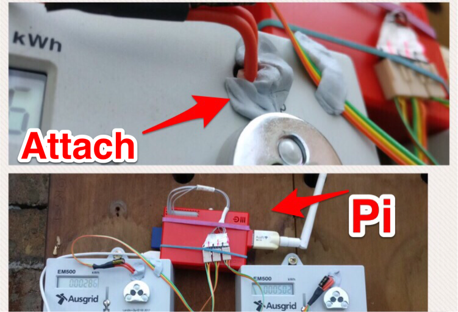

# Home Power Monitoring using a Raspberry Pi.

Home electricity usage monitoring using a Raspberry Pi. Plus some shaky maths to find out when we left the heater on.

As we approached the colder months I wanted a way of monitoring our household power consumption. Our electric heaters are fairly ancient, and I had no accurate way of monitoring their cost (either financially or environmentally).

We don’t have a “smart” power meter, and our wall heaters are certainly not clever either. However our power meter has a tiny red light-emitting diode (LED) that blinks each time we consume 1Wh of power.

*Our power meter has a light — that blinks!*

The LED pulse corresponds to a defined amount of energy passing through the meter. That is, each pulse equals one 1Wh of usage, and 1000 pulses means 1 kWh of power has been used. I *could *sit outside and count the pulses … or work out a way to automatically process the rate LED flashes.

For the very modest price of 50 cents I purchased a couple of Light Dependent Resistors (LDR’s). A LDR is a type of resistor whose resistance varies according to light. Resistance will increase with an increase in light intensity (and the reverse is true too). So, a bit of Google magic leads me to this this helpful site [Interfacing Light Dependent Resistor LDR in Raspberry Pi](https://iotguider.in/raspberrypi/interfacing-light-dependent-resistor-ldr-in-raspberry-pi/).

*Light Dependent Resistors and 1uF Capacitor*

By constructing two of these circuits allowed me to monitor both LED’s on the power-board. The Raspberry Pi is a tiny computer that is perfect for the tedious task of methodically capturing “blinks” and writing the hourly total to a data store (or streaming to an MQTT broker).

A powerful feature of the Raspberry Pi is the row of GPIO (general-purpose input/output) pins along the top edge of the board. This is an interface between the physical world of lights and wires and the software world of zero’s and one’s

*LDR attached to a Raspberry Pi*

Hardware — done! Let’s move onto the software.

### Let them eat code

TL;DR — Python is awesome for event driven coding — allowing code to respond to electrical pulses on the GPIO pins on the Raspberry Pi. A function is written to handle the a light pulse (ie., increase a counter) and this function is attached to an event handler for the appropriate GPIO pin. A quick code segment below ([full repository](https://github.com/saubury/power-pi))

<iframe src="https://medium.com/media/03bc19071e7c37f936e72a65b89030db" frameborder=0></iframe>

### The Pretty Graphs

Running this code for 3 months allowed me to start understanding the rate of power usage each hour. The graph below is daily power consumption trends using a month of data. The horizontal axis is 24 hours, with midnight on the left to 11pm on the right. Minimum consumption is shown in blue, average consumption in orange and maximum consumption in white.

 correlated to accidentally leaving the heater on

* The consistently low consumption (blue line on the 11th) correlated to a mini holiday

### Next steps

Analysing power consumption got me thinking about behaviour trends and providing more immediate feedback to the household.

My next project will take this data in real-time a provide some actionable feedback … like tell me when we do something silly or forgetful. Perhaps a nice alarm when we leave the heater on accidentally!

Interested in doing something similar — this project hosted at [https://github.com/saubury/power-pi](https://github.com/saubury/power-pi)
