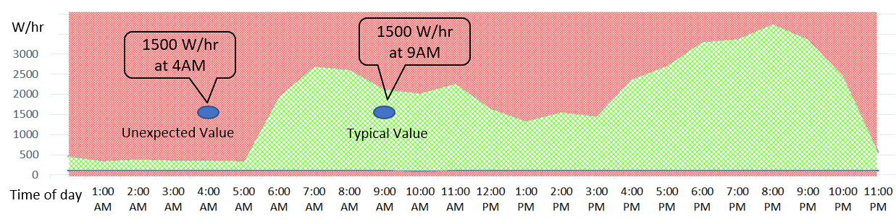
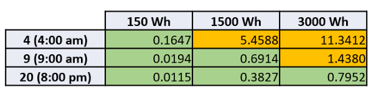

# Machine learning & Kafka KSQL stream processing — bug me when I’ve left the heater on

Continuous household power monitoring with a trained model to alert on unexpected power usage for time of day. Let my Google Home and Phone notify me when I’ve used more electricity than expected.

## What on earth is this?

Household power consumption fluctuates throughout the day. However, the *pattern *of electricity use follows a typical curve and becomes predictable after sufficient observations. Would it surprise you that very little power is used at night when everyone is asleep? Probably not — but a sudden sudden surge of power used 4 am this is worth checking via an alert on my phone

Ready for the buzz words? Data capture via a Raspberry Pi streamed via Apache Kafka. Real-time processing using KSQL streaming engine enriched with a trained model. Unexpected time of day power usage events get sent via mobile notifications to my phone along with a spoken message via our home speaker.

Inspiration for this project comes from [Kai Waehner](https://github.com/kaiwaehner) and his project [Deep Learning UDF for KSQL](https://github.com/kaiwaehner/ksql-udf-deep-learning-mqtt-iot). The notification system was inspired by [Robin Moffatt](https://www.confluent.io/blog/author/robin/) and his blog on [Event-Driven Alerting with Slack](https://www.confluent.io/blog/real-time-syslog-processing-with-apache-kafka-and-ksql-part-2-event-driven-alerting-with-slack/).

The [entire project](https://github.com/saubury/stream-smarts) is easy to run and simply requires docker to demonstrate locally.

### I’m bored — can I get a video?

Sure

<iframe width="560" height="315" src="https://www.youtube.com/embed/t_nRYcTE8r8" frameborder="0" allowfullscreen></iframe>

## Training and Data Capture

With 3 months of data from my experiment of [Home Power Monitoring using a Raspberry Pi](https://medium.com/@simon.aubury/home-power-monitoring-65d0fded7769) I had a stack of data to determine what our household power consumption looked like throughout the average day.

Power consumption is measured in “W/hr — Watt hours”. The power consumption range for a 24 hour period in August is shown below. The area shaded in green shows the range from the minimum value for that hour to the highest consumption. In short, values in the green area are normal, and the red area is unexpected.

*Expected range (green) of power consumption by time of day for the month of August*

Using [H2O.ai](https://www.h2o.ai/) (the open source machine learning package) and a very helpful [getting started guide](https://www.kaggle.com/sudalairajkumar/getting-started-with-h2o) I was able to produce a function that returns an *anomaly score* based on day, hour and power usage. That is, passed a day of month, hour-of-day and power-usage reading the function returns an anomaly score
> *AnomalyScore = *AnomalyFunction (day, hour, power-usage)

Consuming 1500 W/hr at 9 am is pretty normal, however 1500 W/hr power draw at 4 am is a cause for alarm as that’s 500% more than expected. In short, an* anomaly score* above 1.0 signifies power usage beyond what has previously been historically measured at that time and day.

 0 are unusual*

## User Defined Function — and KSQL

[KSQL ](https://www.confluent.io/product/ksql/)is an open source, streaming SQL engine that enables real-time data processing against Apache Kafka. KSQL supports [creating User Defined Scalar Functions](https://docs.confluent.io/current/ksql/docs/udf.html) (UDFs) via custom jars that are uploaded to the ext/ directory of the KSQL installation. That is, my compiled anomaly score function can be exposed to the KSQL server — and executed against the Kafka stream

TL;DR summary — compile some Java and place in the right directory, start ksql server and verify the function is there …

    ksql> list functions;

     Function Name           | Type
    -------------------------------------
      . . .
     ANOMOLY_POWER           | SCALAR   <--- I need this one
     ANOMOLY_WATER           | SCALAR

Firstly a stream (“raw_power_stream”) is created to expose the real-time power-consumption from the kafka topic with real-time power consumption.

The scripts below show the steps to create the final “anomaly_power” kafka topic which will be a stream of events where the anomaly function (“anomaly_power”) has found a significantly unusual value. That is, the “anomaly_power” topic should be silent unless an unusual event has occurred

    create stream raw_power_stream with (kafka_topic='raw_power', value_format='avro');
    
    create stream  power_stream_rekeyed as \
    select rowtime, hour, kwh, anomoly_power(hour, kwh) as fn \
    from raw_power_stream partition by rowtime;
    
    create stream anomoly_power with (value_format='JSON') as \
    select rowtime as event_ts, hour, kwh, fn \
    from power_stream_rekeyed where fn>1.0;

## Ringing the Alarm

The continuous real-time stream processing is fairly useless unless we have a way of raising an alarm when something odd has happened. I wanted notifications to appear on both my mobile phone and be announced over our Google Home smart speaker. Why get bothered only once when I can get annoyed twice?

### Mobile Device notification via Pushbullet

[Pushbullet](https://www.pushbullet.com/) is an awesome service bridge that provide a simple [API](https://docs.pushbullet.com/) for sending push-notifications to iOS and Android devices.

*An iOS push-notification via push-bullet*

A bit of [python](https://github.com/saubury/stream-smarts/blob/master/scripts/python/kafka_notifier.py) code consumes the ANOMOLY_POWER topic and calls pushbullet. A consumer is established, and an event handler calls the notification service on receipt of a new Kafka events. Each message generates a new push notification.

<iframe src="https://medium.com/media/9d7cf85823e78bb6fbec9cabcd5efc6b" frameborder=0></iframe>

### Google Home Text-to-Speech (TTS) via Home Assistant

I run the [Hass.io Home Assistant](https://www.home-assistant.io/hassio/) software locally to control home automation tasks. One nice feature is a simple [API](https://www.home-assistant.io/components/tts/) to send text messages as spoken voice commands directly to out Google Home smart speaker. That is, construct a string — and it gets spoken (quite loudly) via the Google Home.

<iframe src="https://medium.com/media/cf2ba269ab75f3326411c28dda2d8390" frameborder=0></iframe>

## What did I learn?

The first legitimate alarm I received was when I was on holiday. The notification at 9am on a Saturday morning was an notification signifying the household was using substantially *less* power than was expected. This was indeed true — maybe I need more holidays to train the model correctly!

## Ready To Try

The [entire project](https://github.com/saubury/stream-smarts) simply requires docker to run locally.

### Credits & References

* Inspiration for this project comes from [Kai Waehner](https://github.com/kaiwaehner) and his project [Deep Learning UDF for KSQL](https://github.com/kaiwaehner/ksql-udf-deep-learning-mqtt-iot).

* The notification system was inspired by [Robin Moffatt](https://www.confluent.io/blog/author/robin/) and his blog on [Event-Driven Alerting with Slack](https://www.confluent.io/blog/real-time-syslog-processing-with-apache-kafka-and-ksql-part-2-event-driven-alerting-with-slack/).

* [Pushbullet](https://www.pushbullet.com/) and their helpful [API](https://docs.pushbullet.com/)

* The [Hass.io Home Assistant](https://www.home-assistant.io/hassio/) software

* [H2O.ai](https://www.h2o.ai/) and a very helpful [getting started guide](https://www.kaggle.com/sudalairajkumar/getting-started-with-h2o)

* [Home Power Monitoring using a Raspberry Pi](https://medium.com/@simon.aubury/home-power-monitoring-65d0fded7769)
