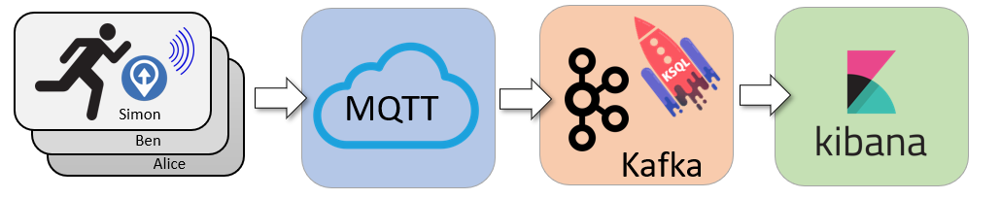
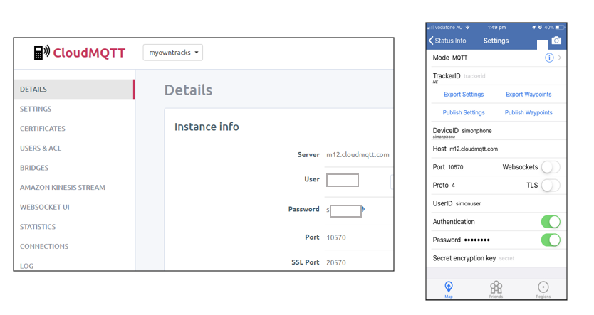
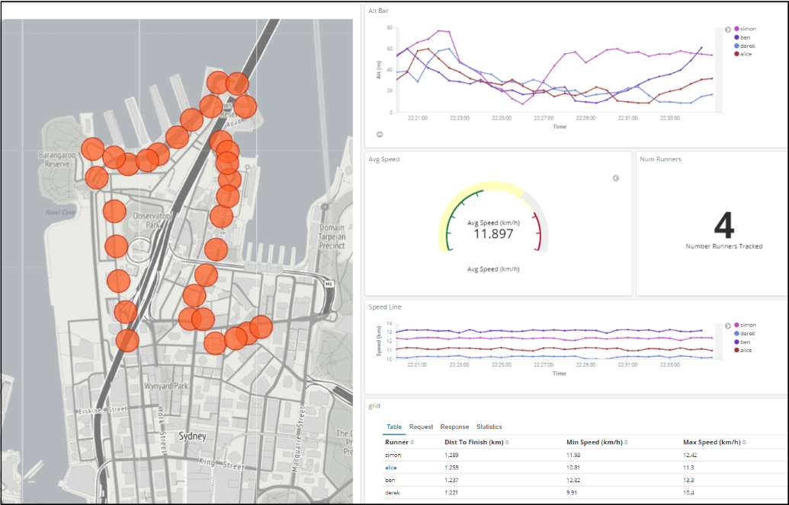

# Did I beat Ben? Race tracking with Kafka KSQL, MQTT & Kibana

Live race tracking with MQTT and Kafka streaming. Race statistics using KSQL and visualisations with Kibana. Can I run a half marathon faster than Ben?

## Design Overview

Runners are tracked with GPS based apps installed on their phones. Location updates are sent (via MQTT) to a central server. Kafka acts as a streaming platform with KSQL performing the live race computations (speed, rank, distance to finish line). The web-based mapping dashboard is generated using Kibana.

## OwnTracks open-source phone app

Each runner has [OwnTracks ](https://owntracks.org/)on their phone. OwnTracks is an open-source app ([iOS](https://itunes.apple.com/au/app/owntracks/id692424691?mt=8) and [Android](https://play.google.com/store/apps/details?id=org.owntracks.android&hl=en)) for communicating phone location to an MQTT server. Phone location is a great proxy for runner location!

So why MQTT and not directly into Kafka? Well, MQTT is lightweight TCP/IP messaging protocol perfect for power constrained devices. It allows for short efficient messages to be constantly sent from the runners phone to a central server. It’s closer to a notice board than a queue, and allows for lightweight messages like “I’ve just moved to location x,y”.

*CloudMQTT and OwnTracks app setup*

I chose [CloudMQTT](https://www.cloudmqtt.com/) to act as a hosted MQTT server, and the free-tier was super easy to configure. Each device has a unique login (eg., *simonuser*) and device ID (eg., *simonphone*). This allowed each runner to be individually tracked with a shared server.

## MQTT to Kafka with Kafka Connect

[Kafka and MQTT are two complementary technologies](https://dzone.com/articles/apache-kafka-mqtt-end-to-end-iot-integration-githu). MQTT acts more like a key/value store, whereas Kafka is a complete streaming platform. I used the [Kafka Connect MQTT Connector](https://docs.confluent.io/current/connect/kafka-connect-mqtt/index.html) to poll MQTT updates and bring the location updates down to a Kafka cluster.

<iframe src="https://medium.com/media/fac9f9a7f1b429f4fa7a7f1f0d185ef3" frameborder=0></iframe>

To check this is actually collection location data into the “*data_mqtt*” topic I can query like this

<iframe src="https://medium.com/media/afd25249609041a32c0e3e57de4a1b5d" frameborder=0></iframe>

Looks like a valid stream of location updates. Now let’s process it to see who is winning.

## Kafka Streaming Transformation with KSQL

I wanted to know where each runner was — along with their average speed and distance to the finish line. [KSQL](https://www.confluent.io/product/ksql/) allowed me to determine each runners speed (over a 5 minute window) and distance to finish line.

By concatenating the latitude and longitude fields together I could also form a “*geo_point*” data type suitable for mapping in Kibana.

<iframe src="https://medium.com/media/d767552744af01dc73fcc3d329b07740" frameborder=0></iframe>

## Kafka To Elastic & Kibana

Now I have 2 derived topics

* *runner-location* — a stream of runner’s and their location

* *runner-status* — a table of runner’s speed and remaining distance

I can write these topics into Kibana using the Elastic [Kafka Connect Sink](https://docs.confluent.io/current/connect/kafka-connect-elasticsearch/index.html) Connector.

<iframe src="https://medium.com/media/5f6b830ac6dde42a310bc3744ed48dd8" frameborder=0></iframe>

## Kibana Visualisations

*A picture tells 10³ words*

A Kibana dashboard is a great way to display a real-time display of

* Runner location platted on a map

* Speed graph per runner

* Altitude plot per runner

* A league table — who is closest to the finish line!

A nice trick for Kibana mapping when you want to zoom further to street-level data is to use Open Street Map as a [third party map and tile services](https://www.objectrocket.com/blog/how-to/elasticsearch-tile-service/). Allows for much richer maps when zoomed in.

## Did I beat Ben?

No. [Ben ](https://www.linkedin.com/in/benjamin-widdup-a8a2175/)beat me by a sizeable margin. Perhaps I should spend more time training than coding?

*Me (left) who lost to Ben (right)*

## Want To Try It?

Want to build your own race mapper for displaying participant progress and location? You can build an entire Kafka, KSQL, Kibana dashboard with demonstration run data by cloning

* [https://github.com/saubury/race-mapper/](https://github.com/saubury/race-mapper/)

* [***KSQL — my course on Udemy](https://www.udemy.com/kafka-ksql/?couponCode=MEDIUM). ***(unashamed plug!)

## Credits & References

* [https://owntracks.org/](https://owntracks.org/)

* [https://www.cloudmqtt.com/](https://www.cloudmqtt.com/)

* [https://dzone.com/articles/apache-kafka-mqtt-end-to-end-iot-integration-githu](https://dzone.com/articles/apache-kafka-mqtt-end-to-end-iot-integration-githu) — by [Kai Wähner](https://dzone.com/users/758579/megachucky.html)

* And of course — thanks [Ben](https://www.linkedin.com/in/benjamin-widdup-a8a2175/)!
