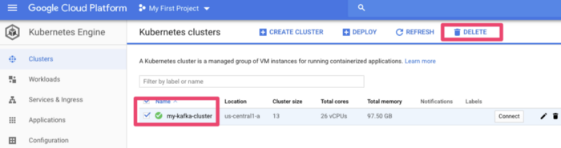

# Confluent Kafka Kubernetes Operator — Setup and Playing!

Confluent released their Kafka Kubernetes Operator this week (as part of their CP 5.3 release). The TL;DR summary is this gives you a straight forward way to deploy your own clustered & secured Apache Kafka on Kubernetes (ZooKeeper, Apache Kafka) along with the cool bits (Kafka Connect, KSQL, Schema Registry, REST Proxy, Control Center).

This is pretty cool as it opens the way for Kafka deployments to on premises (eg., OpenShift or Rancher) and eases the way for clouds deploys (EKS, AKS, GKE). It also automates security configuration setup (setting up kerberos authentication in Kafka is a job for the *patient*!).

So, let’s see how to see this up.

## Machine Setup

I recently got a new Mac — so this was a good opportunity to document the steps necessary to start from a clean machine. This demonstration uses the Google (GCP) Kubernetes Engine

## Kubernetes Helm CLI

First — let’s install the kubernetes command line tools (assuming [*brew](https://brew.sh/)* is already installed)

    brew install kubernetes-helmbrew 

    install kubernetes-cli

## Google Cloud SDK

I’ll be using the Google (GCP) Kubernetes Engine. You’ll need to install the *google-cloud-sdk* . Google has great [quick-start](https://cloud.google.com/sdk/docs/quickstarts) instructions . In short, download, extract and add to your PATH

## Confluent Kubernetes Operator Helm bundle

Next, we actually need to download the Confluent Helm bundle. This Confluent bundle comprises Helm charts, templates, and scripts used to deploy Confluent Operator and Confluent Platform components for your Kubernetes cluster. Remember this is an Enterprise feature (ie., paid for if used in production).

Download and extract the bundle from Confluent Platform Operations from [https://docs.confluent.io/current/installation/operator/co-deployment.html](https://docs.confluent.io/current/installation/operator/co-deployment.html)

    tar xvfz confluent-operator-20190726-v0.65.0.tar.gz

    cd confluent-operator-20190726-v0.65.0/helm

## GCP Kubernetes Engine Provision

### Adding a Kubernetes clusters

Navigating to GCP Kubernetes Engine ; click “create cluster”

*Adding a Kubernetes clusters*

### Add a node pool

For the new cluster; add a lot of capacity. I found 16 nodes of 2 vCPU’s was enough to get going

*Add a node pool*

## Adding resource quota

Initially I hit a problem where I could not provision enough resource due to a quota on CPUs.

*Be sure to increase the CPU quota*

If this happens to you navigate to IAM Admin Quotas ([https://console.cloud.google.com/iam-admin/quotas](https://console.cloud.google.com/iam-admin/quotas)) and increase to something like 32 for the Compute Engine API CPUs maximum

*Update quota*

## Setup GCP Client

Now you’ll need to initialises and authenticate your setup

    gcloud init

    gcloud auth list

    gcloud config set compute/region us-central1

    gcloud config set compute/zone us-central1-a

    gcloud container clusters get-credentials my-kafka-cluster

Next, setup a Service Account

    kubectl create serviceaccount tiller -n kube-system

    kubectl create clusterrolebinding tiller --clusterrole=cluster-admin --serviceaccount kube-system:tiller

    helm init --service-account tiller

## Install Confluent Operator

Good — now my laptop can communicate with a remote GCP Kubernetes Engine. Now to install the Confluent Operator. These steps are pretty much verbatim from [https://docs.confluent.io/current/installation/operator/co-deployment.html](https://docs.confluent.io/current/installation/operator/co-deployment.html)

    helm install -f ./providers/gcp.yaml --name operator --namespace operator --set operator.enabled=true ./confluent-operator

    kubectl -n operator patch serviceaccount default -p '{"imagePullSecrets": [{"name": "confluent-docker-registry" }]}'

    kubectl get pods -n operator | grep "manager"

## Install ZooKeeper

First — let’s install 3 zookeeper nodes

    helm install -f ./providers/gcp.yaml --name zookeeper --namespace operator --set zookeeper.enabled=true ./confluent-operator

    kubectl get zookeeper zookeeper -ojsonpath='{.status.phase}' -n operator

## Setup DNS (Optional)

Not strictly necessary — but if you want to have direct (external) access to your Kafka cluster, you’ll need to provide an accessible DNS that can be pushed into your LISTENER config. The settings are in *helm/providers/gcp.yaml*

![Changes to helm/providers/gcp.yaml](00000004.yaml*

## Install Kafka brokers

A very similar approach to setting up 3 kafka brokers

    helm install -f ./providers/gcp.yaml --name kafka --namespace operator --set kafka.enabled=true ./confluent-operator

    kubectl get pods -n operator | grep kafka

## Install Schema Registry

Now to install a 2 node schema registry

    helm install -f ./providers/gcp.yaml --name schemaregistry --namespace operator --set schemaregistry.enabled=true ./confluent-operator

    kubectl get pods -n operator | grep schemaregistry

## Install Kafka Connect

Now for Kafka connect

    helm install -f ./providers/gcp.yaml --name connect --namespace operator --set connect.enabled=true ./confluent-operator

    kubectl get pods -n operator | grep connectors

## Install Confluent Control Center

    helm install -f ./providers/gcp.yaml --name controlcenter --namespace operator --set controlcenter.enabled=true ./confluent-operator

    kubectl get pods -n operator | grep controlcenter

## Install Confluent KSQL

    helm install -f ./providers/gcp.yaml --name ksql --namespace operator --set ksql.enabled=true ./confluent-operator

    kubectl get pods -n operator | grep ksql

## Running Workload

After the deployments have completed, the running workloads should look like this

*Kubernetes Workloads on GCP*

## Does it work — let’s test it …

### Test Kafka from within the cluster

Launch a bash session on a kafka broker

kubectl -n operator exec -it kafka-0 bash

Create a local *kafka.properties* file

    cat << EOF > kafka.properties
    bootstrap.servers=kafka:9071
    sasl.jaas.config=org.apache.kafka.common.security.plain.PlainLoginModule required username="test" password="test123";
    sasl.mechanism=PLAIN
    security.protocol=SASL_PLAINTEXT
    EOF

And then run a test

    kafka-topics --command-config kafka.properties --bootstrap-server kafka:9092 --list

    exit

## Test local KSQL client against remote KSQL server

Establish a port mapping tunnel

    kubectl port-forward svc/ksql 8088:8088 -n operator

And start a ksql session (locally) connecting to a remote server

    ksql
    list topics;
    exit

## Test Confluent Control Center

Now let’s test access to Confluent Control Center. Establish a port mapping tunnel for port 9021

    kubectl port-forward svc/controlcenter 9021:9021 -n operator

And navigate to [http://localhost:9021](http://localhost:9021/)

The initial login is *admin* and the default password is *Developer1*.

*Behold — Confluent Control Center*

## Teardown and Cleanup

Be sure to remove the deployment once you’ve finished testing. For GCP Kubernetes Engine it’s pretty much down to deleting the cluster

*Things not to do to production*

## Final Thoughts

A managed service *anything* is preferable to rolling things yourself. However, the Kafka Kubernetes Operator made a complex deployment pretty seem-less. This is pretty battle tested too as Confluent run their own public cloud offering (Confluent Cloud) on Kubernetes.

I had a fully clustered, secured and highly available streaming platform of my own with a few *yaml* files and some cli magic.

This is an amazing outcome — built in minutes (not days or weeks). This was *so much easier* than the last time I did this!
