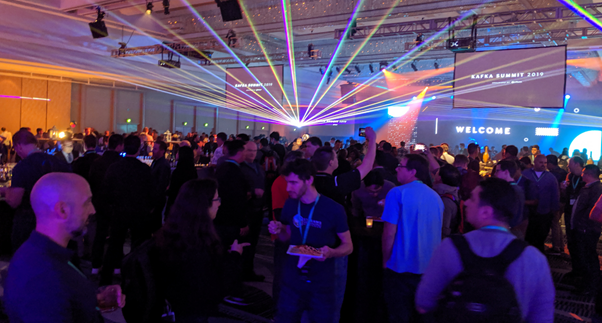

# Kafka Summit 2019 San Francisco: a review

2 day summit review : welcome to the world of streaming data!

Kafka Summit San Francisco (October 2019) was a two day conference aimed at data architects, engineers and developers who are keen to learn about streaming data and appreciate the real-world use cases of others. The event is organised by Confluent, the commercial company founded by the original creators of Apache Kafka.

The summit was held in a single location, the Hilton hotel Union Square, San Francisco. This was a central location, and was easily accessed (well, once you actually made it to San Francisco). This was the third & largest Kafka event of 2019, following on from the recent London and New York summits.

The presentations were split amongst 4 tracks for both days (Core Kafka, Event Driven Development, Stream Processing and Use Cases). It was difficult choosing the 14 talks to attend with the realisation I’d be missing out on 42 session. Luckily, all are recorded (links below). The big draw cards were hearing from the engineering teams of NASA JPL, Tesla, Apple, Walmart & Netflix and how they each manage trillions of events every day.

I was also keen to attend and understand the lessons from less high profile institutions, and there was a large variety of sessions to choose from. There were over 250 submissions for 56 sessions so the calibre of the presentations was super high.

### **Day-0**

The Sunday before the summit was a mini “pre” event — an opportunity to meet the Kafka community contributors , conference speakers and Confluent developer advocates. I was really thrilled to be invited; and it gave me the opportunity to personally thank some amazingly talented distributed system engineers.

*Me and the very talented **Gwen Shapira***

**Day-1**

The summit opened with a warm welcome from Tim Berglund, welcoming the crowd and framing what was in store for the next two days. Following Tim was the keynote presentations from Jun Rao sharing the origin-story of Kafka. Jun covered the history of the Apache Kafka project, and made a nice call of appreciation to the over 600 contributors. The biggest “whoop” from the audience was the road-map discussion around the planned removal of zookeeper.

Following Jun was an entertaining fireside chat with Chris Kasten of Walmart. Chris discussed Walmart’s real time platform managing inventory, analysing fraud and processing every click on their digital channels. Walmart sees 11 billion events a day on their 85 node cluster.

I’d summarise the day-1 keynote as good, but not great. It was entertaining, but we didn’t learn anything new. However, the day was just getting going … and the sessions following the keynote were fabulous!

My favourite sessions of the day included

* [Kafka on Kubernetes: Keeping It Simple](https://www.confluent.io/kafka-summit-san-francisco-2019/kafka-on-kubernetes-keeping-it-simple) by Nikki Thean of Etsy. A wonderful and honest recount of the on-prem to cloud journey from Nikki and her team at Etsy. What they learnt and how others can avoid similar pitfalls

* [Using Kafka to Discover Events Hidden in Your Database](https://www.confluent.io/kafka-summit-san-francisco-2019/using-kafka-to-discover-events-hidden-in-your-database) by Anna McDonald of SAS Institute — a fascinating & entertaining explanation of the styles of streaming. Anna shared a great overview of derivative event processing and event storming. Some great advice, including the need to bring the business on board and focus on what’s important

* The best technical sessions I attended covered the many concepts of time in [What’s the Time? …and Why?](https://www.confluent.io/kafka-summit-san-francisco-2019/whats-the-time-and-why) With Matthias J. Sax of Confluent. A great dive into the strict offset ordering and rich timestamp semantics available from Kafka

Although last of the day I loved the session from Jesse Yates of Tesla describing the incredible edge cases with [Tesla’s Streaming Data Platform](https://www.confluent.io/kafka-summit-san-francisco-2019/0-60-teslas-streaming-data-platform). Cars emit a lot of data, and parking them in a faraday cage (ie., a garage) for a few months means dealing with a variety of different versions of IoT payloads at high velocity.

 from **Inny and Andrew**](00000002.io/kafka-summit-san-francisco-2019/observability-for-everyone) from **Inny and Andrew***

And the [Observability for Everyone](https://www.confluent.io/kafka-summit-san-francisco-2019/observability-for-everyone) from my ThoughtWorks colleagues **Inny and Andrew** was well attended (standing room only!)

Day-1 concluded with a fun Kafka Summit Party. A great opportunity to talk to attendees, contributors, engineers and presenters (and find a beer or n).

*Kafka Summit Party*

### **Day-2**

The day-2 keynote was again opened by the marvellous Tim Berglund. Tim applauded the work of contributors and community involvement. Following Tim, Jay Kreps (co-founder and CEO of Confluent) provided an interesting position on where streaming was going (data in motion, and queries are static). The take-away was classic relational databases aren’t going away, but data warehousing is definitely changing with the advent of event streaming platforms.

KSQL is being enhanced and provides additional integration for the Confluent platform (allows you to deploy and configure Kafka Connect framework for sources and sinks). Have a look at [http://cnfl.io/ksql-klip-7](http://cnfl.io/ksql-klip-7) (Kafka Connect Integration) and [http://cnfl.io/ksql-klip-8](http://cnfl.io/ksql-klip-8) (Queryable State Stores) for a bit more detail.

Dav Tagare from Lyft described their streaming platforms (160 billion writes / day over 11 clusters) — wow!

***Jay Kreps** provided an insight into new KSQL capabilities*

All the day-2 sessions I attended were great, but the highlights for me were

· [Data Streams in Astronomy](https://www.confluent.io/kafka-summit-san-francisco-2019/building-a-newsfeed-from-the-universe-data-streams-in-astronomy) with Maria Patterson. Building a news feed from the Universe and understanding Data Streams in Astronomy. A fascinating explanation of the challenges when finding significant astronomy events within 20 PB of data and using new computational methods for observing the sky.

· [Event Sourcing, Stream Processing and Serverless](https://www.confluent.io/kafka-summit-san-francisco-2019/event-sourcing-stream-processing-and-serverless) with Ben Stopford. Ben shared a succinct review of the styles of event sourcing architecture, CQRS patterns and the evolution of micro-services

· [Building an Enterprise Eventing Framework](https://www.confluent.io/kafka-summit-san-francisco-2019/building-an-enterprise-eventing-framework) with Bryan Zelle, & Neil Buesing

· [Building Stream Processing Applications with Apache Kafka Using KSQL](https://www.confluent.io/kafka-summit-san-francisco-2019/building-stream-processing-applications-with-apache-kafka-using-ksql) by Robin Moffatt — the highest rated session of the conference.

*Me stalking **Ben Stopford***

### **Audience & Vibe**

The audience ranged from Kafka beginners to Apache contributors, product owners, engineers and service providers. There were around 2,200 attendees (significantly more than last year where 1,200 attended). Overall, there was a nice focus in community (big call out to committers), sharing, engagement & well-being (including a lovely morning run across the Golden Gate Bridge). Also liked that t-shirts were printed on demand if you wanted one.

*A great start to day-2 — a run over Golden Gate Bridge*

Girl Geek Dinner with Neha Narkhede (Co-founder of Confluent), was a nice community event and offered 200 attendees a supported and supportive way to participate in the conference & community.

Outside the main conference was the partner event and a meetup at the new Confluent campus.

### Wrap up

The Kafka Summit 2019 summit was simply fantastic. The openness and access to such a talented community was wonderful; and it’s exhilarating to be surrounded by such talent, enthusiasm and community spirit. As a rapidly growing community it’s refreshing to see the energy, openness and technical strength continue amongst the Apache Kafka community.

*Friendly faces — a #streamingselfie Tim Berglund, Neil Buesing & Viktor Gamov*

The Videos & Slides of Kafka Summit 2019 San Francisco are available at [https://www.confluent.io/resources/kafka-summit-san-francisco-2019/](https://www.confluent.io/resources/kafka-summit-san-francisco-2019/) . If you don’t have 56 hours to watch them all, you should at least watch [Ben Stopford’s](https://www.confluent.io/kafka-summit-san-francisco-2019/event-sourcing-stream-processing-and-serverless)
