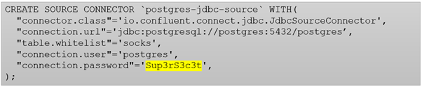
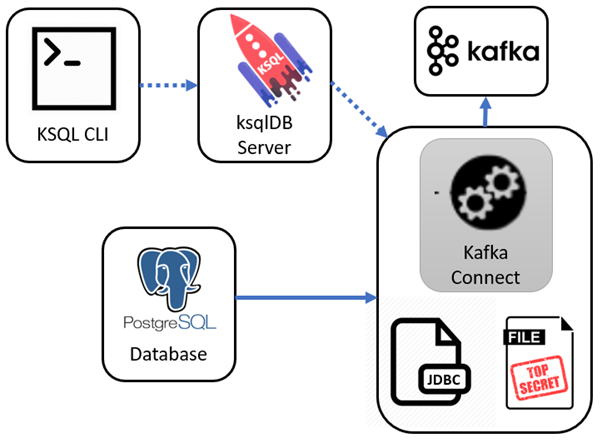

# Kafka Connect Secrets Management with ksqlDB

Get data into and out of Kafka with ease using ksqlDB ... without sharing your passwords

Kafka Connect is a scalable, flexible framework for streaming data between Apache Kafka and other data systems. Got data in a database table and want to stream it into Kafka? No problem, a simple bit of configuration and a JDBC driver will get you going.

What’s even better is this Kafka Connect configuration can be setup and managed with [ksqlDB ](http://ksqldb.io)with Confluent Platform 5.4 onward. That is, you can use a SQL dialect to both manage your real-time data processing against Apache Kafka *and *run connectors to get data to and from your Kafka cluster.

Apache Kafka 2.0 [added support](https://cwiki.apache.org/confluence/display/KAFKA/KIP-297%3A+Externalizing+Secrets+for+Connect+Configurations) for external secrets using a flexible ConfigProvider class. You can externalise secrets using a variety of mechanisms (Vault, KMS, etc.,) However, it’s not immediately obvious how to get this capability running with ksqlDB. Let’s explore ways you can setup your distributed cluster, and keep your secrets, … secret.

## Example Context

We’ll take a simple example. We wish to define a Kafka Connect JDBC source, and want to hide the username and password required to connect to the source database.

*A typical Kafka Connect configuration with a password*

We want a fully distributed setup, with the ksqlDB server controlling our Kafka Connect cluster. We’ll load our Kafka Connect cluster with a JDBC Postgres JAR driver, so it can communicate with a Postgres database.

Let’s setup out database

    CREATE TABLE socks (
        sockname VARCHAR
      , ref SERIAL PRIMARY KEY
      );

    INSERT INTO socks (sockname) VALUES ('Black wool socks');
    INSERT INTO socks (sockname) VALUES ('Yellow colourful socks');
    INSERT INTO socks (sockname) VALUES ('Old brown socks'); 

For simplicity, we’ll manage out secrets via the FileConfigProvide class (ie., an external credentials file). We can create a *secrets* file (cred.properties ) and must remember not to check it into to version control (use a .gitignore or equivalent)

    PG_URI=jdbc:postgresql://postgres:5432/postgres
    PG_USER=postgres
    PG_PASS=Sup3rS3c3t

And then you can concentrate on defining your configuration like this. Note the username and password are simply references into the cred.properties file

    CREATE SOURCE CONNECTOR `postgres-jdbc-source` WITH(
      "connector.class"='io.confluent.connect.jdbc.JdbcSourceConnector',
      "connection.url"='${file:/scripts/cred.properties:PG_URI}',
      "mode"='incrementing',
      "incrementing.column.name"='ref',
      "table.whitelist"='socks',
      "connection.user"='${file:/scripts/cred.properties:PG_USER}',
      "connection.password"='${file:/scripts/cred.properties:PG_PASS}',
      "topic.prefix"='db-',
      "key"='sockname'); 

## Let’s see if it works

From ksqlDB run this

    print 'db-socks' from beginning;

And you should see this

    {"sockname": "Black wool socks", "ref": 1}
    {"sockname": "Yellow colourful socks", "ref": 2}
    {"sockname": "Old brown socks", "ref": 3}

In another window, insert a new database row

    psql -U postgres -c "INSERT INTO socks (sockname) VALUES ('Mismatched socks');"

And your ksqlDB prompt should now show one additional row (notice the Kafka connect cluster found the new row)

    {"sockname": "Mismatched socks", "ref": 4}

## Try it yourself

A complete docker-compose to run this setup available at
[**saubury/ksqldb-demo**
*How to setup Kafka Connect with ksqlDB ..*github.com](https://github.com/saubury/ksqldb-demo/tree/master/ksqldb-connect-demo)
