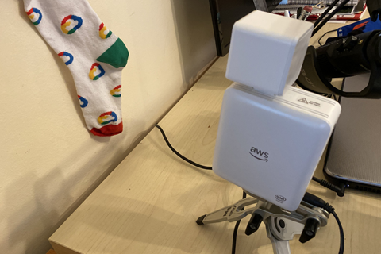

# Sorting my socks with deep learning — Part 1

Can I arrange my sock drawer using machine learning? An adventure in pairing my socks using transfer learning to build a custom sock image classification model. A small project to train and deploy an object recognition model on AWS DeepLens hardware for identifying my socks.

## The Idea

I have a crazy idea that I can pair my mismatched socks with machine learning. That is, building an image recognition model on the socks I have sitting in my sock drawer. With sufficient training data I should be able to tech a machine to classify a sock, and determine when I have a pair of identical socks. No more mismatched socks!

*A deep learning model saving me from household chores*

This project is also a good chance to test (or justify?) my new [AWS Deeplens](https://aws.amazon.com/deeplens/) — a “deep-learning enabled video camera”. A Deeplens is a $300 hardware device with a 4MP video camera, Intel Atom Processor, 8GB RAM and runs Ubuntu. Plenty of hardware to help sort my socks.

*A Deeplens in sock-classification action*

This project and all the files are available [here](https://github.com/saubury/socksort/).

## Image Capture

Any good machine vision project starts with training data. In my case, I need to prepare a set of training images to teach a model to recognise similar classification of socks. More specifically, I need to take a lot of photos of socks, and classify the images so I can run a supervised learning image classification. Much like you can teach a child to recognise something with a few examples, so too a ML model. With enough images of socks (tagged with their known sock type) a model can be created to classify socks into their correct type.

*One sock at a time gets a photo*

Taking photos of socks is just as exciting as it sounds. Luckily I found around 30 photos of each sock were sufficient to accurately identify each sock variety— so it didn’t take too long to capture images.

*Each sock has around 30 different photos*

To save time, I made sure each sock filled the camera frame. This means I didn’t need to add bounding boxes to the images as the entire image frame was filled with a single sock image.

## Image Preparation

*The exciting task of image preparation*

While you can train a model on a folder full of images, it’s preferable to optimise the format of the images so that it’s less IO intensive during model training. I’ll prepare my dataset of sock images in [ImageRecord](https://gluon-cv.mxnet.io/build/examples_datasets/recordio.html) format.

To prepare my sock dataset in ImageRecord format I first need to generate a .lst file, a text file describing images classification and filename. I can use the Apache MXNet* im2rec.py* python file to help with these steps

    python3 -m venv myenv
    source myenv/bin/activate
    pip install mxnet opencv-python
    curl --output im2rec.py [https://raw.githubusercontent.com/apache/incubator-mxnet/master/tools/im2rec.py](https://raw.githubusercontent.com/apache/incubator-mxnet/master/tools/im2rec.py)

I chose to split the photos into 80% training images and 20% for model validation. My data had 8 classification (ie., 8 different sock varieties) each with around 30 images. To randomly allocate the images into training and validation sets I run

    python im2rec.py --list  --train-ratio 0.8   --recursive ./sock-images_rec sock-images/

After the execution, you find files sock-images_rec_train.lst and sock-images_rec_val.lst generated. These text files describe the images and classification for training and validation sets

    wc -l *.lst
    544 sock-images_rec_train.lst
    137 sock-images_rec_val.lst
    681 total

Now I want to actually crunch my sock images into ImageRecord, reducing the size of each image down to a 512x512 pixel image.

    python im2rec.py   --resize 512   --center-crop   --num-thread 4 ./sock-images_rec ./sock-images/

It gives you four more files: (sock-images_rec_train.idx, sock-images_rec_train.rec, sock-images_rec_val.idx, sock-images_rec_val.rec). Now, I’ve got ImageRecord files for both the training and validation. I’ll copy these up to an s3 so I can run the training in d’ cloud.

    aws s3 cp . s3://deeplens-sagemaker-socksort --exclude "*" --include "*.idx"  --include "*.rec"  --include "*.lst" --recursive

## Model Training

Now we want to train an image classification model that can classify sock images. We will use [transfer learning](https://en.wikipedia.org/wiki/Transfer_learning) to leverage the knowledge gained from similar classification tasks to bootstrap my sock classification model. I can run this model training in a hosted Jupyter Notebook (AWS Sagemaker) in Python.

The basic steps being

* Import the sock dataset as a *recordio* format.

* Build an image classification model — see [*sock-classification.ipynb](https://github.com/saubury/socksort/blob/master/20-model-training/sock-classification.ipynb)*. All going well after running this notebook you should have a model file called${S3_BUCKET}/ic-transfer-learning/output/image-classification-${DATE}/output/model.tar.gz

* Deploy a temporary classifier to test the inference function (that is, spin up your model with a temporary end point)

* Test a few demonstration images can be correctly classified

* Convince myself this is time well spent

A more extensive explanation [here](https://github.com/awslabs/amazon-sagemaker-examples/blob/master/introduction_to_amazon_algorithms/imageclassification_caltech/Image-classification-transfer-learning-highlevel.ipynb)

## Deeplens MXNet Model & Lambda Function

So far we’ve managed to train a model, and test it with a cloud hosted interactive Jupyter Notebook. Now I want to have this model running on my local hardware against images captured and processed on the Deeplens camera hardware. I’ll need to deploy the trained model locally and write a local lambda python function.

To create this local run-time project we need to build, publish and deploy a Sock Sort AWS DeepLens Inference Lambda Function. This is essentially a zip file containing my Python code (which pulls images from the camera and calls the classification model) along with support Python libraries (such as MQTT broker libraries) along with basic configuration settings.

Steps to build sock_deeplens_inference_function.zip are detailed [here](https://github.com/saubury/socksort/blob/master/README.md#deeplens-lambda-function). So too are the steps required to load our previously created object classification model into my Deeplens hardware.

## Publish Sock Sort AWS DeepLens Inference Lambda Function

*DeepLens with model and local Lambda sending predictions to browser and MQTT*

Now we have a trained model and Python Inference Lambda Function deployed locally to my Deeplens hardware. Powering up the device should run all images captured by the camera through the classification model. If a likely match is found, the details are overlaid on the image. I can review a live camera feed within as web-browser, and a text overlay displays the sock classification. I’m also pushing the classification prediction into an MQTT topic (more about that in part-2).

*Socks — identified with model*

## To be continued …

Thanks for reading this far. We’ve got a model running locally that can identify single socks … but we’re only half way there! Our next part of the process needs to be able to identify our matching socks.

Have a look at [p](https://medium.com/@simon.aubury/kafka-stream-processing-sorting-socks-with-ksqldb-e4174ae5e703)art 2 — [Kafka stream processing: sorting socks with ksqlDB](https://medium.com/@simon.aubury/kafka-stream-processing-sorting-socks-with-ksqldb-e4174ae5e703).

*Socks — paired!*

### Project Files

Project files with code used available at [https://github.com/saubury/socksort/](https://github.com/saubury/socksort/)
