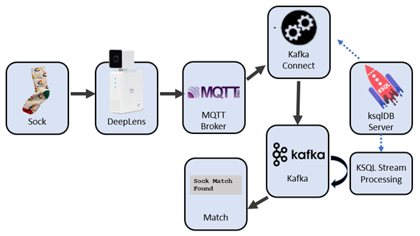
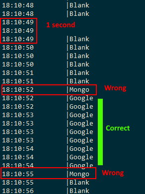
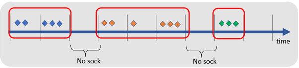

# Kafka stream processing: sorting socks with ksqlDB

Sorting socks with a streaming solution? Pair socks with ksqlDB, Kafka and Kafka Connect.

[ksqlDB](https://ksqldb.io/) is a pretty cool event streaming platform. A few commands allow you to build a detailed real-time stream processing application. Capture, transform and perform continuous transformations on Kafka with a simplified SQL dialect. In addition, ksqlDB allows you to capture events from an external system using Kafka connect.

In my previous blog [classifying socks with deep learning]() I described deploying an object recognition model on AWS DeepLens hardware for identifying socks. Let’s now look at how Kafka plus ksqlDB can retrieve sock classification messages from the camera and perform time-window stream transformations to find pairs of matching socks.

*Kafka and ksqlDB for a streaming platform to pair socks*

## Camera predictions to Kafka: MQTT with ksqlDB

The first task is to pull sock predictions from the DeepLens camera. The images classified by the camera are placed onto an MQTT topic.

MQTT is lightweight TCP/IP messaging protocol perfect for small mobile devices and low powered sensors. It allows for short efficient messages. It’s closer to a notice board than a queue, and allows for lightweight messages like “Sock seen is Google, with a 98% confidence”.

We can peek at MQTT messages with mosquitto_sub(or the terrific GUI tool [MQTT.fx](https://mqttfx.jensd.de/)). Here’s a typical sequence listing the MQTT topic sockfound

    mosquitto_sub -h ${MQTT_HOST} -p ${MQTT_PORT} -u ${MQTT_USER} -P ${MQTT_PASS} -t sockfound

    {"image": "Blank", "probability": 37.59765625}
    {"image": "Blank", "probability": 41.162109375}
    {"image": "Google", "probability": 97.314453125}
    {"image": "Google", "probability": 94.970703125}
    {"image": "Google", "probability": 64.6484375}
    {"image": "Blank", "probability": 67.3828125}
    {"image": "Blank", "probability": 50.634765625}

### MQTT to Kafka with Kafka Connect

We want to add recognised socks into the Kafka stream processor. MQTT acts like a key/value store, whereas Kafka is a complete streaming platform. Getting MQTT messages into Kafka is easily achieved with the Kafka Connect framework. With an [MQTT driver](https://www.confluent.io/hub/confluentinc/kafka-connect-mqtt) added to Kafka Connect, we can configure a source connector to constantly place new prediction events from MQTT into a Kafka topic.

The traditional way of configuring Kafka connect (which I used in [Race tracking with Kafka KSQL, MQTT & Kibana](https://medium.com/@simon.aubury/did-i-beat-ben-race-tracking-with-kafka-ksql-mqtt-kibana-25e62e8ecaef)) was to use curl to interact directly against the Kafka Connect service. Although this works, there is now a much easier way …

### Kafka Connect with ksqlDB

ksqlDB now has commands so you can directly setup and control Kafka Connect. Let’s see how we can configure an MQTT source using only ksqlDB

*ksqlDB used to establish a Kafka Connect source from MQTT to Kafka*

We can create the Kafka Connect source to MQTT with a ksqlDB command like this. Note I’m describing the location and credentials for the MQTT broker plus the name of my destination Kafka topic, and .. that’s about it

    CREATE SOURCE CONNECTOR `mqtt-source` WITH(       "connector.class"='io.confluent.connect.mqtt.MqttSourceConnector',
    "mqtt.server.uri"='tcp://something.example.com:14437', 
    "mqtt.username"='some-user',
    "mqtt.password"='my-password',
    "mqtt.topics"='sockfound',
    "kafka.topic"='data_mqtt', 
    );

By the way — if you’re worried about putting secrets (like passwords) into your KSQL script have a look at [Kafka Connect Secrets Management with ksqlDB](https://medium.com/@simon.aubury/kafka-connect-secrets-management-with-ksqldb-2f218a21a2d2).

### Test MQTT to Kafka

We can check incoming MQTT messages are landing in Kafka by querying the Kafka topic with KSQL

    ksql> print 'data_mqtt';

All going well you’ll see payloads like this

    {"image": "Running Science", "probability": 43.994140625}
    {"image": "Mongo", "probability": 50.29296875}
    {"image": "Mongo", "probability": 86.279296875}
    {"image": "Mongo", "probability": 53.076171875}

## Problem #1: “Ghost” Socks

The DeepLens image classifier works pretty quickly— and I can get 3 or 4 images recognised each second. But not all image classifications are correct. Have a look at this stream (note the time is HH:MM:SS). Within the 4 second span of 18:10:51 to 18:10:55 I saw messages indicating “blank”, a single “Mongo” message, 9 sequential “Google” messages, another single “Mongo” message a finally a sequence of “blank”

*The occasional “ghost” Mongo sock showing up in a stream of Google socks*

What I really want to do is identify a series of similar messages within a windows of time

*Time series — what should be expected for sock image identification*

### Window Hopping with ksqlDB

The first step is to use ksqlDB to create a stream representing the messages updates of the MQTT topic

    create stream sock_stream(image varchar, probability double) 
    with (kafka_topic='data_mqtt',  value_format='json');

We can now utilise a [windowed aggregation](https://docs.ksqldb.io/en/latest/concepts/time-and-windows-in-ksqldb-queries/#windows-in-sql-queries) in KSQL to bucket sock images into windows of 5 seconds. That is, we’ll group arriving images into windows with intervals of 5 seconds to determine the most prevalent image seen. I determine a image classification is legitimate if it is the it appears more than 3 times in that 5 second window

    create table sock_stream_smoothed as
    select image
    , timestamptostring(windowstart(), 'hh:mm:ss') as last_seen
    , windowstart() as window_start
    from sock_stream
    **window tumbling (size 5 seconds)**
    group by image **having count(*) > 3**
    emit changes;

Stream sock_stream_smoothed now represents a stream of likely image — removing occasional ghost socks.

## Problem #2: That’s a wall, not a sock

My second problem was a little silly. I need a way of finding not only the differences between socks — but finding when I had no sock! As I wanted to count socks I needed to exclude the “blank” images.

The first step is to use ksqlDB to create a stream representing the messages updates of the MQTT topic

    create stream sock_stream(image varchar, probability double) 
    with (kafka_topic='data_mqtt',  value_format='json');

I can eliminate pictures of the wall (the payloads of ‘blank’) by simply excluding them in a stream

    create stream sock_stream_without_blanks as
    select image
    from sock_stream
    **where image != 'blank';**

## Finding Pairs of Sock

Now we’ve got a steady steam of identified socks — we now need to find pairs of identical images. To find pairs of socks I’ll look for socks appearing in even numbers. Here’s a sample segment of KSQL

    select image
    , case when (count(*)/2)*2 = count(*) then 'Pair' else 'Un-matched' end  as pair_seen
    , count(*) as number_socks_seen
    from sock_stream_smoothed 
    group by image 
    emit changes;

Should see something like this

    +--------------+-------------+--------------------+
    |IMAGE         |PAIR_SEEN    |NUMBER_SOCKS_SEEN   |
    +--------------+-------------+--------------------+
    |Mongo         |Pair         |2                   |
    |Streamset     |Un-matched   |1                   |
    |Google        |Pair         |2                   |
    |Confluent     |Pair         |2                   |

## Did it work?

Well — yes. I was super thrilled with the result. There was a bit of latency between the image recognition and the pair identification which I hope to still optimise. But overall, very happy with this project.

*Demo of matches*

## Project Code

Do you have socks to pair? Have a look at the complete project code at : [https://github.com/saubury/socksort](https://github.com/saubury/socksort)
