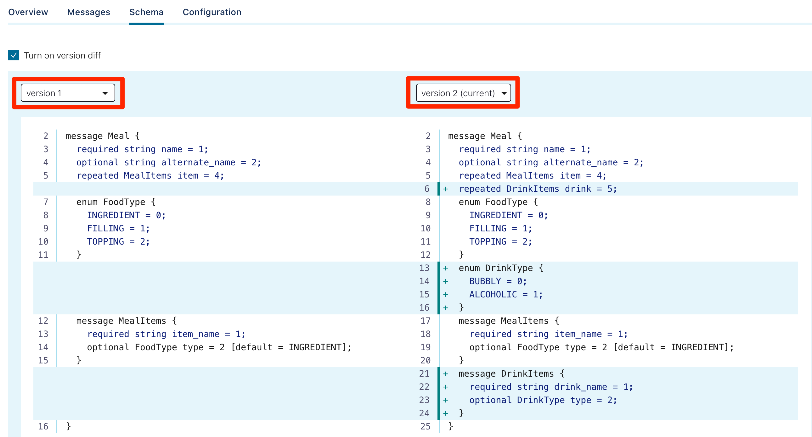

# Kafka with AVRO vs., Kafka with Protobuf vs., Kafka with JSON Schema

Kafka serialisation schemes — playing with AVRO, Protobuf, JSON Schema in Confluent Streaming Platform. The code for these examples available at https://github.com/saubury/kafka-serialization

Apache Avro was has been the default Kafka serialisation mechanism for a long time. Confluent [just updated](https://www.confluent.io/blog/confluent-platform-now-supports-protobuf-json-schema-custom-formats/) their Kafka streaming platform with additional support for serialising data with Protocol buffers (or *protobuf*) and JSON Schema serialisation.

Protobuf is especially cool, and offers up some neat opportunities beyond what was possible in Avro. The inclusion of Protobuf and JSON Schema applies at producer and consumer libraries, schema registry, Kafka connect, ksqlDB along with Control Center. It’s worth a few minutes of your time getting familiar with the new opportunities possible with a choice of serialising strategies for your streaming application.

## Do I care about serialising structured data?

So why bother with serialising structured data? Let’s start with an example data string … “cookie,50,null” What does this data mean? Is *cookie* a name, a place or something to eat? And what about *50* - is this an age, a temperature or something else?

If you were using a database (such as Postgres or Oracle) to store your data you would create a table definition (with nicely named columns and appropriate data types). The same is true for your streaming platform — you really should pick data format for serialising structured data. Bonus points for and being consistent across your data platform!

Until recently your choices for serialising structured data within Kafka were limited. You had “bad” choices (such as free text or CSV) or the “better” choice of using Apache Avro. Avro is an open source data serialisation system which marshals your data (and it’s appropriate schema) to a efficient binary format. One of the core features of Avro is the ability to define a schema for our data. So our data cookie,50,null would be associated with a *snack* Avro schema like this

    {
      "type": "record",
      "name": "snacks",
      "fields": [
          {"name": "name",  "type": "string" }
        , {"name": "calories", "type": "float" }
        , {"name": "colour", "type": "string", "default": null}
      ]
    }

Here we can see our data cookie,50,null is snack data (the most important type of data). We can see *cookie* is a *string* representing the name of the snack. Our schema offers us a lot of flexibility (our schema can evolve over time) plus ensures data integrity (for example, ensuring calories are integers ).

Although most of Apache Kafka users use Apache Avro to define contracts for their messages, it’s always been a bit of a “Java thing”. Classes automatically generated by the Apache Avro compiler favour JVM developers. You can certainly use AVRO in pretty much any language, however, Google Protocol Buffer (protobuf) is very popular for serialising, de-serialising and validating data in other languages (Python, Rust, Ruby, Go).

## AVRO, Protobuf, JSON Schema use with Kafka

This *isn’t* a blog on the “best” serialisation strategy. However, let’s get familiar with how we can use new choices for serialising structured data

We’ll run through a few examples. Remember our initial set of yummy data looks like this saved in the file snacks.txt

    {"name": "cookie", "calories": 500, "colour": "brown"}
    {"name": "cake", "calories": 260, "colour": "white"}
    {"name": "timtam", "calories": 80, "colour": "chocolate"}

## AVRO serialisation

Let’s remind ourselves how to encode our snacks using AVRO serialisation. We’ll use the include command line tool kafka-avro-console-producer as a Kafka producer which can perform serialisation (with a schema provided as a command line parameter). A *producer* is something that *writes* data into a Kafka broker.

    kafka-**avro**-console-producer  --broker-list localhost:9092 --topic SNACKS_AVRO --property value.schema='
    **{
      "type": "record",
      "name": "myrecord",
      "fields": [
          {"name": "name",  "type": "string" }
        , {"name": "calories", "type": "float" }
        , {"name": "colour", "type": "string" }
      ]
    }**' < snacks.txt

And to *read* the data, we can use the kafka-avro-console-consumercommand line application to act as kafka consumer to read and de-serialising our AVRO data

    kafka-**avro**-console-consumer --bootstrap-server localhost:9092 --topic SNACKS_AVRO --from-beginning 

    **{"name":"cookie","calories":500.0,"colour":"brown"}
    {"name":"cake","calories":260.0,"colour":"white"}
    {"name":"timtam","calories":80.0,"colour":"chocolate"}**

## Protocol Buffers (Protobuf) serialization

This time we’ll use *protobuf* serialisation with the new kafka-protobuf-console-producer kafka producer. The concept is similar to to approach we took with AVRO, however this time our Kafka producer will can perform protobuf serialisation. Note the protobuf schema is provided as a command line parameter.

    kafka-**protobuf**-console-producer --broker-list localhost:9092 --topic SNACKS_PROTO --property value.schema='
    **message Snack {
        required string name = 1;
        required int64 calories = 2;
        optional string colour = 3;
    }**' < snacks.txt

And to read the data, we can use the kafka-protobuf-console-consumerkafka consumer for de-serialising our protobuf data

    kafka-**protobuf**-console-consumer --bootstrap-server localhost:9092 --topic SNACKS_PROTO --from-beginning 

    **{"name":"cookie","calories":"500","colour":"brown"}
    {"name":"cake","calories":"260","colour":"white"}
    {"name":"timtam","calories":"80","colour":"chocolate"}**

## JSON Schema serialization

Finally we’ll use JSON Schema serialisation with the new kafka-json-schema-console-producer kafka producer. Note the json-schema schema is provided as a command line parameter.

    kafka-**json-schema**-console-producer --broker-list localhost:9092 --topic SNACKS_JSONSCHEMA --property value.schema='
    **{
      "definitions" : {
        "record:myrecord" : {
          "type" : "object",
          "required" : [ "name", "calories" ],
          "additionalProperties" : false,
          "properties" : {
            "name" : {"type" : "string"},
            "calories" : {"type" : "number"},
            "colour" : {"type" : "string"}
          }
        }
      },
      "$ref" : "#/definitions/record:myrecord"
    }**' < snacks.txt

And to read the data, we can use the kafka-json-schema-console-consumer kafka consumer for de-serialising our json-schema data

    kafka-**json-schema**-console-consumer --bootstrap-server localhost:9092 --topic SNACKS_JSONSCHEMA --from-beginning 

    **{"name":"cookie","calories":"500","colour":"brown"}
    {"name":"cake","calories":"260","colour":"white"}
    {"name":"timtam","calories":"80","colour":"chocolate"}**

## What you can do with Protobuf and can’t do with Avro?

Let’s have a look at a more complex modelling example to illustrate some of the possibilities with Protobuf schemas. Imagine we want to model a meal and describe the ingredients within the meal. We can use a protobuf schema to describe a meal such as a *taco* is composed of *beef filling* and *cheese topping*.

Our data for a taco and fish-and-chips meal could look like this

    {
      "name": "tacos",
      "item": [
        {
          "item_name": "beef",
          "type": "FILLING"
        },
        {
          "item_name": "cheese",
          "type": "TOPPING"
        }
      ]
    }, {
      "name": "fish and chips",
      "alternate_name": "fish-n chips",
      "item": []
    }

An example protobuf schema to represent our meals would look like this

    message Meal {
      required string name = 1;
      optional string alternate_name = 2;

      enum FoodType {
        INGREDIENT = 0;
        FILLING = 1;
        TOPPING = 2;
      }

      message MealItems {
        required string item_name = 1;
        optional FoodType type = 2 [default = INGREDIENT];
      }

      repeated MealItems item = 4;
    }

To try this modelling with protobuf in Kafka

    kafka-**protobuf**-console-producer --broker-list localhost:9092 --topic MEALS_PROTO --property value.schema='
    **message Meal {
      required string name = 1;
      optional string alternate_name = 2;**

    **  enum FoodType {
        INGREDIENT = 0;
        FILLING = 1;
        TOPPING = 2;
      }**

    **  message MealItems {
        required string item_name = 1;
        optional FoodType type = 2 [default = INGREDIENT];
      }**

    **  repeated MealItems item = 4;
    }**' < meals.txt

Which gives you an idea of how flexible data representation can be using protobuf in Kafka. But what happens if we need to make changes to these schemas?

## Protobuf with the Confluent Schema Registry

You may have wondered where the schemas actually went in the above examples? The Confluent Schema Registry has been diligently storing these schemas (as part of the serialisation process when using kafka-blah-console-producer). That is, both the schema name (eg., *SNACKS_PROTO-value*), schema content, version and style (protobuf, Avro) have all been stored. We can peak at the stored schema with curl. For example, to explore the recently used protobuf schema for our snacks

    curl -s -X GET [http://localhost:8081/subjects/SNACKS_PROTO-value/versions/1](http://localhost:8081/subjects/SNACKS_PROTO-value/versions/1)

Which responds the this snack schema (yummy)

    {
      "subject": "SNACKS_PROTO-value",
      "version": 1,
      "id": 6,
      "schemaType": "PROTOBUF",
      "schema": "\nmessage Snack {\n  required string name = 1;\n  required int64 calories = 2;\n  required string colour = 3;\n}\n"
    }

## Schema Evolution with Protobuf

As the saying goes — *the only constant is change*. Any good data platform needs to accommodate changes — such as additions or changes to a schema. Supporting schema evolution is a fundamental requirement for a streaming platform, so our serialization mechanism also needs to support schema changes (or evolution). Protobuf and Avro both offer mechanisms for updating schema without breaking downstream consumers — which could still be using a previous schema version.

## Adding drinks to our meals

Tacos and pizza’s sound great — but let’s have something to drink with our meal! We can now add some additional attributes to our schema to include meals. This is sometimes called *schema evolution*. Note we’ll continue to use the existing MEALS_PROTO topic.

A new data payload (with the inclusion of *beer*)

    {
      "name": "pizza",
      "drink": [
        {
          "drink_name": "beer",
          "type": "ALCOHOLIC"
        }
      ]
    }

So to encode the command looks like

    kafka-**protobuf**-console-producer --broker-list localhost:9092 --topic MEALS_PROTO --property value.schema='
    message Meal {
      required string name = 1;
      optional string alternate_name = 2;

      enum FoodType {
        INGREDIENT = 0;
        FILLING = 1;
        TOPPING = 2;
      }

    **  enum DrinkType {
        BUBBLY = 0;
        ALCOHOLIC = 1;
      }**

      message MealItems {
        required string item_name = 1;
        optional FoodType type = 2 [default = INGREDIENT];
      }

    **  message DrinkItems {
        required string drink_name = 1;
        optional DrinkType type = 2 ;
      }**

      repeated MealItems item = 4;
    **  repeated DrinkItems drink = 5;
    **}' < meals-2.txt

## Visualising schema difference with Confluent Control Center

One nice inclusion with the *Confluent Control Center* (the Web GUI included in the Confluent platform) is the ability to look at schemas, and the *differences between schemas*. For example, we can see version 1 and version 2 of the MEALS_PROTO-value schema

*Schema difference with Confluent Control Center*

## Application Binding — Protobuf classes with Python

Let us now build an application demonstrating protobuf classes. To generate protobuf classes you must first install the protobuf compiler protoc. See the [protocol buffer docs](https://developers.google.com/protocol-buffers/docs/pythontutorial) for instructions on installing and using protoc.

We can compile our Python schema like this. This will take our schema (from meal.proto) and will create the meal_pb2.py Python class file.

    protoc -I=. --python_out=. ./meal.proto

Excellent, with the meal_pb2.py Python class file you can now build protobuf classes and produce into Kafka with code like this

    **import meal_pb2
    ** 
    mybeer = **Meal.DrinkItems**(drink_name="beer")
    mywine = Meal.DrinkItems(drink_name="wine")
    meal =   **Meal(name='pizza', drink=[mybeer,mywine])**

    producer.produce(topic='MEAL_PROTO', value=meal)

Have a look at [producer-protobuf.py](https://github.com/saubury/kafka-serialization/blob/master/producer-protobuf.py) for a complete example of protobuf Kafka producer in Python.

## Conclusion

Kafka continues to grow in capabilities, and having the options of AVRO, Protobuf, JSON Schema use within the Confluent Platform gives even more opportunities to build cool streaming applications

The code for these examples available at

* [https://github.com/saubury/kafka-serialization](https://github.com/saubury/kafka-serialization)
