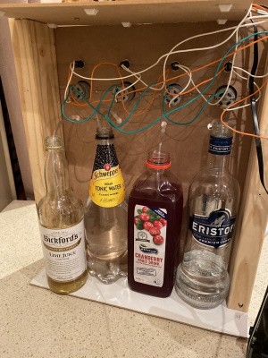

# 🍹 Cocktail Pi

Cocktails based on your mood created by a Raspberry Pi bartender. Drinks are selected based on your emotion and multilingual voice prompts let you know when your drink is available.



How to build a fully automated home build cocktail maker. Code available at [**https://github.com/saubury/cocktail-pi](https://github.com/saubury/cocktail-pi)**🍸

## Pumps

I used 4 [peristaltic pumps](https://en.wikipedia.org/wiki/Peristaltic_pump) to provide a “food safe” way to pump the liquids from the drink bottles. These pumps provide a steady rate of flow of liquids when powered. By carefully timing the “on” time for the pump I can precisely deliver the ideal amount of spirits or mixers for the perfect 🍸

*A quick search on AliExpress*

*Pumps — straight from the post*

The pumps are mounted on a basic wooden frame higher than the tallest bottle. My children helped to build the frame, labelling and installing the pumps.

*The important task of adding labels to pumps*

A view from the rear show the placement of pumps and liquids. A manual electrical switch allow the pumps to be run independently from the Raspberry Pi (helpful for cleaning).

*Rear view of Cocktail maker*

The pumps use 12 volt motors. To operate them via the Raspberry Pi I used a [4 Channel 12V Relay Module](https://www.jaycar.com.au/arduino-compatible-4-channel-12v-relay-module/p/XC4440). This allows the pumps to be switched on and off independently with the 5 volt signals from the [GPIO pins](https://www.raspberrypi.org/documentation/usage/gpio/) of the Raspberry Pi.

*Relay board*

The Raspberry Pi is mounted with the relay board. The relays switch 12 volt power on and off for the pump motors. The signals for the relay board are taken directly from the GPIO header of the Raspberry Pi.

*Board placement*

## Software — Storing Recipes

[Recipes](./recipe.py) are stored as a map of ingredients with the number of millilitres required for the perfect drink. My idea of a great *Vodka Lime Soda* is 20ml of Vodka, 70ml of Tonic and 30ml of Lime cordial. The code mapping for this is noted below.

    pump_map = {"PUMP_A": "Vodka", "PUMP_B": "Cranberry", "PUMP_C": "Tonic", "PUMP_D": "Lime"}

    recipe_vodkasoda = {"Name": "Vodka Soda", "Vodka": 20, "Tonic": 70}
    recipe_vodkasodacranburry = {"Name": "Vodka Soda Cranberry", "Vodka": 20, "Tonic": 70, "Cranberry": 40}
    **recipe_vodkalimesoda = {"Name": "Vodka Lime Soda", "Vodka": 20, "Tonic": 70, "Lime": 30}**
    recipe_limesoda = {"Name": "Lime Soda", "Tonic": 70, "Lime": 30}
    recipe_test = {"Name": "Test", "Vodka": 10, "Cranberry": 20, "Tonic": 30, "Lime":40}

## Dispensing the perfect amount

The pumps I’m using dispense 1.9mL of liquid per second. I can delegate each pump to a thread timer so it knows how long to operate for once the drink is selected. Have a look at [pump.py](./pump.py) for complete code

    *# Return the number of seconds to run*
    def lookup_time(drink_name, pump_name):
        ML_per_second = 1.9 
        num_ML = drink_name[pump_map[pump_name]]
        return num_ML / ML_per_second

    *# Run a pump for given number of seconds*
    def pump_thread_runner(gpio_pump_name, run_seconds):
        GPIO.output(gpio_pump_name, GPIO.HIGH)
        time.sleep(run_seconds)
        GPIO.output(gpio_pump_name, GPIO.LOW)

    *# Pick a drink*
    this_drink = recipe_vodkasoda

    *# How long to run each pump ...*
    duration_a = lookup_time(this_drink, "PUMP_A")
    duration_b = lookup_time(this_drink, "PUMP_B")

    *# these threads start in background*
    pump_thread_start(config.gpio_pump_a, duration_a)
    pump_thread_start(config.gpio_pump_b, duration_b)

## Emotion and Age

I use the [AWS Rekognition](https://aws.amazon.com/rekognition/) service to determine likely emotion and approximate age. A photo is saved as a jpeg. Uploaded to the AWS Rekognition service I get a JSON string describing the emotion, gender and ago. Have a look at [cloud.py](./cloud.py) for complete code

    *# Save camera image to file file_jpg*
    with picamera.PiCamera() as camera:
        camera.capture(file_jpg)

    *# Process file_jpg using AWS rekognition to extract emotion and age*
    with open(file_jpg, 'rb') as f_file_jpg:
        b_a_jpg = bytearray(f_file_jpg.read())
        rclient = boto3.client('rekognition')
        response = rclient.detect_faces(Image={'Bytes': b_a_jpg}, Attributes=['ALL'])

## Spoken words

For *text to speech* I used the [AWS Polly](https://aws.amazon.com/polly/) service. A text string can be converted into with a spoken voice saved as an mp3 audio file. Selecting the appropriate “voice” is language specific (although it is fun to have the English works spoken with a French accent). Have a look at [cloud.py](./cloud.py) for complete code

    *# Using "Emma" as am English voice, generate text to voice*
    voice='Emma'
    client = boto3.client('polly')
    response = client.synthesize_speech(OutputFormat='mp3', Text=audiotext, VoiceId=voice)    
    thebytes = response['AudioStream'].read()
    thefile = open(file_mp3, 'wb')
    thefile.write(thebytes)
    thefile.close()

    *# Play mp3 file via speaker*
    os.system('mpg123 -q {}'.format(file_mp3))

## Summary

A few hours and a bit of programming and you too can enjoy a 🍹 cocktail pi. Enjoy!

Project code — [**https://github.com/saubury/cocktail-pi](https://github.com/saubury/cocktail-pi)**

*Drinks are ready*
