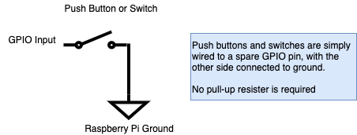
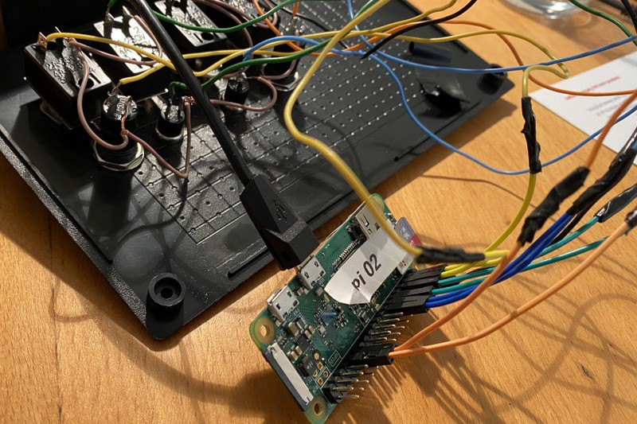
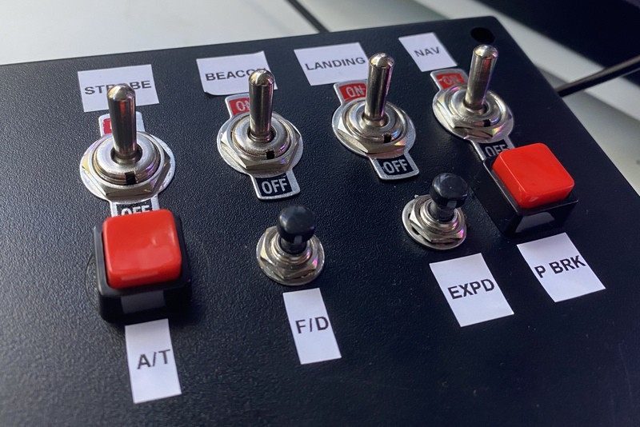
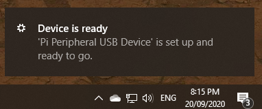
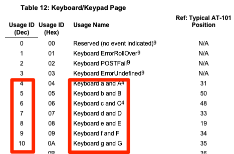
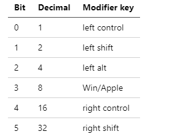
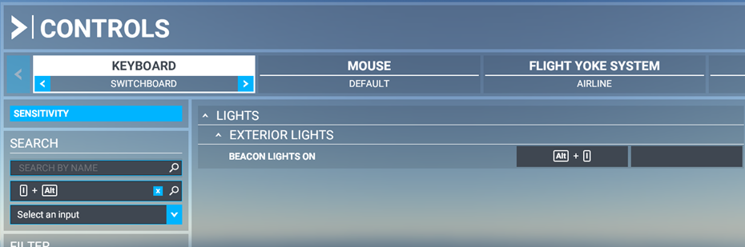

# Pi Peripheral

Landing gear down and strobe lights active. How to add physical buttons, switches and dials to control computer actions with a $10 Raspberry Pi Zero.

Why would you want to do this? Well you might want to add some additional buttons or switches to your favorite game. Or maybe you can streamline your video production but switching cameras with a foot pedal. For me, I wanted to add tactile controls to *Microsoft Flight Simulator 2020*. Switches for the landing gear, beacons and lights.

Project code at — [https://github.com/saubury/pi-peripheral/](https://github.com/saubury/pi-peripheral/)

*Animated GIF showing box in usage*

In short, *Pi Peripheral* can be used to control close to any keyboard activated activity — anywhere where physical controls are preferable to using a keyboard.

## Pi Peripheral — Hardware

A Raspberry Pi Zero board acts as a HID (Human Interface Device) device — pretending to be a USB keyboard. Python code generates key-presses when GPIO events are triggered. With basic wiring, the Raspberry Pi has 28 GPIO pins suitable for controlling actions.

## Wiring

The Raspberry Pi is very easy to wire up to switches and push buttons. Each only requires a single connection to a spare GPIO pin, and a common ground. Software will configure the GPIO pin as an input. There is no need to a physical pull up resistor — this can be configured in software.

*Wiring of GPIO*

## Power

Both power and USB host (USB OTG) are provided by a single micro-USB port. Use the port labeled “USB” (*not* the one labeled “Power”).

*Wiring of GPIO*

## Box Enclosure

You can be creative here — I just picked a generic project box which was easy mount the switches and push buttons.

*Outside view of box*

## Pi Peripheral — Software

## Configure Raspberry Pi Zero as a USB Keyboard

The first software task is configure the Raspberry Pi Zero to act as a USB Keyboard (HID input device.) These steps have largely been inspired from [randomnerdtutorials](https://randomnerdtutorials.com/raspberry-pi-zero-usb-keyboard-hid/) which has more detailed steps should you run into problems.

    echo "dtoverlay=dwc2" | sudo tee -a /boot/config.txt
    echo "dwc2" | sudo tee -a /etc/modules
    echo "libcomposite" | sudo tee -a /etc/modules

    sudo cp scripts/isticktoit_usb /usr/bin
    sudo chmod +x /usr/bin/isticktoit_usb 

Add this line to the second-last line of /etc/rc.local (just before the line containing exit 0)

    /usr/bin/isticktoit_usb # This line new
    exit 0

## Installing the Pi Peripheral on your PC

All going well, you can not connect the *Pi Peripheral* and it should be identified as a keyboard. This will work for Windows, Mac or Linux. Here’s what it looks like in Windows 10.

*Windows 10 Pop up message*

## Configuring Key Presses

The piperipheral.py Python code places events against each GPIO input. An event is fired when either the circuit is completed (button is pressed or the switch is flicked on) or when the circuit is disconnected (button is released or the switch is off).

A keypress is composed of a keyboard code (which represents a key on a keyboard) and a modifier (such as the Shift or control key). To produce a capital *B*, we would need to send the key code of 5 (for the letter *b*) and a modifier value of 00000010 (left Shift).

*USB HID keyboard codes*

For the entire mapping look at [usb.org](https://www.usb.org/sites/default/files/documents/hut1_12v2.pdf)

## Keyboard Modifiers

*Keyboard Modifiers*

## GPIO to key mappings

The GPIO line to key mapping is held in a Python collection

    *# Key mapping in the form*
    *# GPIO_ID, (press-key,press-key-modifier, release-key,release-key-modifier) *

    GPIO_BUTTON_1 = 6
    KEY_B = 5

    gpio_button_map = dict([
        (GPIO_BUTTON_1, (KEY_B,MOD_ALT, KEY_B,MOD_L_CNTR))  
      ])

## Installing the Pi Peripheral Service

Now the Raspberry Pi is acting like a USB Keyboard, we need to send some key commands. The *Pi Peripheral* is a Python programmed installed as a service

    sudo cp piperipheral.service /lib/systemd/system

    sudo systemctl daemon-reload
    sudo systemctl enable piperipheral.service
    sudo systemctl start piperipheral.service

## Game control binding

This will be specific to your game or program. In *Microsoft Flight Simulator 2020* you can customize controls with this setup window.

*Game keyboard mapping*

## Code

Get the code at — [https://github.com/saubury/pi-peripheral/](https://github.com/saubury/pi-peripheral/)

## Closing

A few dollars and a bit of configuration and you can have your own Pi Peripheral
