# 1 Cat, 3 Clouds — Where is Snowy sleeping?

Our cat Snowy is an outdoor cat — but we are beginning to wonder where she travels once she’s left the house. Let me share how I built a low cost pet tracking device to show Snowy’s location in real-time.
> Plus, what’s it like to build the same IoT data project in AWS, Azure & Google Cloud in 2021? This is article 1 in a 4 part series. This first blog post describes the project and details hardware and networking components. The next three articles describe the experience of building the data pipelines with each major cloud.

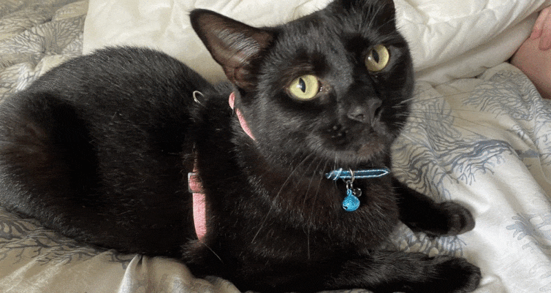*Where is Snowy?*

You may already know [Snowy the cat](); but I’ve always been curious where she goes on her day long travels. With a fascination of small “Internet of Things” devices and a surge of IoT announcement from the major cloud providers I was interesting in building a cat tracking project. Using some standard components could I build a real-time cat tracking solution to find Snowy’s secret sleeping area?

## Goals & Requirements

With limited time, I wanted to ensure I was clear on the goals for the project, the hardware and software.

### Project Goals

* Real-time cat location — so I can find her secret hiding lair and take a photo

* Historic location — so I can trace where she’s been over different days

* Cool maps — as I really like interactive dynamic maps

* Compatible with existing cat version

### Hardware Requirements

* Pet friendly (light, waterproof, not an embarrassment in front of neighborhood cats)

* Provide an accurate location & provide a real-time up-link of location — preferable without data costs

* Have a long battery life and capture motion and acceleration

* Opensource hardware a plus! Oh, and low cost — because I’m cheap

### Software Requirements

* Write as little code & use native cloud services where possible

* Try each cloud to see which is the easiest (plus give me a motivation to blog a bit more about the Amazon Web Services, Microsoft Azure & Google Cloud experiences)

* Use Python (ominous foreboding; one cloud is not going to make this easy)

* Low cost — did I mention I’m cheap?

### Hardware Selection & Communication

I settled on using a [LGT-92 GPS Tracker](https://www.iot-store.com.au/collections/connected-devices/products/lorawan-gps-tracker-accelerometer-lgt92) inspired by [Shermayne Lee’s entertaining Internet of Dog](https://www.youtube.com/watch?v=vlaxUEfHkjo) presentation. This compact device uses an onboard GPS module to determine location, and transmits these coordinates on a regular schedule.

What is interesting about this open-source device is data is sent (and received) via [LoRaWAN](https://www.thethingsnetwork.org/docs/lorawan/architecture.html) — a wireless technology designed for extremely long ranges at low data-rates. Devices communicating over a LoRaWAN network can expect up coverage of around 3km in a city to a gateway, while in the rural areas it can reach beyond 10 km.

The LGT-92 is pre-configured to use [The Things Network](https://www.thethingsnetwork.org/) as the LoRaWAN network. The Things Network is a community-based worldwide LoRaWAN network which allows anyone to connect their gateways, register devices and send/receive data for *free*. That is, you can have hardware devices (such as a cat tracker) sending and receiving small data packets across a community-based network for no charge. As long as your device is less than 10km away from a [gateway](https://www.thethingsnetwork.org/map) your data is available via secured Internet end points.

The module includes a low power GPS module, a 9-axis accelerometer for motion and attitude detection and a rechargeable 1000mA Li-on battery. The power for both of the GPS module (accurate to 2.5m) and accelerometer can be controlled by a motion control unit so power isn’t used if the cat is also conserving energy (eg., sleeping).

The TL;DR being the LGT-92 is a light-weight, power efficient location tracker — which transmits data via a free network!

## Connecting a cat to The Things Network

Well, the first task is actually connecting the LGT-92 to The Things Network before adding the device to the cat. If the LGT-92 is attached securely to Snowy, we’ll know where Snowy is when she’s outside.

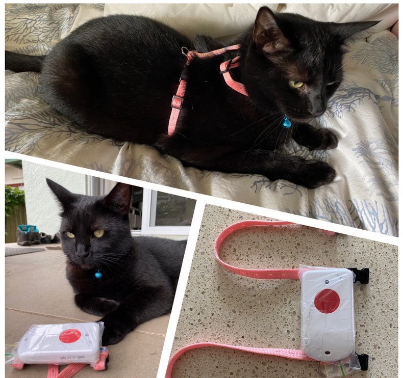

The [LGT-92 User Manual](http://www.dragino.com/downloads/downloads/LGT_92/LGT-92_LoRa_GPS_Tracker_UserManual_v1.5.5.pdf) provides some well documented steps for how to join the device to TTN LoRaWAN Network. It is however less specific about ways to affix to your cat (I chose a pet harness)

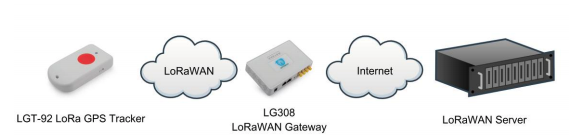*LGT-92 User Manual — Connections in a LoRaWAN Network*

The LGT-92 is shipped with a sticker with the the important default key, EUI and application keys.

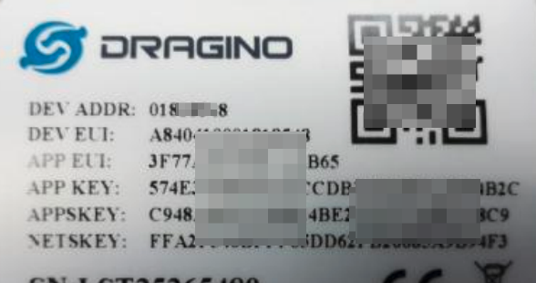*The LGT-92 with printed keys*

These keys are input into The Things Network portal so the device can register itself.

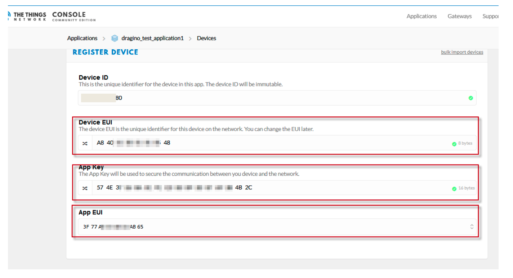*The Things Network portal*

Well, that’s pretty much it. Once the correct keys are entered, and the device switched on — location updates are broadcast every five minutes when the device moves. Messages from the LGT-92 device to the The Things Network are known as *uplink data*.

Within The Things Network portal we can see the uplink payloads, inclusive of the Snowy’s Latitude and Longitude.

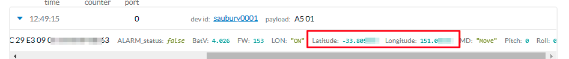*Snowy — we know where you are!*

## MQTT

MQTT is a machine-to-machine ”Internet of Things” protocol. It was designed as an extremely lightweight publish/subscribe messaging transport.

The Things Network uses MQTT to publish messages. That is, each location update goes onto an MQTT topic showing Snowy’s latest location.

I’m using [MQTT.fx](https://mqttfx.jensd.de/) to read the messages and the [TTN MQTT quick start](https://www.thethingsnetwork.org/docs/applications/mqtt/quick-start.html) instructions were very helpful in getting setup

. I generally only care about the payload_fields as this is where the useful data from the LGT-92 including Latitude, Longitude, Battery level, Motion etc.,

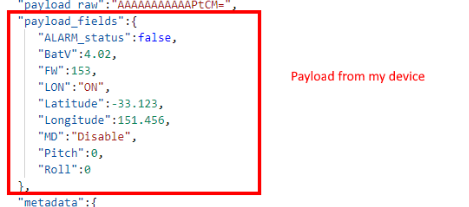*Data including location*

The payload also includes some interesting metadata, including the location of the gateway (or gateways) the received the radio transmission.

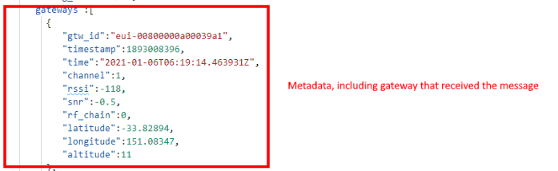

## Sleepy cats and motion detection

To conserve power, the LGT-92 GPS Tracker will only power up the GPS and broadcast location if movement is detected. By default, the device is set to movement detect mode (AT+MD=1). In this mode, if the tracker is not moving, it will uplink location info every 1 hour. If the tracker moves, it will uplink location info at every 5 minutes.

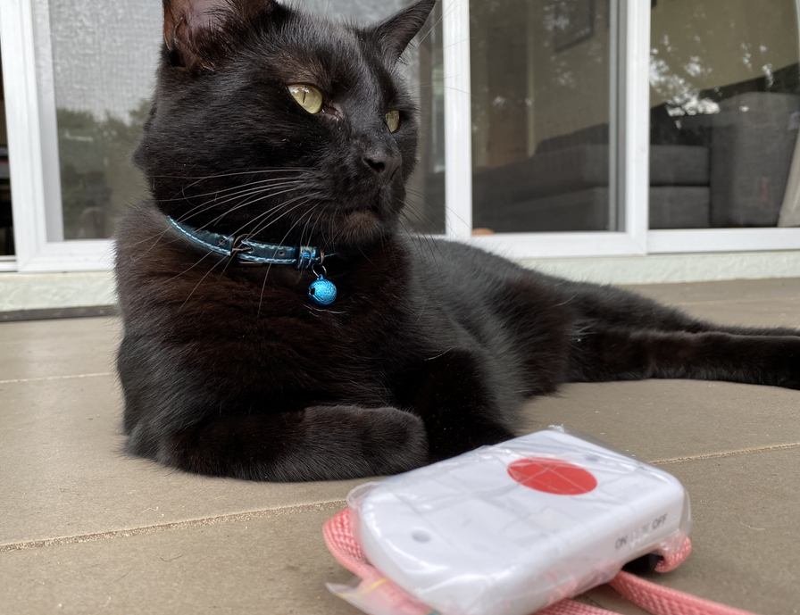*Snowy — unsure of the value of this project*

Now, Snowy the cat sleeps* a lot. *This meant that while the cat was conserving power so too was the tracker. If Snowy wanted a long nap I may not get a location update for hours!

I wanted the movement mode disabled, so the location was updated every 5 minutes regardless if Snowy was moving or asleep. This does impact battery life, but this wasn’t a huge issue.

To change the movement detection mode of the LGT-92 I would need to send a special *downlink message* (ie., a message from the Internet to the device). By following [these instructions](https://www.thethingsnetwork.org/docs/applications/http/) I was able to determine the downlink URL for my device

    export downlink_url="https://integrations.thethingsnetwork.org/ttn-eu/api/v2/down/saubury-001/mydownlink?key=ttn-account-v2.XXXXxxxxXXX"

To disable the [motion detection mode](http://www.dragino.com/downloads/downloads/LGT_92/DRAGINO_LGT92_AT_Commands_v1.5.3.pdf) I would need so send a downlink message of *AT+MD=0 *to my device. This sequence is encoded as ***0xA500*** which is ***pQA=*** in Base64. To schedule this downlink message I used this curl command

    curl -X POST --data '{"dev_id": "saubury0001",  "payload_raw": "pQA=" }'  ${downlink_url}

This downlink message is queued and visible in The Things Network portal

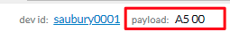*Downlink message*

With motion detection disabled on the device, Snowy’s location is now updated every 5 minutes regardless if Snowy was moving or asleep

## Summary & Next Steps

So far I have managed to get reliable location updates broadcast to a secure MQTT topic. These location messages are transmitted every 5 minutes.

But there is a lot still to do. I need to integrate these IoT messages, store them securely, process & refine the messages and finally plot the paths on a map. These are fairly routine problems, so I wanted to try out each of the major cloud providers (AWS, Azure & Google Cloud) to see how easy it was to build each solution.

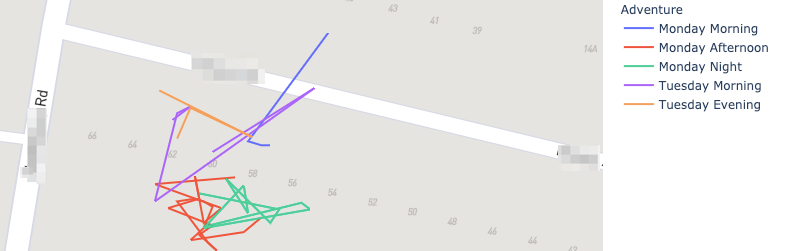*Example map built on AWS cloud technologies*

The next three articles in this blog series explores building an end to end project using native cloud services. There are good aspects of each cloud platform, plus a few stumbling blocks where things do not work as expected

* [Amazon Web Services — AWS Elastic Beanstalk, AWS IoT, DynamoDB and SageMaker]()

* Microsoft Azure — Azure Functions, Cosmos DB and Cosmic notebooks (**currently unpublished**)

* Google Cloud — Cloud Build, Cloud Functions, BigQuery and Geo Viz (**currently unpublished**)

## Code for this project

Thanks for reading this far. All code for this project available at

* [https://github.com/saubury/3clouds1cat/](https://github.com/saubury/3clouds1cat/)

## References and Links

* Shermayne Lee: [Internet of Dog](https://www.youtube.com/watch?v=vlaxUEfHkjo)

* [The Thing Network](https://www.thethingsnetwork.org)

* [LGT-92 LoRa GPS Tracker_User Manual](http://www.dragino.com/downloads/downloads/LGT_92/LGT-92_LoRa_GPS_Tracker_UserManual_v1.5.5.pdf)

* [MQTT.fx](https://mqttfx.jensd.de/)
