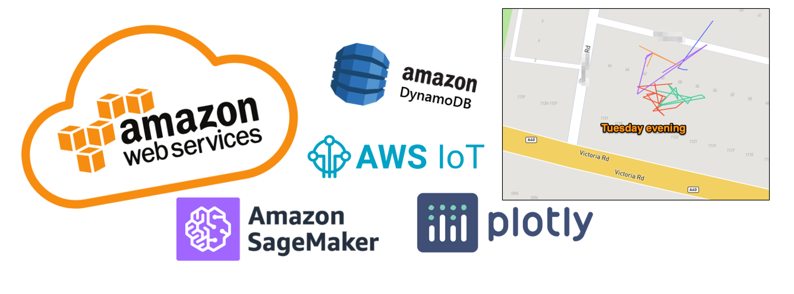
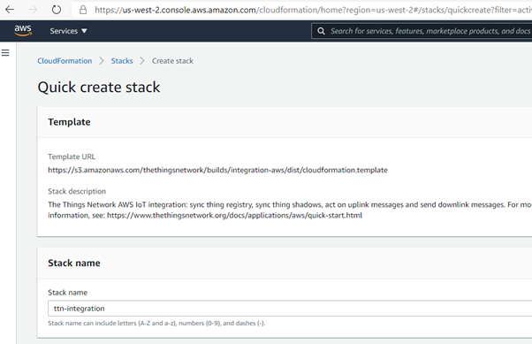
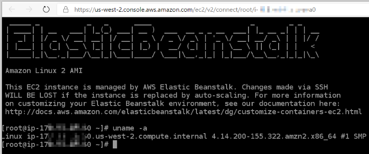
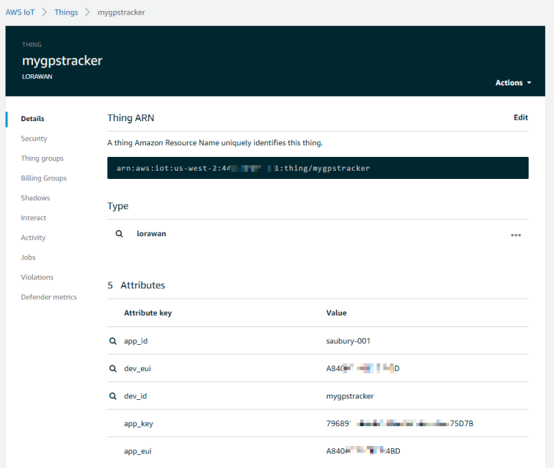
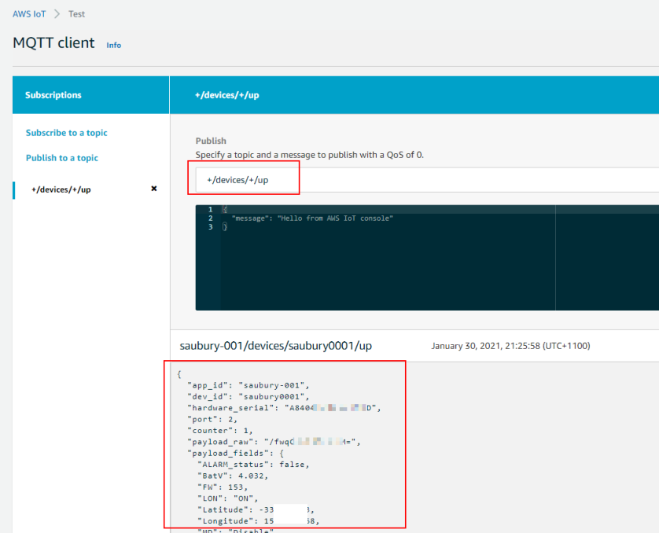
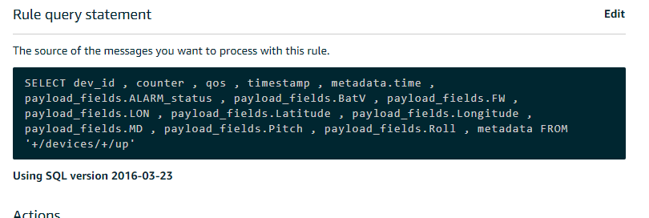
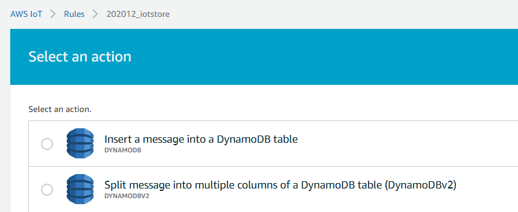
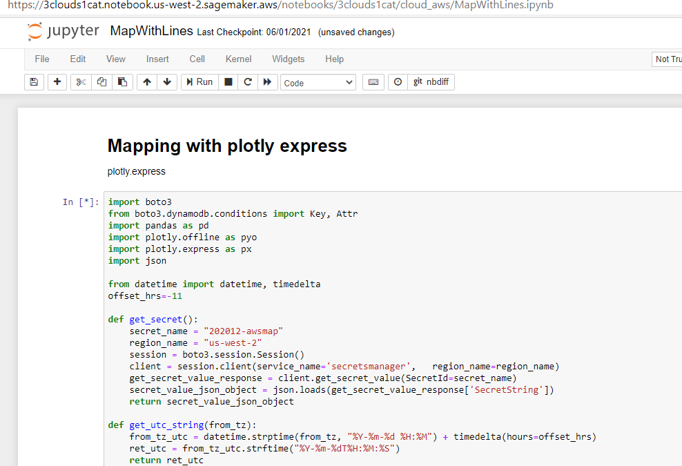
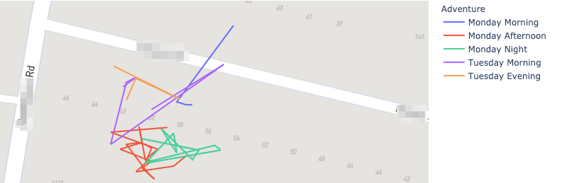

# Cat tracking with Amazon Web Services— AWS IoT, DynamoDB and SageMaker

If you read  [1 Cat, 3 Clouds — Where is Snowy sleeping (Part 1)]()
 you’ll know I’m trying to build a real-time location tracker for my cat.
> Following on from that initial blog (which described the hardware and networking), this “Part 2” article describes data processing with Amazon Web Services. I’ll be using native AWS services for data ingest, data processing and mapping visualisation to build a low cost pet tracking device to show Snowy’s location in real-time. Later articles will cover similar approaches in both Microsoft Azure & Google Cloud.

*AWS IoT, DynamoDB and SageMaker*

Today I’m describing my data build in AWS, however my goal for each cloud solution is identical

* Use cloud native services where possible — following “best practices” documentation (if available) to ensure the tools are demonstrated in their best light. Where there are conflicting approaches published, pick the most recent

* Write as little code as possible; and utilise cloud native build, deployment, logging and secrets management

* Build a data ingestion pipeline that will subscribe to location updates from my cat/device registered on [The Things Network](https://www.thethingsnetwork.org/) and write all location updates into a data store. Extra points for being able to manage the cat/device as an IoT “thing” rather than worrying about end-points (especially important if I want to track hundreds of cats!)

* Perform basic data analysis, such as selecting locations by time or cluster locations by frequency of visit

* Display maps where Snowy has spent her day

## What do we need to do?

Our pet tracker is working, with reliable location updates transmitted every 5 minutes. The data is captured by [The Things Network](https://www.thethingsnetwork.org/) (TTN), but I will need additional services from AWS to capture these messages, store them securely, process & refine the messages and finally plot the paths on a map.

### IoT Integration to AWS

My first task is IoT Integration to AWS. That is, bring my [LoRaWAN](https://www.thethingsnetwork.org/docs/lorawan/architecture.html) TTN messages into AWS. Fortunately there is a well documented AWS IoT [Integration ](https://www.thethingsnetwork.org/docs/applications/aws/)which integrates TTN to the AWS IoT service. This integration runs in my AWS account and bridges The Things Network community network into my private AWS account. This integration provided by TTN is quite elegant, and presents each of LoRaWAN physical device (such as Snowy’s locator) as an AWS IoT. Syncing the IoT “thing shadows” enables reporting from uplink messages.

The AWS TTN IoT integration is established with a provided AWS [CloudFormation template](https://ap-southeast-1.console.aws.amazon.com/cloudformation/home?region=ap-southeast-1#/stacks/create/review?filter=active&templateURL=https%3A%2F%2Fs3.amazonaws.com%2Fthethingsnetwork%2Fbuilds%2Fintegration-aws%2Fdist%2Fcloudformation.template&stackName=ttn-integration&param_AccountServer=https:%2F%2Faccount.thethingsnetwork.org&param_DiscoveryServer=discovery.thethings.network:1900&param_InstanceType=t2.micro&param_ThingShadowDeltaFPort=1&param_ThingSyncEnabled=true&param_ThingSyncInterval=10m&param_ThingTypeName=lorawan) which describes the final resources and their dependencies. The TL;DR is — click a link, cross fingers — and initial configuration for integrations to The Things Network is done.

*AWS IoT integration using CloudFormation from the Quick Start guide*

The template uses AWS Elastic Beanstalk (an orchestration service) to create a *t3.micro* EC2 instance to provide a sync service to the TTN devices. After a few minutes, my services are spun up.

The AWS IoT service provides a registry that helps manage “things”. In my case, my “thing” is a representation of the physical GPS tracker device attached to my cat. Following the Thing Registry [setup steps](https://www.thethingsnetwork.org/docs/applications/aws/thing-registry.html), I could register Snowy’s GPS tracker as a “thing” in the AWS IoT console. The thing acts a device shadow; whatever you do to the thing (such as read a value, or update a setting) is reflected in the physical device. If Snowy moves in the real work, the thing is updated to reflect her new location.

Information about a thing is stored in the IoT registry as JSON data. Here is an example a payload from Snowy’s tracker “thing” by subscribing to the “*+/devices/+/up*” topic. Within the JSON are location updates (latitude, longitude) along with acceleration data and battery voltage.

So, it looks like I’ve got my GPS tracker registering updates to the AWS IoT thing shadow, with some nicely formatted JSON data. Now let’s do some data processing.

An AWS IoT action rule can be triggered by the arrival of new IoT data. An action rule consists of an SQL select statement, a topic filter, and a rule action. My rule query is shown below, indicating the fields I wanted to extract

*AWS IoT rule query*

### Storing location updates in a DynamoDB table

IoT messages are “posted” to a payload topic, but they don’t hang around. As each time a new payload arrives, it replaces the former payload. I wanted to persist all my JSON payloads so database, so I would have a history of past locations. I decided to use DynamoDB as my document database to store my IoT JSON payloads

A *rule action* is used to take the information extracted via the *rule* and send it to another AWS service, such as DynamoDB. For simplicity, I chose the “dynamoDBv2” action, to split message into multiple columns of my DynamoDB table.

*Rule action choices*

Finally I can check the data is arriving by jumping over to the DynamoDB services console, and checking an item is created for each new message

*DynamoDB console*

## Map merriment with AWS SageMaker

So I’ve now got a regular feed of location updates being persisted to DynamoDB. This is a good start — I have both historic and current accurate location for Snowy, but I now want to start plotting her movements on a map.

Now my original plan was to use Amazon QuickSight for visualization of my data. However, the [geospatial capabilities](https://docs.aws.amazon.com/quicksight/latest/user/geospatial-data-prep.html) of QuickSight did not me to build a path map over Snowy’s movements throughout the day. I decided I would need to break out a bit of [Plotly expres](https://plotly.com/python/lines-on-maps/)s Python graphing libraries to get the desired result. So how to fire up a Python notebook in AWS?

AWS SageMaker provides managed Jupyter Notebook instances. SageMaker is typically used as managed machine-learning platform; but it is great for my needs for some querying and visualization within an Jupyter Notebook. This provides a simple way to write Python code, interact with data — and visualize the results.

### Interacting with DynamoDB with boto3 in Python

Within my notebook I would need to collect my location updates from DynamoDB into Python. Boto3 is the go-to AWS SDK for Python — a nice way for Python developers to interact with AWS services such as DynomoDB. For me, this is a quick way to query (select data, limit to particular timeframes) from DynamoDB and return the result into a data frame. Here’s the section of the notebook that collects Latitude and Longitude between a given date range (or *FilterExpression* in boto speak)

    dynamodb = boto3.resource('dynamodb')
    table = dynamodb.Table('saubury-001')

    fe = Key('time').between(time_from, time_to);
    response = table.scan(FilterExpression=fe)
    items = response['Items']

    for item in items:
        lat_array.append(item['Latitude'])
        lon_array.append(item['Longitude'])

### Lines on Maps — Plotly Express

For mapping, I wanted to plot locations on a map; along with a line showing the path taken between recorded locations. Plotly Express is a fantastic Python library, and provides API’s for creating different types of figures — including line paths over a map. There are heaps of mapping services available (Google Map, OpenStreetMaps etc.) but my use case required quite detailed maps tiles as I wanted detailed maps provided by the Mapbox tile service when zoomed into a very small area. Plotly provides support Mapbox which is convenient to use and provides detailed tiles for my local area. Mapbox maps in Python for my base layers required getting a free [Mapbox Access token](https://docs.mapbox.com/help/how-mapbox-works/access-tokens/).

You can see the entire notebook [here](https://github.com/saubury/3clouds1cat/blob/master/cloud_aws/MapWithLines.ipynb).

*Notebook — Mapping with plotly express*

And more importantly, here is a sample of the multi day tracks of Snowy. The generated Plotly Expres map can be zoomed to show details are a very local level. I also like that I can plot each morning/afternoon Snowy outing as an individual path in a new colour.

*Generated maps*

## TL;DR — AWS Conclusion

What’s it like building this data solution in AWS?

### The Good bits of AWS

There are some great attributes whilst building this data solution in AWS

• TheThingsNetwork integration — a simple out of the box integration by running the TTN provided AWS CloudFormation template made it really fast to get going. Extra points for making it so easy to represent cats in the IoT thing devices
 • Secure by default — nothing works until you have an IAM policy change. This is initially frustrating; but does force you to think which service needs to connect where
 • Secrets management — I loved the sample code generated within the AWS Secrets manager console. With my newly created secret I could view a Python code sample that illustrates how to retrieve my secret for pasting into my notebook. However, I did waste a bit of time with an annoying bug in this template code (see below)

### The not-so-good bits of AWS

Not everything is unicorns & muffins. There were some not so good bits when building this solution in AWS. Nothing major, but worth sharing some nitpicks

• Bewildering number of solutions — as a mature cloud providing a crazy large number of services, there is choice overload when trying to build a solution in AWS. It would be nice if there was an “opinionated approach” to delivering a build. Equally there are lots of blogs; documents etc., with no prioritisation or sunsetting. Getting rid of outdated blogs would be great to minimise confusion
 • Default secrets code for python mask IAM problems — the really cool code sample (generated within the AWS Secrets manager console) has an exception handler that hid my basic permission problem. I had failed to establish an IAM policy for my secret to be used in my notebook, but the generated Python code initially masked the issue 
 • Running a beanstalk EC2 machine is overkill — I would have preferred a “serverless” or event-driven approach to respond to location updates. Running a server all the time to respond to occasional events is wasteful (and costly)
 • Confusing git integration with Sagemaker — the documentation describes how to setup git integration for Sagemaker notebooks. However, add, commit, push are really inelegant steps within the notebook

## Closing Thoughts

Building a cat tracking with Amazon Web Services was heaps of fun. Lots of existing guides and established services such as AWS IoT, DynamoDB and SageMaker made it easy to work out where Snowy was sleeping.

There are good aspects of each cloud platform — so please look out for the next two articles in this blog series explores building a similar solution in

* Microsoft Azure — Azure Functions, Cosmos DB and Cosmic notebooks (**currently unpublished**)

* Google Cloud — Cloud Build, Cloud Functions, BigQuery and Geo Viz (**currently unpublished**)

## Code for this project

Thanks for reading this far. All code for this project available at

* [https://github.com/saubury/3clouds1cat/](https://github.com/saubury/3clouds1cat/)
