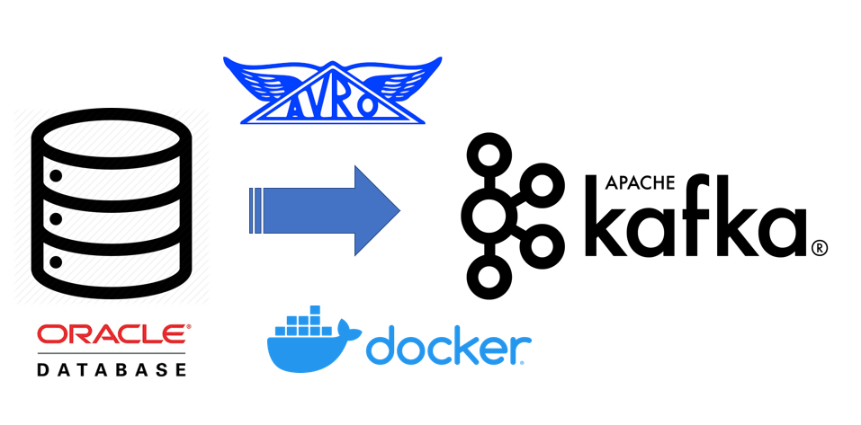
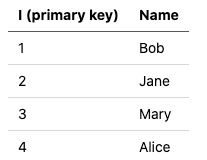
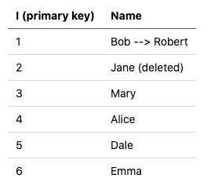
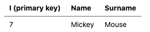

---
title: "Oracle to Kafka — Playing with Confluent’s new Oracle CDC Source Connector in Docker"
date: 2021-02-18T12:00:00+11:00
draft: false
categories: ["Kafka", "CDC"]
description: "Streaming Oracle data into Kafka"
dropCap: true
resources:
- name: featuredImage
  src: "00000000.png"
---

# Oracle to Kafka — Playing with Confluent’s new Oracle CDC Source Connector in Docker

It’s really exciting to have a new option for streaming Oracle data into Kafka. With Confluent releasing their “Oracle CDC Source Premium Connector” there’s a new way to capture data that has been added to, updated, or deleted from Oracle RDBMS with Change Data Capture (CDC). Think of this as a low touch way to stream both the Oracle data and schema changes into Kafka and Schema Registry.
> I put together some [examples](https://github.com/saubury/kafka-connect-oracle-cdc) so you can play with this entire pipeline in Docker. Docker is an easy-way to run a an end to end pipeline on your machine. I hope this demo gives you a glimpse of how Oracle CDC to Kafka works.

⚠️ Some of these components are paid offerings 💰 for production use. Both the [Oracle](https://www.oracle.com/downloads/licenses/standard-license.html) and [Confluent](https://www.confluent.io/software-evaluation-license/) license grant you free licence to play with this stuff as a developer for 30 days (disclaimer: I’m not a lawyer; nor do I play one on TV)

🛠 Code available at [https://github.com/saubury/kafka-connect-oracle-cdc](https://github.com/saubury/kafka-connect-oracle-cdc)

## Kafka Connect, CDC— What be this?

[Kafka Connect](https://docs.confluent.io/platform/current/connect/index.html) is an open source framework for streaming data between Apache Kafka and other data systems (such as databases). Confluent’s Oracle CDC Source Connector is a plug-in for Kafka Connect, which (surprise) connects Oracle as a source into Kafka as a destination.

This connector uses the [Oracle LogMiner](https://docs.oracle.com/en/database/oracle/oracle-database/19/sutil/oracle-logminer-utility.html#GUID-3417B738-374C-4EE3-B15C-3A66E01AE2B5) interface to query online and archived redo log files. That’s an Oracle specific way to stream both the DML and DDL directly from the redo of the database. This is similar to how the [Debezium](https://debezium.io/) project reads the Postgres write-ahead log or the MySQL binlog.

### Why not just use the Oracle JDBC Source Connector?

Robin Moffatt has written a great article on [How to Integrate Your Databases with Apache Kafka](https://www.confluent.io/blog/no-more-silos-how-to-integrate-your-databases-with-apache-kafka-and-cdc/) which provides a great discussion on the differences between a JDBC connector reading data from a database (such as Oracle) vs a log-based Change Data Capture (CDC) tool to extract changes.

The Oracle JDBC Connector is fine for getting a snapshot of a table. However, to identify changed or deleted rows with a JDBC connector is painful. Let’s just say you’ll quickly fall into a murky world of putting triggers on tables to determine what has changed … and no-one wants to do that.

The Oracle CDC Source Connector on the other hand is essentially listening to the recovery redo segment of the database. This allows for *most* DML (insert, update, delete) and *some* DDL (alter table) database events to be captured an Oracle database and produced into into Kafka and the Schema Registry.

### Oracle Versions

Worth highlighting that when this blog was written, the connector works with Oracle 11g, 12c and 18c but *not* Oracle 19c. For this demonstration I’m using Oracle 12c with pluggable databases.

## Let’s Play

### Clone this repo

    git clone [https://github.com/saubury/kafka-connect-oracle-cdc](https://github.com/saubury/kafka-connect-oracle-cdc)

    cd kafka-connect-oracle-cdc

## Get Oracle CDC Source Connector

Be sure to review the license and [download](https://www.confluent.io/hub/confluentinc/kafka-connect-oracle-cdc) the zip file for the Confluent Oracle CDC Source Connector

Unzip to confluentinc-kafka-connect-oracle-cdc (and remove any trailing version numbers)

    unzip ~/Downloads/confluentinc-kafka-connect-oracle-cdc-1.0.3.zip

    mv confluentinc-kafka-connect-oracle-cdc-1.0.3 confluentinc-kafka-connect-oracle-cdc

## Get Oracle Docker

Credit to [Stackoverflow](https://stackoverflow.com/questions/47887403/pull-access-denied-for-container-registry-oracle-com-database-enterprise) for explaining how to get Oracle working in Docker (well, at least in February 2021)

* log into [https://hub.docker.com/](https://hub.docker.com/)

* search “oracle database”

* click on “Oracle Database Enterprise Edition”

* click on “Proceed to Checkout”

* fill in your contact info on the left, check two boxes under “Developer Tier” on the right, click on “Get Content”

You should now be able to download an Oracle Docker image

    docker login --username YourDockerUserName --password-stdin
    <<Enter your password>>

    docker pull store/oracle/database-enterprise:12.2.0.1

## Docker Startup

You’re all set to startup the platform (which will start Oracle, Kafka, Kafka Connect, Schema registry etc.,)

    docker-compose up -d

## Setup Oracle Docker

Once the Oracle database is running, we need run a script to perform some setup. This SQL will turn on ARCHIVELOG mode, create some users, and establish permissions

First, ensure the database looks like it’s finished starting up (docker-compose logs -f oracle) and then run the following (for the curious, the SQL script is [here](https://github.com/saubury/kafka-connect-oracle-cdc/blob/master/scripts/oracle_setup_docker.sql) )

    docker-compose exec oracle /scripts/go_sqlplus.sh /scripts/oracle_setup_docker

## Sample Data

This SQL script also creates an EMP table, and adds four employees.

*The EMP table*

### Connector Configuration

Check the OracleCdcSourceConnector source plug-in is available

    curl -s -X GET -H 'Content-Type: application/json' http://localhost:8083/connector-plugins | jq '.'

And look for an occurrence of "class": "io.confluent.connect.oracle.cdc.OracleCdcSourceConnector"

All good — now it’s time to establish the SimpleOracleCDC connector. This configuration will initially snapshot the EMP table, and then listen to all redo activity (DML and DDL) against this table.

    curl -s -X POST -H 'Content-Type: application/json' --data @SimpleOracleCDC.json http://localhost:8083/connectors | jq

Check the status of the connector. You may need to wait a minute or so for the status to show up

    curl -s -X GET -H 'Content-Type: application/json' http://localhost:8083/connectors/SimpleOracleCDC/status | jq

## Check topic

If you have Kafka tools installed locally, you can look at the de-serialised AVRO like this

    kafka-avro-console-consumer --bootstrap-server localhost:9092 --topic ORCLCDB.C__MYUSER.EMP --from-beginning

Or if you don’t have the Kafka tools installed, you can launch kafka-avro-console-consumer via a container like (yes; this is all one line)

    docker-compose exec kafka-connect kafka-avro-console-consumer --bootstrap-server kafka:29092 --property schema.registry.url="http://schema-registry:8081" --topic ORCLCDB.C__MYUSER.EMP --from-beginning

The (simplified) output of kafka-avro-console-consumer should look something like. Four rows initially from the table are four records in Kafka

    {"I":"\u0001","NAME":{"string":"Bob"}}
    {"I":"\u0002","NAME":{"string":"Jane"}}
    {"I":"\u0003","NAME":{"string":"Mary"}}
    {"I":"\u0004","NAME":{"string":"Alice"}}

## Schema

Let’s see what schemas we have registered for the EMP table

    curl -s -X GET http://localhost:8081/subjects/ORCLCDB.C__MYUSER.EMP-value/versions/1 | jq -r .schema | jq .

Amongst other things, you’ll see version 1 of the schema has been registered like this

    "fields": [
        {
          "name": "I",
          "type": {
            "type": "bytes"
        },
        {
          "name": "NAME",
          "type": [
            "string"
          ]
        }

## Insert, update and delete some data

Let’s now insert more data, and try some updates and a delete.

Run docker-compose exec oracle /scripts/go_sqlplus.sh followed by this SQL

    insert into C##MYUSER.emp (name) values ('Dale');
    insert into C##MYUSER.emp (name) values ('Emma');
    update C##MYUSER.emp set name = 'Robert' where name = 'Bob';
    delete C##MYUSER.emp where name = 'Jane';
    commit;
    exit

## Updated Sample Data

This adds 2 rows to EMP table, updates 1 row, and deletes 1 row.

*Updated EMP table*

The (simplified) output of *kafka-avro-console-consumer* should look something like

    {"I":"\u0005","NAME":{"string":"Dale"},"op_type":{"string":"I"}}
    {"I":"\u0006","NAME":{"string":"Emma"},"op_type":{"string":"I"}}
    {"I":"\u0001","NAME":{"string":"Robert"},"op_type":{"string":"U"}}
    {"I":"\u0002","NAME":{"string":"Jane"},"op_type":{"string":"D"}

## DDL

So far we’ve seen DML applied to a table. Now let’s try some DDL to modify a table.

Run docker-compose exec oracle /scripts/go_sqlplus.sh followed by this SQL

    ALTER TABLE C##MYUSER.EMP ADD (SURNAME VARCHAR2(100));

    insert into C##MYUSER.emp (name, surname) values ('Mickey', 'Mouse');
    commit;

## Updated Sample Data

Our new row looks like this (note the new surname column)

*DDL applied to EMP table*

### Schema mutation

Let’s see what schemas we have registered now.

    curl -s -X GET http://localhost:8081/subjects/ORCLCDB.C__MYUSER.EMP-value/versions

Will show [1,2] — indicating two versions of the schema are available. We have data registered against version 1 and version 2 of the schema

    curl -s -X GET http://localhost:8081/subjects/ORCLCDB.C__MYUSER.EMP-value/versions/2 | jq -r .schema | jq .

Note, schema version 2 has this addition

    {
          "name": "SURNAME",
          "type": [
            "null",
            "string"
          ],
          "default": null
        }

### Tear Down

To tear down the containers

    docker-compose down

## Conclusion

Capturing data from an Oracle database into Kafka is a really common request. Having a Confluent supported CDC Source Connector is a great option to consider when you require a low touch way to stream both the Oracle data and schema changes into Kafka and Schema Registry.

Oh, and Docker is awesome !

## References

* [Oracle CDC Source Connector](https://www.confluent.io/hub/confluentinc/kafka-connect-oracle-cdc)

* [Oracle CDC Source Connector Configuration Properties](https://docs.confluent.io/kafka-connect-oracle-cdc/current/configuration-properties.html)

* [How to Integrate Your Databases with Apache Kafka](https://www.confluent.io/blog/no-more-silos-how-to-integrate-your-databases-with-apache-kafka-and-cdc/)

* [https://github.com/saubury/kafka-connect-oracle-cdc](https://github.com/saubury/kafka-connect-oracle-cdc)
