# Snowy’s eating — tweeting my cats weight & dining habits with a Raspberry Pi

Our cat Snowy 😸 has been enjoying her meals over winter. I wanted to start collecting data on her eating habits, and analyse her weight over time. This data is collected with food and cat weight measurements; alongside phots taken by two cameras. Data is collected and images processed locally using a Raspberry Pi. At the risk of body-shaming our cat, updates are posted regularly to [Twitter](https://twitter.com/SnowyBlackCat) #snowydata.

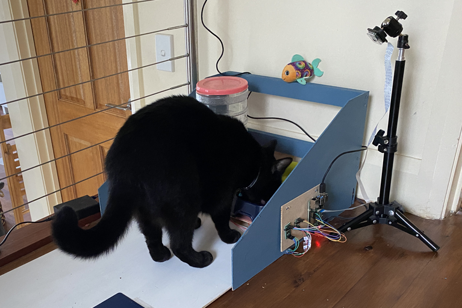*Snowy enjoying her food while being measured*

## Project Overview

There are two scales — one for weighing the cat; and an independent weight measure for her food. As Snowy enters the cat scale, an initial measurement is taken for her current weight along with an starting weight for her food. An overhead and lateral camera takes a photo every 5 seconds.

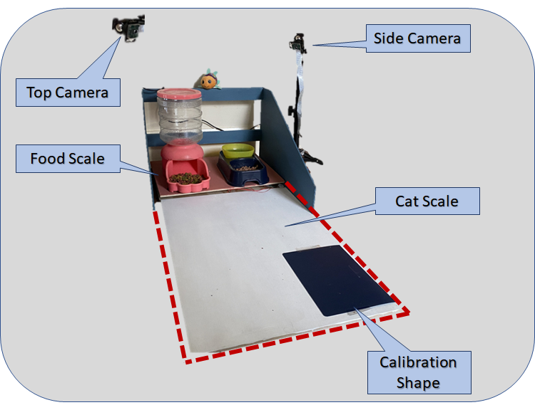*Diagram indicting two scales and camera placement*

When Snowy leaves the cat scale, a calculation is made between the initial and current cat and food weight measurements to determine how much food has been eaten and her current weight. Two camera images are selected, text is overlaid the photos — and a Tweet is sent to announce her latest meal.

<iframe src="https://medium.com/media/459210923619c80a05bf7bfc3d3f4a5e" frameborder=0></iframe>

## Hardware — how much food?

I needed to build two scales — one for the food and one for the cat. So another excuse for online [shopping](https://www.aliexpress.com/w/wholesale-10kg-load-cell.html) for a collection of load cells and load cell amplifiers.

Load cells are pretty neat. They measure weight (or, more accurately, directional force). Each load cell is able to measure the electrical resistance that changes in response to (and is proportional to) the force applied.

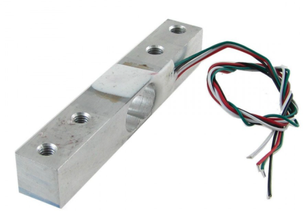*A “straight bar” load cell*

For weighting the food; I used a single “straight bar” load cell which can translate up to 1kg of pressure (force) into an electrical signal. To weigh the food I had the load cell mounted between two wooden boards. The weight of the food is measured by the strain resistance measured across the load cell.

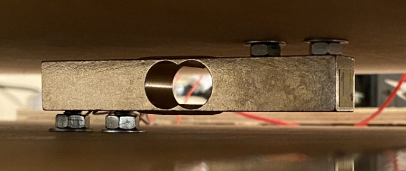*Load cell mounted between boards*

A load cell amplifier is used to get measurable data out from a load cell. I used an [HX711](https://learn.sparkfun.com/tutorials/load-cell-amplifier-hx711-breakout-hookup-guide/all) — which is an analogue-to-digital converter (ADC) designed to act as interface between the analogue world of weigh sensors to a digital input for the Raspberry Pi.

## Hardware — cat weight

To accurately weigh Snowy I needed a larger scale. I wanted a surface large enough for her body and tail so she could be weighted whist she was eating. The first step required measuring the length of a cat

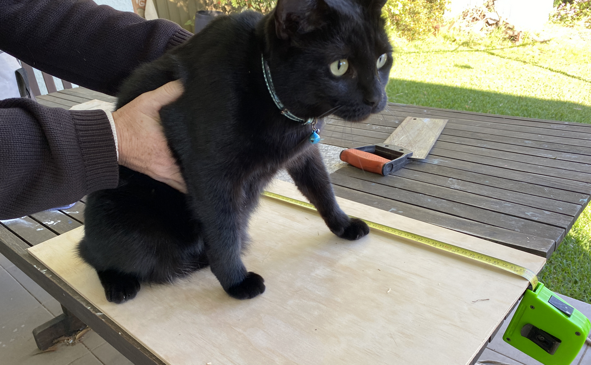*Snowy was not helpful when I tried to measure her length*

I used four load cell weighing sensors — one for each corner of the cat weighing station. The [50kg load cells and another HX711](https://www.aliexpress.com/item/32968926628.html) amplifier module was around $5. The peculiar thing about these sensors is they don’t sit flush to a surface, and the centre of each sensor needs a gap for it to flex when a load is applied. You can 3D print [a bracket](https://www.thingiverse.com/thing:2274593) — but I found I could build 4 brackets with some scrap wood cut with a Dremel.

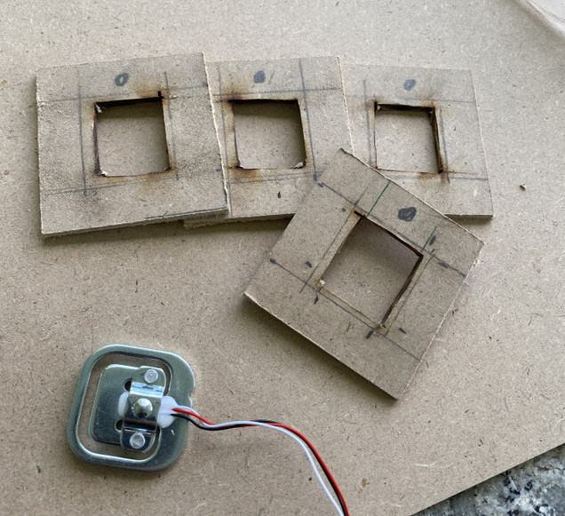*Offset bracket for load cell*

The wooden brackets provided sufficient clearance for the foot of the load cell to flex, while still holding the perimeter of the sensor.

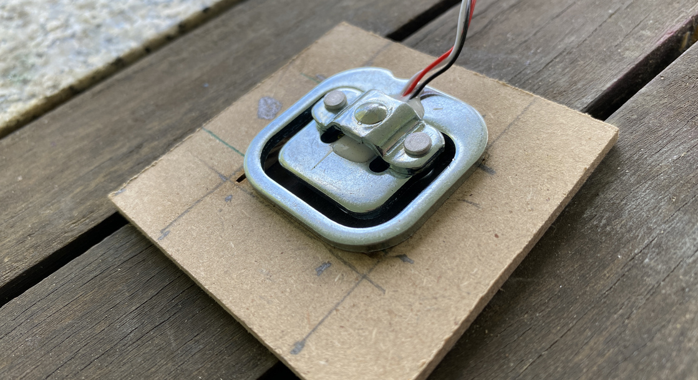*Closeup of wooden mounting bracket*

The four load cells are wired into a single circuit with the HX711 amplifier module in a [wheatstone bridge](https://en.wikipedia.org/wiki/Wheatstone_bridge) configuration — have a look at [this helpful blog](https://circuitjournal.com/50kg-load-cells-with-HX711) for the detailed steps.

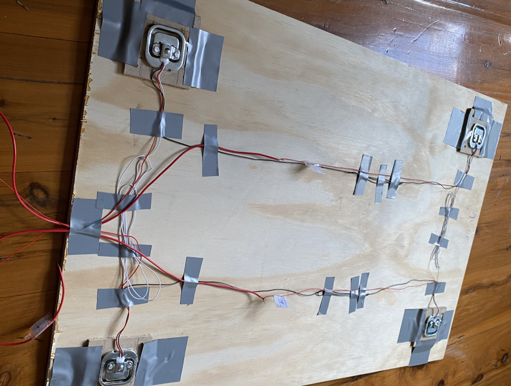*The four load cells are mounted to each corner and wired together*

Finally I was ready to connect the five load cells to the two HX711 amplifier modules — and in turn to the [Raspberry Pi](https://www.raspberrypi.org/); a tiny and very cheap computer. I found [this guide](https://tutorials-raspberrypi.com/digital-raspberry-pi-scale-weight-sensor-hx711/) very helpful for providing wiring details to build a digital Raspberry Pi scale.

*Two HX711 amplifier modules connected to the Raspberry Pi*

## Real world testing

My first experiment was a dismal failure. After waiting an eternity for Snowy to approach the weigh station, she quickly discovered a flaw in my design.

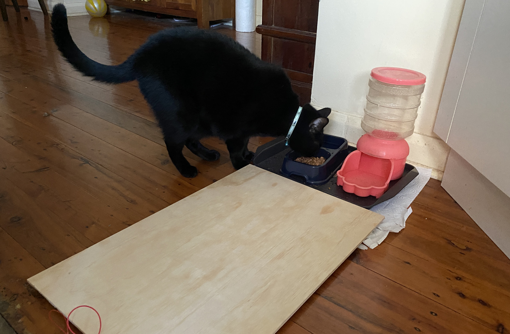*Snowy avoiding the scale in version 1*

To encourage Snowy to step onto the scale when eating, I placed small triangular walls on the side of her feed station. This worked well, and Snowy appreciated the additional privacy while eating

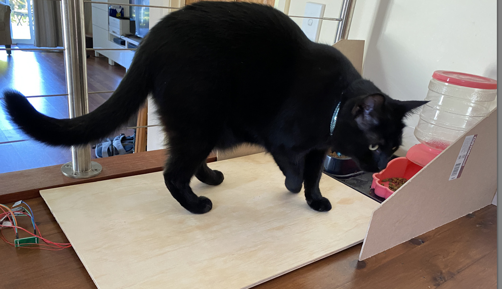*Small walls around her food encouraged Snowy to stand on the scale*

A camera was mounted above and next to the feed station — and the entire contraption was painted.

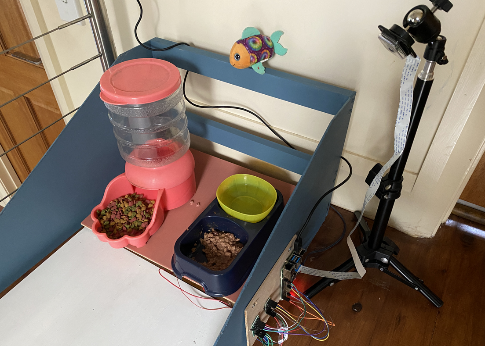*Final cat weigh station — now painted*

## What’s next

This blog covers the initial hardware steps for the ongoing [catfit data project](https://github.com/saubury/catfit). Further blogs will describe data processing, trend analytics and data visualisation.

## Links

* Project files: [https://github.com/saubury/catfit](https://github.com/saubury/catfit)

* Follow [Snowy The Cat (@SnowyBlackCat) / Twitter](https://twitter.com/SnowyBlackCat)

* [Build a digital Raspberry Pi Scale](https://tutorials-raspberrypi.com/digital-raspberry-pi-scale-weight-sensor-hx711/)
