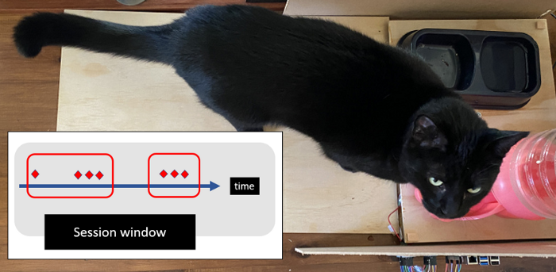
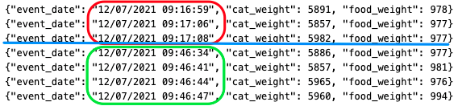
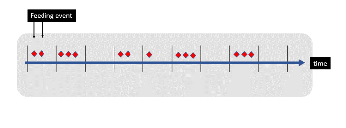
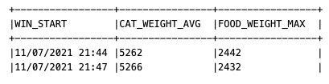
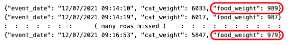
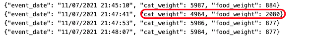
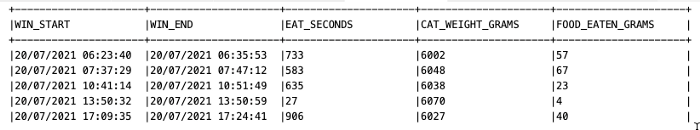

# Cleaning messy sensor data in Kafka with ksqlDB

> Collecting streaming data is easy — but understanding it is much harder! With months of 🐱 weight data captured I discovered sensor data can be very messy⚡. Let me share some of the real world data problems I encountered — and how I solved my stream processing & cat dining challenges with ksqlDB


*Snowy the cat — an expert in streaming data*


You may have seen me [tweeting my cats weight & dining habits with a Raspberry Pi](https://simon-aubury.medium.com/snowys-eating-tweeting-my-cats-weight-dining-habits-with-a-raspberry-pi-3218e340c20c). This small project captures the weight of both my cat and her food bowl and places these measurements into a Kafka topic about every second.

These weight measurements are pretty messy — and Snowy 😺 doesn’t want to stand still on the scale! She has been causing havoc with the measurement data by interfering with both the food scale and cat scale when eating. The four problems I needed to overcome

- Data type casting — forming strings into timestamps
- Windowing — finding the start and end of dining sessions
- Resequencing — handling refilling of food tray during the day
- Discarding — weight mismatch when the cat stands on the food scale

Fortunately the time series measurements are captured in an infinite event stream in Kafka. This gives me a chance to reprocess the stream to make sense of her weight and dining habits. Let me share some of the sensor data problems I encountered — and how I solved my stream processing cat dining challenges with ksqlDB

# Context — getting weight data into Kafka
As described in earlier the Raspberry Pi is constantly measuring the weight of the food and cat using load cells weight sensor. The [catfit](https://github.com/saubury/catfit) project is written in Python, so the code to write weight measurements looks something like the code below. TL;DR weight measurements are written to the feed_log Kafka topic roughly every second with cat and food values.

```
from confluent_kafka import Producer, KafkaError
import json

# Kafka Producer
producer_conf = {
'bootstrap.servers': config.bootstrap_servers, 
'sasl.username': config.sasl_username, 
'sasl.password': config.sasl_password,
'security.protocol': 'SASL_SSL', 
'sasl.mechanisms': 'PLAIN'
}

producer = Producer(producer_conf)
# Regularly save the cat & food weight measurement

producer.produce('feed_log',  value=json.dumps({"event_date": event_date.strftime("%d/%m/%Y %H:%M:%S"), "cat_weight": cat_weight, "food_weight": food_weight}))
```

I’m using [Confluent Cloud](https://www.confluent.io/confluent-cloud/) as a fully managed Kafka service; but the code would look almost identical if you were connecting to another Kafka cluster.

# Kafka Event stream processing with ksqlDB

Now I have a stream of time-based measurements streaming into Kafka, I want to understand Snowy’s eating habits. I could dump the feeding events into a database and then perform some analysis. A better approach would be [stream processing](https://en.wikipedia.org/wiki/Stream_processing) — which means I can write an application to respond to new data events at the moment they occur. I’m a big fan of [ksqlDB](https://ksqldb.io/) as a platform to create event streaming applications. I can perform stream processing data clean-up with a few lines of SQL (as opposed to writing a stream processor in Scala or Java).

# Create Stream
First job is to create a KSQL [stream](https://docs.ksqldb.io/en/latest/concepts/streams/) describing the Kafka feed_log topic. A KSQL stream is a simple way to describe the contents of a Kafka topic. It’s pretty self describing and looks something like …

```
CREATE STREAM feed_stream_raw 
(event_date varchar, cat_weight double, food_weight double) 
WITH (kafka_topic='feed_log', value_format='json');
```

When I created the project I had (foolishly) placed the timestamp of the events in a text field called event_date. In hindsight this was a bit silly, but I had already collected over a month of data — so I needed to convert it to a timestamp datatype. I got a little fancy and created a second stream called weight_stream with the converted datatype, and set the TIMESTAMP property to the expected value. I also set the serialization format to [AVRO](https://docs.ksqldb.io/en/latest/reference/serialization/#avro). Not only does this neatly register everything in a [schema registry](https://docs.confluent.io/platform/current/schema-registry/index.html), it also makes me feel like I’m [building an airplane](https://en.wikipedia.org/wiki/Apache_Avro#Logo) in my garage.

```
create stream weight_stream
with (timestamp='event_ts', value_format='avro') 
as 
select 'snowy' as cat_name
, stringtotimestamp(event_date, 'dd/MM/yyyy HH:mm:ss') as event_ts
, event_date
, cat_weight
, food_weight 
from debug_stream_raw ;
```

# Challenge 1 - Find the start and end of dining sessions
I want to find periods of time when Snowy if eating. If I was ambitious I’d train her to press a button at the end of her meal. Instead I’ll settle for using some stream processing magic to work out her dining sessions.

I’ll define an eating session as when Snowy is on the cat scale. That is, if the cat scale is indicating a 5.8kg fluffy mass is on the scale I can assume some eating is underway. When the weight (of the cat scale) drops to zero I can assume she has stopped eating. A zero weight means she has wondered off to have a nap somewhere.



*Eating windows — jumping from one session to another*


Events (such as periodic weight measurements) are simply a stream of numbers landing in a Kafka topic. I can use a windowing state store to aggregate all the records received so far within the defined window boundary. The window closes when a sufficient gap of inactivity (say 1 minute) has passed with near zero weight measurements.


*ksqlDB Session Windows*


A windowing state store is used to store the aggregation results per window — and allows me to determine how much food is consumed within each eating session. Here’s a quick idea of how to write a [time session window query](https://docs.ksqldb.io/en/latest/concepts/time-and-windows-in-ksqldb-queries/#session-window) in KSQL. This code is finding a period of activity separated by (at least) a 60 second gap of inactivity.

```
select avg(cat_weight) as cat_weight_avg
, max(food_weight) as food_weight_max
from  weight_stream 
window session (60 seconds) 
group by 1
emit changes;
```


*Two session windows*


# Challenge 2 — Ignore refilling of the food
A practical problem with the monitoring station, I need to refill 🍴 the food tray. This means the food weight can increase throughout the day, at fairly random times.


*An eating session spanning almost 3 minutes*


Fortunately I can ignore the actual weight of the food, as I really only care about the change of food weight during an eating window. As long as I know the beginning food weight and final food weight during an eating window we know how much Snowy has eaten during that meal. I can find the difference in food weight within a window like this …

```
select ...
, max(food_weight) - min(food_weight) as food_eaten
from  weight_stream
window ...
```

# Challenge 3— Stepping on the wrong scale
There are two independent scales — but there are times when Snowy leaves her sensor plate and places her weight on the food scale. Suddenly her measured weight will drop (by around 1kg) and the weight of the food will seem to increase.


*Data mismatch — cat stepping on food plate*


I initially tried to account for this momentary difference by calculating the shifted mass. But after a bit of tinkering I decided it was easier to simply ignore these spurious events with some boundary checks. To only keep the “sensible” events I can use a predicate like this …

```
select ..
from  weight_stream
where food_weight < 1100 and cat_weight > 5800 and cat_weight < 6200
...
```

# Putting it all together
I now have a stream of events, grouped into eating session windows. I’ve excluded the rogue data and calculated the food consumed for each meal. I can materialize the result into a KSQL table which represents a snapshot (a point in time) of how much food was eaten within a window

```
create table cat_weight_table 
as 
select avg(cat_weight) as cat_weight_avg
, max(food_weight) - min(food_weight) as food_eaten
from  weight_stream 
window session (600 seconds) 
where food_weight < 1100 and cat_weight > 5800 and cat_weight < 6200
group by cat_name
having count(*) > 4;

select  timestamptostring(windowstart, 'dd/MM/yyyy HH:mm:ss') 
, timestamptostring(windowend, 'dd/MM/yyyy HH:mm:ss') 
, (windowend-windowstart) / 1000 as eat_seconds
, round(cat_weight_avg) as cat_weight_grams
, round(food_weight_max - food_weight_min) as food_eaten_grams
, cnt 
from cat_weight_table 
where cat_name = 'snowy';
Which results in a projection with clear dining sessions, the duration and weight of feed eaten.
```

*Eating sessions — with elapsed time and food eaten*


# Conclusion
An uncooperative cat plus unexpected load cell measuring inaccuracies meant I had a lot of messy data. A bit of stream processing with ksqlDB makes it much easier to work out when your cat needs to go on a diet.
Feel free to download and try out this project yourself (with data) — [catfit (github.com)](https://github.com/saubury/catfit/blob/master/ksqldb/ksqldb.md)