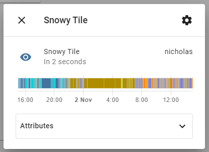

# Can ML predict where my cat is now — part 1

It’s 9am on a rainy Tuesday morning — can a simple ML model predict where my cat will be sleeping? How I used a bluetooth tracker, a dozen microcontrollers plus a bit of Python to predict where Snowy the cat would be napping in the next hour.

*Predicting where Snowy the cat is likely to be based on time and weather*

## Summary

With some inexpensive hardware (and a cat ambivalent to data privacy concerns) I wanted to see if I could train a machine learning (ML) model to predict where Snowy would go throughout her day.

Home based location & temperature tracking allowed me to build up an extensive history of which room she used for her favourite sleeping spots. I had a theory with sufficient data collected I’d be able to train an ML model to predict where the cat was likely to be.

This two part blog describes the hardware and software necessary to collect the data, build a prediction model and test the real-world accuracy of cat behaviour estimation. This first blog describes the hardware and data collection, and part 2 describes building the prediction model

## Hardware for room level cat tracking

The first task was to collect a *lot* of data on where Snowy historically spent her time — along with environmental factors such as temperature & rainfall. I set an arbitrary target of collecting hourly updates for around three months of movement in and around the house.

*Finding the room Snowy is in relies on a base station in each likely location*

Cat’s aren’t great at data entry; so I needed an automated way of collecting her location. I asked Snowy to wear a [Tile](https://www.thetileapp.com/en-us/products) — a small, battery powered bluetooth tracker. This simply transmits a regular and unique BLE signal. I then used eight stationary receivers to listen for the BLE Tile signal. These receiver nodes were [ESP32](https://en.wikipedia.org/wiki/ESP32) based presence detection nodes each running [ESPresense](https://espresense.com/). The nodes were placed in named rooms in and around the house (6 inside, 2 outside).

*A collection of ESP32 modules and a BLE Tile (white square)*

Each node constantly looking for the unique BLE signal of Snowy’s tile and measuring the received signal strength indicator ([RSSI](https://en.wikipedia.org/wiki/Received_signal_strength_indication)). The stronger the signal, the closer Snowy is to that beacon (either that, or she’s messing with the battery). If I got a few seconds of strong signal next to the study sensor for example, I could assume Snowy was likely very close to that room.

Each ESP32 module is powered by a micro-usb power supply and communicate back to the base station by joining the home WiFi network. The networking is important as multiple receivers can simultaneously receive a signal — and they need to determine which base station has the “strongest” signal.

## Hardware for logging environmental information

Snowy avoids the outside garden when it rains, and tends to fall asleep in the warm (but not hot) rooms of the house. I wanted to collect environmental conditions, as I figured temperature and rainfall would play a significant role in determining where Snowy would hang out.

*Xiaomi Aqara Temperature and Humidity Sensors*

I selected the [Xiaomi Temperature and Humidity Sensor](https://www.xiaomiproducts.nl/fr/xiaomi-aqara-temperature-and-humidity-sensor.html) as they run for months on a battery, and communicate over large distances via the [Zigbee](https://en.wikipedia.org/wiki/Zigbee) wireless mesh network. I placed these sensors throughout the house and in two external locations to capture outside conditions

## Integration — building a data collection platform

For the data collection platform I used [Home Assistant](https://www.home-assistant.io/) running on a Raspberry Pi. Home Assistant is a free and open-source software for home automation that is designed to be the central control system for smart home devices. I was able to track Snowy’s location via the [binary sensor](https://espresense.com/home_assistant) configuration. Essentially the room based beacon receiving the strongest signal from Snowy’s BLE tile updates an MQTT topic with her current location.

*Home Assistant display of location*

For temperature and humidity measurements, I used the Xiaomi integration to get a constant update of room level environment conditions. (Worthy of another blog: TL;DR flash the Xiaomi Zigbee hub with [Tasmota](https://tasmota.github.io/docs/Zigbee/))

*Home Assistant display of temperature and humidity*

The TL;DR summary — with the support of the amazing Home Assistant and Tasmota community I was able to gather accurate cat location along with fine grained temperature and humidity readings.

## Data preparation — extracting data from Home Assistant

Home Assistant by default uses a SQLite database with a 10 day retention. I actually wanted to retain a lot more historic data to train the model. By modifying the [recorder integration](https://www.home-assistant.io/integrations/recorder/) I pushed all the data storage into a Postgres database with 6 months of retention.

<iframe src="https://medium.com/media/8584ec2b391047cbfe2c1041caa5fb2f" frameborder=0></iframe>

Home assistant stores each sensor update in the [states](https://www.home-assistant.io/docs/backend/database/) table. This is *really *fine-grained, with updates added every few seconds from all the sensors (in my case, around 18,000 sensor updates a day). My goal was to summarise the data into hourly updates — essentially a single (most prevalent) location, along with temperature and humidity readings.

I extracted the initial three months (SQL [here](https://github.com/saubury/cat-predictor/blob/master/sql/extract.sql)) of hourly location and environmental conditions to train the model.

*Extract of hourly location and environmental readings*

## What’s next in part 2

This first blog described the the method for locating Snowy and data collection platform. The next blog will describe building the prediction model, and how accurate can a ML model be when determining where a cat is likely to be.

*Snowy looking forward to reviewing the confusion matrix*
