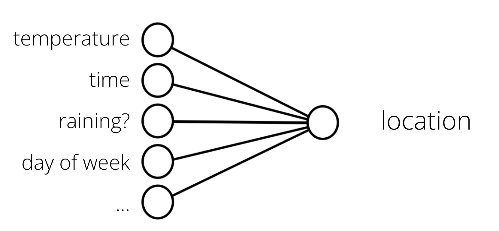
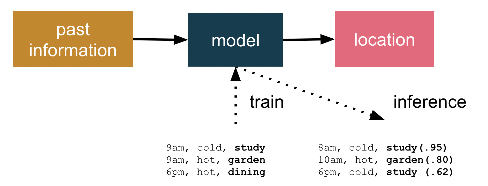
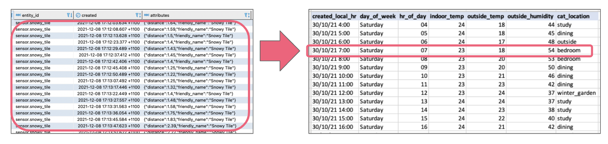
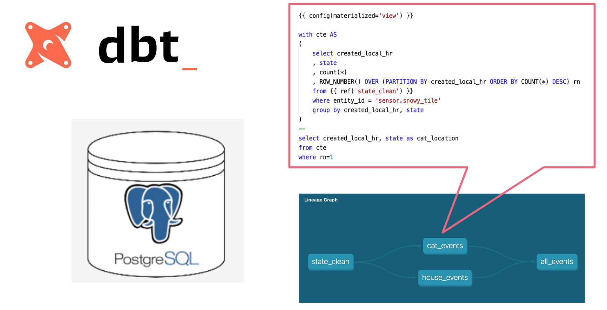
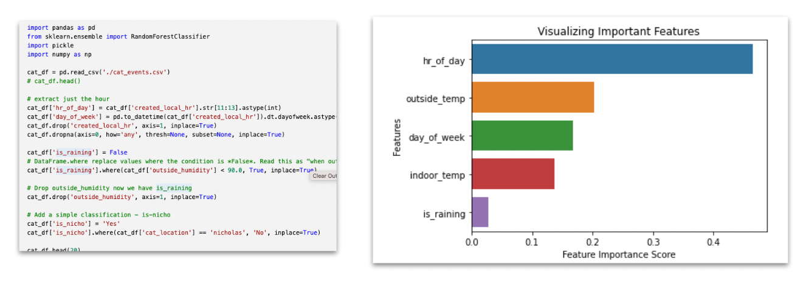
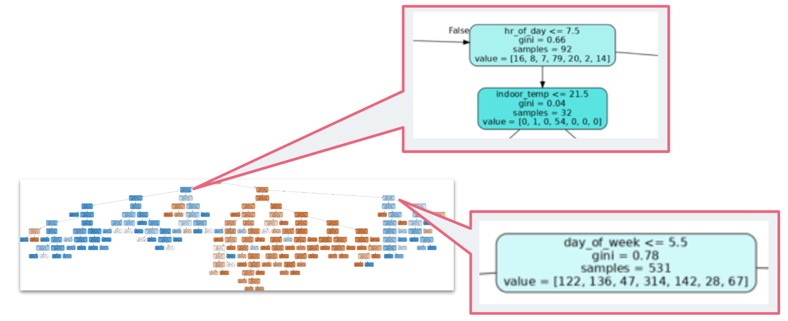

---
title: "Can ML predict where my cat is now — part 2"
date: 2022-07-01T10:22:20+11:00
draft: false
categories: ["Raspberry Pi", "Cat"]
description: "Where did I leave the cat?"
dropCap: true
resources:
- name: featuredImage
  src: "00000000.gif"
---

# Can ML predict where my cat is now — part 2

> Can ML predict where Snowy the cat would go throughout her day? With months of location & temperature data captured, this second blogs covers how to train a machine learning (ML) model to predict where Snowy would go throughout her day. For the impatient, you can skip directly to the prediction web-app here.

[Part 1 of this blog](/202202_cat_predition1) covered the hardware required build a history of which room she used for her favourite sleeping spots.

 

*Cat location prediction using Streamlit web apps*

## Where are we starting?

This [first blog](/202202_cat_predition1) described the the method for locating Snowy and data collection platform. I had collected over three months of location observations, with over **12 million** location, temperature, humidity and rainfall observations (I *may* have gone over the top with data collection).

The question I’ve been trying to answer, can I use these historic observations to build a prediction model of where she is likely to go? How confident can I be using a machine to predict where a cat is likely to be at predicting the hiding spot for Snowy?

## ML Bootcamp

Supervised learning is the ML task of creating a function that maps an input to an output based on example input-output pairs. In my case, I want to take historic observations about cat location, temperature, time of day etc., as inputs and find patterns … a function (inference) that predicts future cat location.

*Temperature, time and day — can it map to location?*

My assumption is the problem can be generalised from this data; e.g. future data will follow some common pattern of past cat behaviour (for a cat — this assumption may be questionable) .

*Cat location prediction*

The training uses past information to build a model that is a deployable artefact. Once a candidate model is trained, it can be tested for predication accuracy and finally deployed. In my case, I wish to create a web application to make predictions on where Snowy is likely to be napping.

What’s also important is that the model doesn’t have to explicitly output an absolute location, but can give its answer in terms of a confidence. If it output P(location:study) near 1.0 it’s confident, but values near 0.5 represent “unsure” about the confidence of predicting Snowy’s location.

## Summarising data with dbt

As covered in [part 1](https://simon-aubury.medium.com/can-ml-predict-where-my-cat-is-now-part-1-cfb194b51aab) — my data platform Home assistant stores each sensor update in the [states](https://www.home-assistant.io/docs/backend/database/) table. This is *really *fine-grained, with updates added every few seconds from all the sensors (in my case, around 18,000 sensor updates a day). My goal was to summarise the data into hourly updates — essentially a single (most prevalent) location, along with temperature and humidity readings.

*Summarising lots of data into hourly summaries*

Initially I was manually running the data processing with a bunch of SQL statements (like [this](https://github.com/saubury/cat-predictor/blob/master/sql/extract.sql)) to process the data. However, I found this fairly cumbersome as I wanted to retraining the model with newer location and environmental conditions. I settled on using the trusty data engineering tool [dbt](https://www.getdbt.com/) to simplify the creation of the SQL transformation in my database to make retraining more effective.

*The dbt lineage graph showing the transformation of data*

dbt handles turning these my select statements into tables and views, performing the transforming data already inside of my postgres data warehouse.

## Model training & evaluation

I used a Scikit-learn random [forest decision tree](https://www.datacamp.com/tutorial/random-forests-classifier-python) classification for my predictive model. Random forests creates decision trees on randomly selected data samples, gets prediction from each tree and selects the best solution by means of voting. It also provides a pretty good indicator of the feature importance.

If you look at the [python notebook](https://github.com/saubury/cat-predict/tree/master/notebooks) you can see the steps taken to assigns a class label to inputs, based on many examples it has been trained on from thousands of past observations of time of day, temperature and location.

*Python code segment for visualizing feature importance*

One really cool thing about the Scikit-learn decision tree models is how easy it is to visualise what’s going on. By visualizing the model features (above) I can see that “hour of the day” is the most significant feature in the model.

Intuitively this makes sense — time of day is likely to have the most significant impact on where Snowy is likely to be. The second most significant feature in predicting Snowy’s location is outside air temperature. Again this makes sense — too hot or too cold is likely to change is she wants to be outside. What I found surprising was the *least significant* feature was the is-raining feature. One possible explanation is the feature only makes sense during daylight hours, the is-raining won’t have an effect on the model when Snowy is sleeping inside at night.

It’s also possible to [visualize a decision tree](https://towardsdatascience.com/how-to-visualize-a-decision-tree-from-a-random-forest-in-python-using-scikit-learn-38ad2d75f21c) from a random forest in Python using Scikit-Learn.

*A visual decision tree showing the hour and day decision points*

Here in my display tree I can see the hour of the day is the initial decision point in the prediction — with 7:00am an interesting part of the algorithm. This is the time when alarm clocks go off in our household — and the cat is motivated to get up and look for food. Another interesting part of the tree is the “day of the week ≤ 5.5”. This equates to day of day of week being Monday through Friday — and again this part of the algorithm makes sense as we (and the cat) generally get up a bit later on week-ends

## The cat predictor web-app in Streamlit

With the model created, I now wanted to build a web application to predict Snowy’s location based on a range of inputs. [Streamlit](https://docs.streamlit.io/) is an open-source Python library that makes it easy to create web apps (without me having to learn a bunch of front-end frameworks). I added sliders and selection boxes to for feature values, such as day and temperature.

*Web application — with inputs as slider controls*

And voila — with a bit more [python code](https://github.com/saubury/cat-predict-app/blob/master/cat_predictor_app.py) I’ve created a Cat Prediction App; a web-app that predicts the likely location of Snowy the cat. I found some [excellent instruction](https://towardsdatascience.com/a-quick-tutorial-on-how-to-deploy-your-streamlit-app-to-heroku-874e1250dadd)s to deploy my Streamlit app to Heroku. So I can now [share my Cap Predicator app](https://cat-predict-app.herokuapp.com/) with the world!

## Links to code

Hope you find this blog and code helpful for all your pet location prediction needs

* Data platform and ML prediction: [https://github.com/saubury/cat-predict](https://github.com/saubury/cat-predict)

* Streamlit App: [https://github.com/saubury/cat-predict-app](https://github.com/saubury/cat-predict-app)
