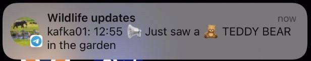

Wildlife monitoring is critical for keeping track of population changes of vulnerable animals. As part of the Confluent Hackathon ʼ22, I was inspired to investigate if a streaming platform could help with tracking animal movement patterns. The challenge was to examine trends in identified species and demonstrate how animal movement patterns can be observed in the wild using Apache Kafka® and open source dashboarding.

Note : This article was originally written and published for the [Confluent blog](https://www.confluent.io/blog/real-time-detection-monitoring-with-apache-kafka/).

*Dashbaord with upding animal counts*

I’ve been using Kafka in my “day job” for many years, building streaming solutions in retail, telemetrics, finance, and energy — but this hackathon challenged me to build something new and novel. The goal was ambitious. Before scaling up to monitor and alert on more exotic creatures, I initially chose to test the viability at a smaller scale by tracking wildlife in my own back garden.

*Simplified archiecture diagram*

## Backyard animal detection

To test the viability of the project, I built a “backyard monitoring” experiment using a Raspberry Pi along with an attached camera. The images were processed locally to identify and classify animals, with the observation events published to [Confluent Cloud](https://www.confluent.io/confluent-cloud/tryfree/) for stream processing.

This project used TensorFlow Lite with Python on a Raspberry Pi 4 to perform real-time object classification using images streamed from the attached Raspberry Pi camera. TensorFlow is an open source platform for machine learning, and TensorFlow Lite is a slimmed-down library suitable for deploying models on low-powered, battery-operated edge devices such as a Raspberry Pi. TensorFlow also has a great number of community resources, so I was able to make use of a detection model already pre-trained to detect numerous animals, including zebras, elephants, cats, dogs and more importantly, teddy bears.

I deployed a small Python application to run on the Raspberry Pi. The application continuously captures images from the camera — and each detected animal is given an object detection score. To connect the Raspberry Pi to the Kafka cluster, I used confluent_kafka API, which is a powerful Python client library for interacting with Kafka. With some basic setup (and some secret tokens for connecting) my Python application acts as a Kafka producer. Whenever an animal is detected, be it an elephant, zebra, kangaroo, or household cat, it is sent as a new record to the objects topic.

Once tested, I deployed the Raspberry Pi, camera, and battery into the “field” ( aka my backyard) to monitor the local wildlife. This worked surprisingly well, capturing the cats, dogs, and several birds that appeared during the week of testing.

## Peeking into zoo wildlife

I was happy with the minimal viable product (MVP), but was disappointed I hadn’t spotted any exotic animals in my local garden. To increase the variety of animal encounters, I deployed a second Kafka producer, but this time connected to a webcam at a local zoo. Live animal webcams provide a great source of video feeds with an increased likelihood of spotting giraffes, elephants, and zebras over what may be roaming in my back garden. Similar to the Python application described earlier, a stream of webcam images provided a great source of interesting animal encounters that could be detected with the TensorFlow object classification. Regardless of the source, animal detection events were sent to a shared Kafka cluster with a payload describing the image source and animals detected.

    {
      "camera_name": "zoo-webcam",
      "objects_count": {
        "elephant": 1,
        "zebra": 2
      }
    }

*Elephants and zebras with identifed JSON stream*

## Animal crossing — the stream processing edition

So I now had two Kafka producers sending animal detection events into a Kafka cluster, and my next challenge was to intercept the animals detection payloads. The goal was to understand the population observations over short time periods (such as animals seen this hour) and longer-term trends (such as population changes day on the day). I elected to use [ksqlDB](https://ksqldb.io/) to help transform the raw objects topic into some meaningful observations.

The first task was to declare an objects stream in ksqlDB—allowing me to author SQL statements against the underlying Kafka objects topic.

    create stream objects (camera_name VARCHAR, objects_found VARCHAR, objects_count VARCHAR) 
    WITH (KAFKA_TOPIC='objects', VALUE_FORMAT='json');

The objects identified by the Raspberry Pi and webcam were transported as JSON records. Understanding the number and variety of animals identified in each Kafka record required digging into the JSON. Fortunately, ksqlDB has a handy EXTRACTJSONFIELD function to retrieve nested field values from a string of JSON. It returns the number of each animal if the field key exists in that message; otherwise, it returns NULL. The following is an example of extracting counts of each animal into appropriately named fields:

    create stream animals as
    select camera_name
    , objects_count
    , cast(extractjsonfield(objects_count, '$.elephant') as bigint) as elephant
    , cast(extractjsonfield(objects_count, '$.bear') as bigint) as bear
    , cast(extractjsonfield(objects_count, '$.zebra') as bigint) as zebra
    , cast(extractjsonfield(objects_count, '$.giraffe') as bigint) as giraffe
    , cast(extractjsonfield(objects_count, '$.teddybear') as bigint) as teddybear
    from objects;

Something I noticed during testing was that the TensorFlow detection didn’t always detect all the animals in each frame. Two animals in the frame were often only detected as a single animal. I discovered I could “smooth” out the observations from the detection model by finding the highest count of each animal type within a sliding 30-second window. This was achieved by defining a tumbling window to count the number of each animal that had been observed in the time window. I figured it was appropriate to call this the zoo table.

    create table zoo as
    select camera_name
    , max(elephant) as max_elephant
    , max(bear) as max_bear
    , max(zebra) as max_zebra
    , max(giraffe) as max_giraffe
    , max(teddybear) as max_teddybear
    from animals
    window tumbling (size 30 seconds)
    group by camera_name
    emit changes;

Due to the limited processing on the Kafka producer, it was common to undercount the number of animals seen in consecutive frames of the video. By adding the max ksqlDB function I could create a table to project the highest occurrence count of each animal seen in the time window.

## Visualizing

With animal observations running and stream transformations deployed I moved on to building the analytics system. To complete the project I wanted to create a live dashboard, with animal counts and a visual image of population trends over time. A Kibana dashboard was ideal, so I just needed to populate the underlying Elasticsearch indexes to create a visual analytics dashboard.

I wanted a simple way to send the Kafka data onwards to my analytics dashboard. Kafka Connect is a framework for connecting Kafka with external systems such as relational databases, document databases, and key-value stores. I used the Kafka Connect Elasticsearch connector to send both the animals and zoo Kafka topics to Elasticsearch indexes. Once configured, the connector consumes records from the two Kafka topics and writes to a corresponding index in Elasticsearch. With the Elasticsearch index created and populated, a Kibana dashboard provides a great way to visualize the mix of animals, and the trending population of the zoo.

## Alerting for the ultra-rare teddy bear sighting

With the detection, transformation, and visualization complete for the wildlife monitoring system, there was still an opportunity for one last feature: rare animal alerting!

In addition to the more traditional animals, I noticed the detection model I was using had the ability to identify teddy bears. This provided an ideal situation to demonstrate exceptional processing conditions — after all, what’s more rare than the arrival of a teddy bear in the back garden?

Inspired by [Building a Telegram Bot with Apache Kafka](https://dev.to/rmoff/building-a-telegram-bot-with-apache-kafka-go-and-ksqldb-4and), I set up a Telegram bot to alert me when a rare animal is sighted — or at least send a phone push notification to my phone if a teddy bear is seen in the garden.

To create the special notification simply required a new ksqlDB stream. The teddytopic stream contains a recording signifying the arrival of a teddy bear.

    create stream teddytopic as 
    select '📢 Just saw a 🧸 TEDDY BEAR in the garden' as message 
    from animals 
    where teddybear > 0

Next, I wanted to build the alerting mechanism when the accompanying teddytopic Kafka topic acquired a record when an “endangered” teddy bear was sighted.

The [Telegram Bot API](https://core.telegram.org/bots/api) allows me to create managed bots for interacting with Telegram — a popular messaging service. To call Telegram I needed to create a Kafka wildlife bot, which provides an HTTP-based interface to let me know instantly when something novel had been observed. With the bot created, I used the Kafka Connect HTTP Sink Connector to make an HTTPS API call for each record in the teddytopic topic. Once configured, the connector consumes records from Kafka topic, sending the record value in the request body to the configured http.api.url. In this case, the endpoint was a preconfigured api.telegram.org.

With these steps completed, I get instant notification on my phone whenever a rare teddy bear is observed.

## Takeaways

Building this project as part of the Confluent Hackathon ʼ22 was both a great learning experience and a fun way to mix together some impressive technologies. Combining cheap computing devices and open source machine learning libraries along with the Kafka streaming platform provides a new tool to examine trends in animal population and movement observations.

Although wildlife watcher is a simple proof of concept, I hope a project like this demonstrates how incredible components can be incorporated quickly. Stream processing with ksqlDB, the flexibility of Confluent Cloud, and the integration of data systems with Kafka Connect allowed me to build a fun project with less than 200 lines of code and perhaps contribute a small part in helping to solve real-world wildlife challenges.

## Links to code

* [GitHub project](https://github.com/saubury/wildlife-watch)
