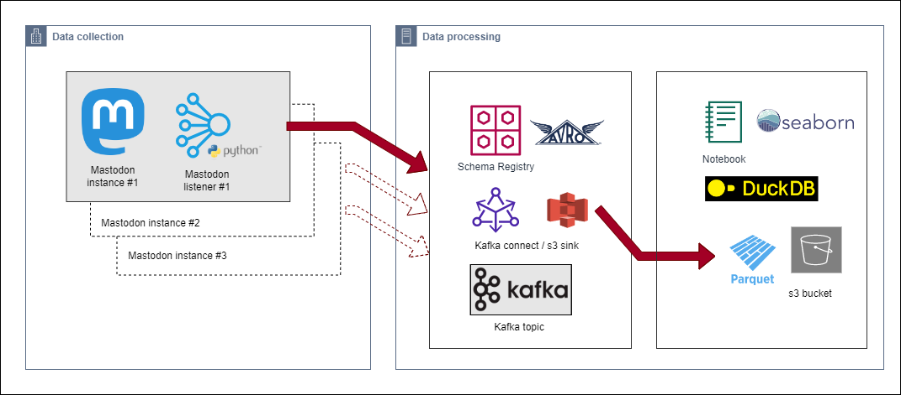
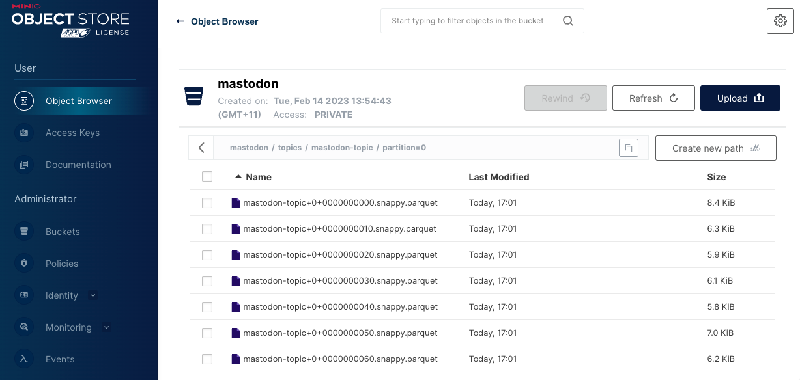
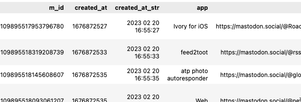
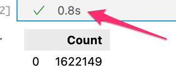
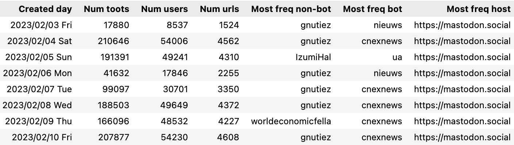
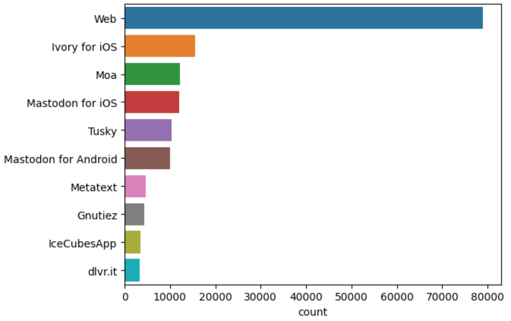
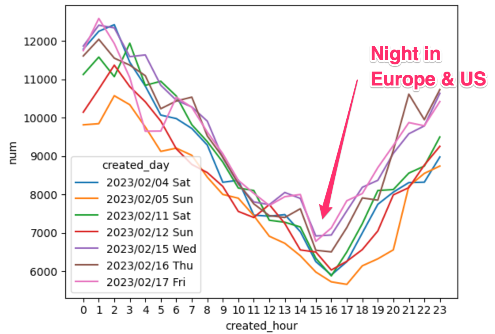
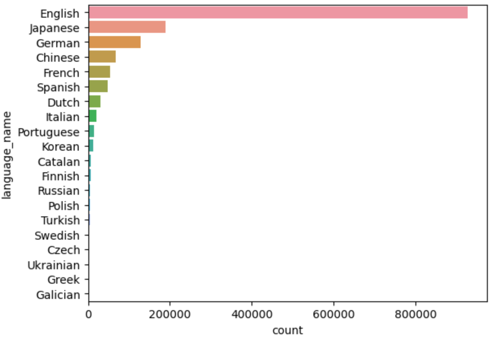
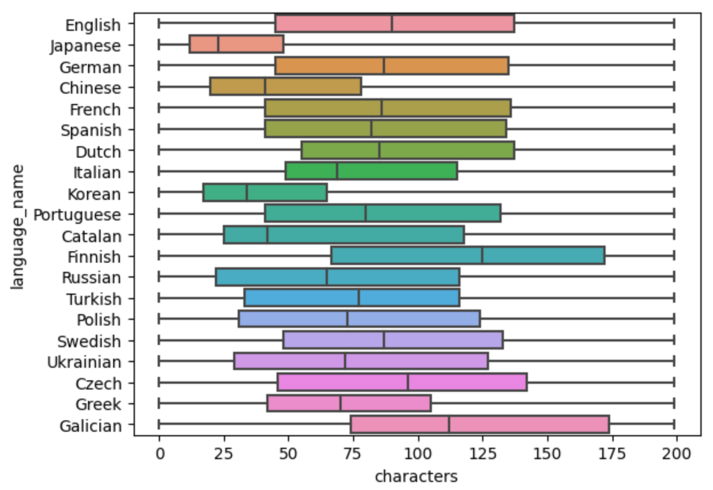

# Mastodon usage 

*Counting toots with Kafka, DuckDB & Seaborn 🐘🦆📊*

Mastodon is a decentralized social networking platform. Users are members of a specific Mastodon instance, and servers are capable of joining other servers to form a federated social network.
> I wanted to start exploring Mastodon usage; and perform exploratory data analysis of user activity, server popularity and language usage. I used distributed stream processing tools to collect data from multiple instances to get a glimpse into what’s happening in the [fediverse](https://en.wikipedia.org/wiki/Fediverse).

This blog covers the tools for data collection and data processing ([Apache Kafka](https://kafka.apache.org/) stream processing). If this doesn’t interest you you can jump straight to the [data analysis](#data-analysis) ([DuckDB](https://duckdb.org/) and [Seaborn](https://seaborn.pydata.org/)). For the enthusiastic you can [run the code](https://github.com/saubury/mastodon-stream)


### Tools used

* [Mastodon.py](https://mastodonpy.readthedocs.io/) — Python library for interacting with the Mastodon API
* [Apache Kafka](https://kafka.apache.org/) — distributed event streaming platform
* [DuckDB](https://duckdb.org/) — in-process SQL OLAP database and the [HTTPFS DuckDB extension](https://duckdb.org/docs/extensions/httpfs.html) for reading remote/writing remote files of object storage using the S3 API
* [MinIO](https://min.io/) — S3 compatible server
* [Seaborn](https://seaborn.pydata.org/) — visualization library

## Data collection — the Mastodon listener

ℹ️ If you’re not interested in the data collection … jump straight to the [data analysis](#data-analysis)

*Data collection architecture*

There is a [large collection](https://joinmastodon.org/servers) of Mastodon servers with a wide variety of subjects, topics and interesting communities. Accessing a public stream is generally possible without authenticating, so no account is required to work out what’s happening on each server.

In the decentralized Mastodon network, not every message is sent to every server. [Generally](https://commons.wikimedia.org/wiki/File:Mastodon_timelines.png), public toots from instance-A will only be sent to instance-B if a user from B follows that user from A.

I wrote a python application mastodonlisten to listen for public posts from a given server. By running multiple listeners I could collect toots from both popular and niche instances. Each python listener collects public toots from that server to and publishes to a private Kafka broker. To illustrate how multiple Mastodon listeners can be run in the background like this:

```console
python mastodonlisten.py --baseURL https://mastodon.social --enableKafka &
    
python mastodonlisten.py --baseURL https://universeodon.com --enableKafka &
    
python mastodonlisten.py --baseURL https://hachyderm.io --enableKafka &
```

## Kafka Connect

I’ve now got multiple Mastodon listeners feeding public posts from multiple servers into a single Kafka topic. My next task is to understand what’s going on with all this activity from the decentralised network.

I decided to incrementally dump the “toots” into Parquet files on an S3 object store. Parquet is a columnar storage that is optimised for analytical querying. I chose to use Kafka Connect to streaming data between my Kafka topic and land the data into S3 using the S3SinkConnector

That sounds like a lot of work — but the TL;DR is with a bit of configuration, I can instruct Kafka Connect to do everything for me. To consume the mastodon-topic from Kafka and create a new parquet file on S3 every 1000 records I can accomplish with this configuration

```json
{
    "name": "mastodon-sink-s3",
    "connector.class": "io.confluent.connect.s3.S3SinkConnector",
    "topics": "mastodon-topic",
    "format.class": "io.confluent.connect.s3.format.parquet.ParquetFormat",
    "flush.size": "1000",
    "s3.bucket.name": "mastodon",
    "aws.access.key.id": "minio",
    "aws.secret.access.key": "minio123",
    "storage.class": "io.confluent.connect.s3.storage.S3Storage",
    "store.url": "http://minio:9000"
}
```

To check this is all working correctly, I can see new files are being regularly created by looking in the MinIO web-based object browser.

*MinIO web-based object browser*

## Data analysis

Now we have collected a week of Mastodon activity, let’s have a look at some data. These steps are detailed in the [notebook](https://github.com/saubury/mastodon-stream/blob/main/notebooks/mastodon-analysis.ipynb)
> ⚠️ Observations in this section are based on naive interpretation on a few days worth of data. Please don’t rely on any of this analysis, but feel free to use these techniques yourself to explore and learn

Firstly, some quick statistics from the data collected over 10 days (3 Feb to 12 Feb 2023)

* 🔢 Number of Mastodon toots seen 1,622,149
* 👤 Number of unique Mastodon users 142,877
* 💻 Number of unique Mastodon instances 8,309
* 🌏 Number of languages seen 131
* ✍️ Shortest toot 0 characters, average toot length 151 characters and longest toot 68,991 characters (If you’re curious, the longest toot was a silly comment followed the repeating the same emoji 68,930 times)
* 📚 Total of all toots 245,245,677 characters
* 🦆 DuckDB memory used to hold **1.6 million toots is just 745.5MB** (which is tiny!)
* ⏱ Time it takes to calculate the above statistics in a single SQL query is** 0.7 seconds** (wow — fast!)

DuckDB’s Python client can be used [directly in Jupyter notebook](https://duckdb.org/docs/guides/python/jupyter). The first step is import the relevant libraries. DuckDB Python package can run queries directly on Pandas. With a few [SqlMagic](https://www.datacamp.com/tutorial/sql-interface-within-jupyterlab) settings it’s possible to configure the notebook to directly output data to Pandas

```sql
%load_ext sql
%sql duckdb:///:memory:
%config SqlMagic.autopandas = True
%config SqlMagic.feedback = False
%config SqlMagic.displaycon = False
```

Plus we can use the [HTTPFS DuckDB extension](https://duckdb.org/docs/extensions/httpfs.html) for reading remote/writing remote files of object storage using the S3 API

```sql
%%sql
INSTALL httpfs;
LOAD httpfs;
```

## Establish s3 endpoint

Here we’re using a local [MinIO](https://min.io/) as an Open Source, Amazon S3 compatible server (and no, you shouldn’t share your secret_access_key). Set the S3 endpoint settings like this

```sql
%%sql
set s3_endpoint='localhost:9000';
set s3_access_key_id='minio';
set s3_secret_access_key='minio123';
set s3_use_ssl=false;
set s3_region='us-east-1';
set s3_url_style='path';
```

And I can now query the parquet files directly from s3

```sql
%%sql
select *
from read_parquet('s3://mastodon/topics/mastodon-topic/partition=0/*');
```

*Reading parquet from s3 without leaving the notebook*

This is pretty cool — we can read the parquet data directly, which is sitting in our S3 bucket.

## DuckDB SQL to process Mastodon activity

Before moving on, I had a bit of data cleanup which I could do within DuckDB, loading remote parquet files (from s3).

* Map the ISO 639–1 (two-letter) language code (zh, cy, en) to a language description (Chinese, Welsh, English). We can create alanguage lookup table and load languages from [language.csv](../duckdb/language.csv).
* Calculate created_timestamp from the created_at integer. The created_at timestamp is calculated as number of seconds from EPOC (1/1/1970)
* Determine the originating instance with a regular expression to strip the URL
* Create the table mastodon_toot as a join of mastodon_toot_raw to language


```sql
CREATE TABLE language(lang_iso VARCHAR PRIMARY KEY, language_name VARCHAR);

insert into language
select *
from read_csv('./language.csv', AUTO_DETECT=TRUE, header=True);

create table mastodon_toot_raw as
select m_id
, created_at, ('EPOCH'::TIMESTAMP + INTERVAL (created_at::INT) seconds)::TIMESTAMPTZ  as created_tz
, app
, url
, regexp_replace(regexp_replace(url, '^http[s]://', ''), '/.*$', '') as from_instance
, base_url
, language
, favourites
, username
, bot
, tags
, characters
, mastodon_text
from read_parquet('s3://mastodon/topics/mastodon-topic/partition=0/*');
create table mastodon_toot as
select mr.*, ln.language_name
from mastodon_toot_raw mr 
left outer join language ln on (mr.language = ln.lang_iso);
```

🪄Being able to do this cleanup and transformation in SQL and have it execute in 0.8 seconds is like magic to me.

*Very fast processing — less then a second*

## Daily Mastodon usage

We can query the mastodon_toot table directly to see the number of *toots*, *users* each day by counting and grouping the activity by the day. We can use the [mode](https://duckdb.org/docs/sql/aggregates.html#statistical-aggregates) aggregate function to find the most frequent “bot” and “not-bot” users to find the most active Mastodon users

```sql
%%sql
select strftime(created_tz, '%Y/%m/%d %a') as "Created day"
, count(*) as "Num toots"
, count(distinct(username)) as "Num users"
, count(distinct(from_instance)) as "Num urls"
, mode(case when bot='False' then username end) as "Most freq non-bot"
, mode(case when bot='True' then username end) as "Most freq bot"
, mode(base_url) as "Most freq host"
from mastodon_toot
group by 1
order by 1;
```

*Raw daily counts of activity*

️ℹ️ ️The first few days were a bit sporadic as I was playing with the data collection. Once everything was setup I was generally seeing

* 200,000 toots a day from 50,000 users
* masterdon.social was the most popular host
* news organisations are the biggest generator of content (and they don’t always set the “bot” attribute)

## The Mastodon app landscape

What clients are used to access mastodon instance. We take the query the mastodon_toot table, excluding "bots" and load query results into the mastodon_app_df Panda dataframe

```sql
%%sql
mastodon_app_df << 
    select *
    from mastodon_toot
    where app is not null 
    and app <> ''
    and bot='False';
```

[Seaborn](https://seaborn.pydata.org/) is a visualization library for statistical graphics in Python, built on the top of [matplotlib](https://matplotlib.org/). It also works really well with Panda data structures.

We can use [seaborn.countplot](https://seaborn.pydata.org/generated/seaborn.countplot.html) to show the counts of Mastodon app usage observations in each categorical bin using bars. Note, we are limiting this to the 10 highest occurances

    sns.countplot(data=mastodon_app_df, y="app", order=mastodon_app_df.app.value_counts().iloc[:10].index)

*Web, Ivory and Moa are popular ways of toot’ing*

ℹ️ The Mastodon application landscape is rapidly changing. Web usage is the preferred client, with mobile apps like Ivory, Moa, Tusky and the Mastodon app

⚠️ The [Mastodon API](https://mastodonpy.readthedocs.io/en/stable/02_return_values.html#toot-status-dicts) attempts to report application for the client used to post the toot. Generally this attribute does not federate and is therefore undefined for remote toots.

## Time of day Mastodon usage

Let’s see when Mastodon is used throughout the day and night. I want to get a raw hourly count of *toots* each hour of each day. We can load the results of this query into the mastodon_usage_df dataframe

```sql
%%sql
mastodon_usage_df << 
    select strftime(created_tz, '%Y/%m/%d %a') as created_day
    , date_part('hour', created_tz) as created_hour
    , count(*) as num
    from mastodon_toot
    group by 1,2 
    order by 1,2;

sns.lineplot(data=mastodon_usage_df, x="created_hour", y="num", hue="created_day").set_xticks(range(24))
```



⏰ It was interesting to see daily activity follow a very similar usage pattern.

* The lowest activity was seen at 3:00pm in Australia (12:00pm in China, 8:00pm in California and 4:00am in London)
* The highest activity was seen at 2:00am in Australia (11:00pm in China, 7:00am in California and 3:00pm in London)

## Language usage

The language of the toot, can be specified by the server or the client — so it’s not always an accurate indicator of the language within the toot. So consider this is a wildly inaccurate investigation of language tags.

```sql
%%sql
mastodon_usage_df << 
    select *
    from mastodon_toot;

sns.countplot(data=mastodon_usage_df, y="language_name", order=mastodon_usage_df.language_name.value_counts().iloc[:20].index)
```

*English is prominent language, followed by Japanese*

## Toot length by language usage

I was also curious what the length of toots looked like over different languages.

```sql
%%sql
mastodon_lang_df << 
    select *
    from mastodon_toot
    where language not in ('unknown');

sns.boxplot(data=mastodon_lang_df, x="characters", y="language_name", whis=100, orient="h", order=mastodon_lang_df.language_name.value_counts().iloc[:20].index)
```



What’s interesting to see is the typical Chinese, Japanese and Korean toot is shorter than English, wheres Galicia and Finish messages are longer. A possible explanation is logographic languages (like Mandarin) may be able to convey more with fewer characters.

## Closing thoughts

The [rise of Mastodon](https://www.bleepingcomputer.com/news/technology/mastodon-now-has-over-1-million-users-amid-twitter-tensions/) is something I’ve been really interested in. The open sharing nature has helped with the rapid adoption by communities and new users ([myself included](https://data-folks.masto.host/@saubury)).

It’s been great to explore the [fediverse](https://en.wikipedia.org/wiki/Fediverse) with powerful open source distributed stream processing tools. Performing exploratory data analysis in a Jupyter notebook with DuckDB is like pressing a turbo button ⏩. Reading parquet from s3 without leaving the notebook is neat, and DuckDB’s ability to run queries directly on Pandas data without ever importing or copying any data is really snappy.

I’m going to conclude with my two favourite statistics. DuckDB memory used to hold **1.6 million toots is just 745.5MB** and to process my results in **0.7 seconds** is like a super power 🪄

* ⚒️ [Code](https://github.com/saubury/mastodon-stream/)
* 🐘 [Simon on Mastodon](https://data-folks.masto.host/@saubury)
