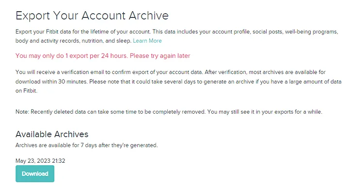
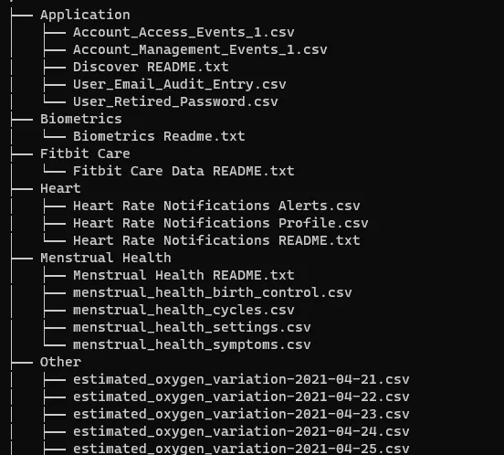
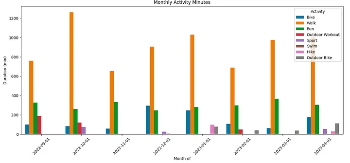
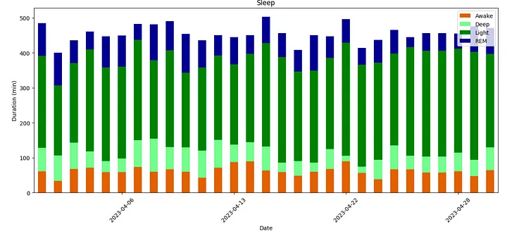
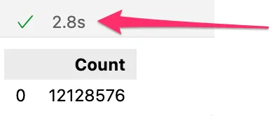
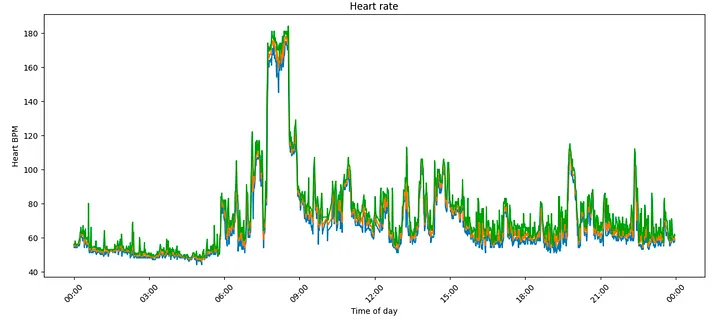
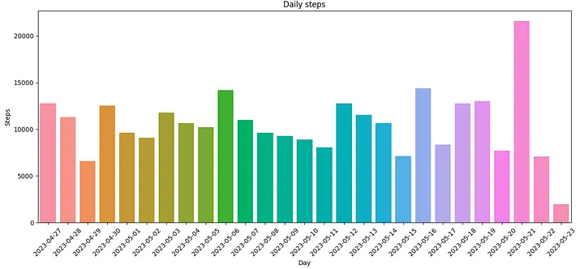
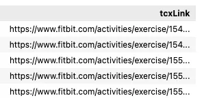
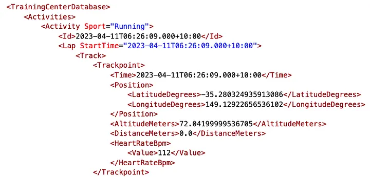
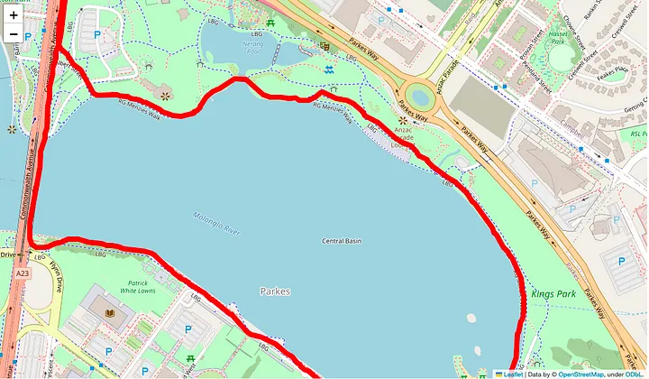

# My (very) personal data warehouse — Fitbit activity analysis with DuckDB


> Wearable fitness trackers have become an integral part of our lives, collecting and tracking data about our daily activities, sleep patterns, location, heart rate, and much more. I’ve been using a Fitbit device for 6 years to monitor my health. However, I have always found the data analysis capabilities lacking — especially when I wanted to track my progress against long term fitness goals. What insights are buried within my archive of personal fitness activity data? To start exploring I needed a good approach for performing data analysis over thousands of poorly documented JSON and CSV files … extra points for analysis that doesn’t require my data to leave my laptop.

Enter [DuckDB](https://duckdb.org/why_duckdb) — a lightweight, free yet powerful analytical database designed to streamline data analysis workflows — that runs locally. In this blog post, I want to use DuckDB to explore my Fitbit data achieve and share the approach for analysing a variety of data formats and charting my health and fitness goals with the help of [Seaborn](https://seaborn.pydata.org/) data visualisations.

Export Fitbit data archive
==========================

Firstly, I needed to get hold of all of my historic fitness data. Fitbit make it fairly easy to export your Fitbit data for the lifetime of your account by following the instructions at [export your account archive](https://www.fitbit.com/settings/data/export).


Instructions for using the export Fitbit data archive — Screenshot by the author.

You’ll need to confirm your request … and be patient. My archive took over three days to create — but I finally received an email with instructions to download a ZIP file containing my Fitbit data. This file should contain all my personal fitness activity recorded by my Fitbit or associated service. Unzipping the archive reveals a huge collection of files — mine for example had 7,921 files once I unzipped the 79MB file.


A small sample of the thousands of nested files — Screenshot by the author.

Let’s start looking at the variety of data available in the archive.

Why DuckDB?
===========

There are many great blogs ([1](https://betterprogramming.pub/duckdb-whats-the-hype-about-5d46aaa73196),[2](https://mattpalmer.io/posts/whats-the-hype-duckdb/),[3](https://towardsdatascience.com/a-serverless-query-engine-from-spare-parts-bd6320f10353)) describing DuckDB — the [TL;DR](https://www.dictionary.com/browse/tl-dr) summary is DuckDB is an open-source in-process OLAP database built specifically for analytical queries. It runs locally, has extensive SQL support and can run queries directly on Pandas data, Parquet, JSON data. Extra points for its seamless integration with Python and R. The fact it’s insanely fast and does (mostly) all processing in memory make it a good choice for building my personal data warehouse.

Fitbit activity data
====================

The first collection of files I looked at was activity data. Physical Activity and broad exercise information appears to be stored in numbered files such as `Physical Activity/exercise-1700.json`

I couldn’t work out what the file numbering actually meant, my guess is they are just increasing integers for a collection of exercise files. In my data export the earliest files started at 0 and went to file number 1700 over a 6 year period. Inside is an array of records, each with a description of an activity. The record seems to change depending on the activity — here is an example of a “walk”

```json
"activityName" : "Walk",  
  "averageHeartRate" : 79,  
  "calories" : 122,  
  "duration" : 1280000,  
  "steps" : 1548,  
  "startTime" : "01/06/23 01:08:57",  
  "elevationGain" : 67.056,  
  "hasGps" : false,  
  : : : :  
  "activityLevel" : [  
    { "minutes" : 1, "name" : "sedentary"},  
    { "minutes" : 2, "name" : "lightly"},  
    { "minutes" : 6, "name" : "fairly"},  
    { "minutes" : 6, "name" : "very"  
  }]
```
This physical activity data is one file of the 7,921 files now on my laptop. Fortunately, DuckDB can read (and auto-detect the schema) from JSON files using [read_json](https://duckdb.org/docs/data/json/overview.html#read_json_auto-function) function, allowing me to load all of the exercise files into the `physical_activity` table using a single SQL statement. It’s worth noting I needed to specify the date format mask as the Fitbit export has a very [American style date](https://en.wikipedia.org/wiki/Date_and_time_notation_in_the_United_States) format 😕.

```sql
CREATE OR REPLACE TABLE physical_activity  
as  
SELECT   
  startTime + INTERVAL 11 hours as activityTime  
, activityName  
, activityLevel  
, averageHeartRate  
, calories  
, duration / 60000 as duration_minutes  
, steps  
, distance  
, distanceUnit  
, tcxLink  
, source  
FROM read_json('./Physical Activity/exercise-*.json'  
, format='array'  
, timestampformat='%m/%d/%y %H:%M:%S');
```

This SQL command reads the physical activity data from disk, converts the activity and duration and loads into a DuckDB table in memory.

Load Physical Activity data into data frame
===========================================

I wanted to understand how I was spending my time with each month. As the activity data is stored at a very granular level I used the DuckDB SQL [time_bucket](https://duckdb.org/docs/sql/functions/timestamp.html) function to truncate the _activityTime_ timestamp into monthly buckets. Loading the grouped physical activity data into data frame can be accomplished with this aggregate SQL and the query results can be directed into a Pandas dataframe with the `<<` operator.

```sql
activity_df <<  
  select time_bucket(interval '1 month', activityTime) as activity_day  
  , activityName  
  , sum(duration_minutes) as duration  
  from physical_activity  
  where activityTime between '2022-09-01' and '2023-05-01'  
  group by 1, 2  
  order by 1;
```

This single SQL query groups my activity data (bike, walk, run etc.,) into monthly buckets and allows me to honestly reflect on how much time I was devoting to physical activity.

Plot Monthly Activity Minutes
=============================

I want to now explore my activity data visually — so let’s get the Fitbit data and produce some statistical graphics. I’m going to use the Python [Seaborn](https://seaborn.pydata.org/) data visualisation library to create a bar plot of the monthly activity minutes directly from the _activity_df_ dataframe.

```python
import matplotlib.pyplot as plt  
import seaborn as sns  
from matplotlib.dates import DateFormatter  
plt.figure(figsize=(15, 6))  
plt.xticks(rotation=45)  
  
myplot =sns.barplot(data=activity_df, x="activity_day", y="duration", hue="activityName")  
myplot.set(xlabel='Month of', ylabel='Duration (min)', title='Monthly Activity Minutes')  
plt.legend(loc="upper right", title='Activity')   
plt.show()
```

Executing this against the loaded activity data creates this bar plot.


Workout activity breakdown — Screenshot by the author.

It looks like my primary activity continues to be walking, and my New Years resolution to run more often in 2023 hasn’t actually happened (yet?)

Sleep
=====

About [one in three adults doesn’t get enough sleep](https://www.health.harvard.edu/heart-health/are-you-getting-enough-sleep), so I wanted to explore my long term sleeping patterns. In my Fitbit archive sleep data appears to be recorded in dated files such as `Sleep/sleep-2022-12-28.json`. Each file holds a months worth of data, but confusingly is dated for the month before the event. For example, the file `sleep-2022-12-28.json` appears to have data for January spanning the dates 2023-01-02 to 2023-01-27. Anyway — file naming weirdness aside we can explore the contents of the file. Within the record is an extended “levels” block with a breakdown of sleep type (wake, light, REM, deep)

```json
"logId" : 39958970367,  
  "startTime" : "2023-01-26T22:47:30.000",  
  "duration" : 26040000,  
  :: :: ::  
  "levels":   
    "summary" : {  
      {  
      "light": { "count": 30, "minutes": 275},  
      "rem": { "count": 4, "minutes": 48 },  
      "wake": { "count" : 29, "minutes" : 42 },  
      "deep" : { "count" : 12, "minutes" : 75}  
      }  
    }
```

If I look at some of the older files (possibly created with my older Fitbit surge device) there is a different breakdown of sleep type (restless, awake, asleep).

```json
"logId" : 18841054316,  
  "startTime" : "2018-07-12T22:42:00.000",  
  "duration" : 25440000,  
  :: :: ::  
  "levels" : {  
    "summary" : {  
      "restless" : {"count" : 9, "minutes" : 20 },  
      "awake" : { "count" : 2, "minutes" : 5 },  
      "asleep" : { "count" : 0,   "minutes" : 399}  
    }  
  }
```

Regardless of the schema, we can use the [DuckDB JSON](https://duckdb.org/docs/extensions/json.html) reader to read the records into a single table.

```sql
CREATE OR REPLACE TABLE sleep_log  
as  
select dateOfSleep   
, levels  
from read_json('./Sleep/sleep*.json'  
, columns={dateOfSleep: 'DATE', levels: 'JSON'}  
, format='array') ;
```

Schema changes for sleep data
=============================

I wanted to process all of my sleep data, and handle the apparent schema change in the way sleep is recorded (most likely as I changed models of Fitbit devices). Some of the records have time recorded against `$.awake` which is similar (but not identical to) `$.wake`

I used the SQL [coalesce](https://duckdb.org/docs/sql/functions/utility.html) function — which return the first expression that evaluates to a non-NULL value to combine similar types of sleep stage.

```sql
sleep_log_df <<  
  select dateOfSleep  
  , cast(coalesce(json_extract(levels, '$.summary.awake.minutes'), json_extract(levels, '$.summary.wake.minutes')) as int) as min_wake  
  , cast(coalesce(json_extract(levels, '$.summary.deep.minutes'), json_extract(levels, '$.summary.asleep.minutes')) as int) as min_deep  
  , cast(coalesce(json_extract(levels, '$.summary.light.minutes'), json_extract(levels, '$.summary.restless.minutes')) as int) as min_light  
  , cast(coalesce(json_extract(levels, '$.summary.rem.minutes'), 0) as int) as min_rem  
  from sleep_log  
  where dateOfSleep between '2023-04-01' and '2023-04-30'  
  order by 1;
```

With DuckDB I can query with [json_extract](https://duckdb.org/docs/extensions/json.html#json-extraction-functions) to extract the duration stages from the nested JSON to generate a _sleep_log_df_ dataframe with all of the historic sleep stages grouped.

Plot sleep activity
===================

We can not take the daily sleep logs and produce a stacked bar plot showing the breakdown each night of being awake and in light, deep and [REM](https://en.wikipedia.org/wiki/Rapid_eye_movement_sleep) sleep.

```python
import matplotlib.pyplot as plt  
import seaborn as sns  
import matplotlib.dates as mdates  
  
#create stacked bar chart  
fig, axes = plt.subplots(figsize=(15,6))  
myplot = sleep_log_df.set_index('dateOfSleep').plot(ax=axes, kind='bar', stacked=True, color=['chocolate', 'palegreen', 'green', 'darkblue'])  
myplot.set(xlabel='Date', ylabel='Duration (min)', title='Sleep')  
axes.xaxis.set_major_locator(mdates.DayLocator(interval=7))  
plt.legend(loc="upper right", labels = ['Awake', 'Deep', 'Light', 'REM'])   
plt.xticks(rotation=45)  
plt.show()
```

Loading a month of sleep data allows me to create a broader analysis of sleep duration.


Sleep cycle duration each night — Screenshot by the author.

The ability to graph multiple nights of sleep together on a single plot allows me to start understanding how days of the week and cyclic events affects the duration and quality of my sleep.

Heart rate
==========

Heart rate is captured very frequently (every 10–15 seconds) in files stored daily named like `Physical Activity/heart_rate-2023-01-26.json`. These files are really big — each day has around 70,000 lines — all wrapped in a single array.

```json
[{{"dateTime": "01/25/25 13:00:07", "value": {"bpm": 54, "confidence": 2}},  
  {"dateTime": "01/25/25 13:00:22", "value": {"bpm": 54, "confidence": 2}},  
  {"dateTime": "01/25/25 13:00:37", "value": {"bpm": 55, "confidence": 2}},  
  : : : : : :  
  {"dateTime": "01/26/26 12:59:57", "value": {"bpm": 55, "confidence": 3}  
}]
```

My theory here is the file name represents the locale of the user. For example, in my timezone (GMT+11) named `heart_rate-2023-01-26.json` the data covers the day 26 00:00 (AEST) to 23:59 (AEST) - and it makes logical sense if the dates within the files are in GMT.

Transform JSON files
====================

Up to now I’ve managed to process my Fitbit data as-is with included DuckDB functions. However, I hit a problem when trying to process these enormous heart rate files. DuckDB gave me this error when trying to process a large array of records in a JSON files

**(duckdb.InvalidInputException) “INTERNAL Error: Unexpected yyjson tag in ValTypeToString”**

I think this error message is an abrupt way of telling me it’s unreasonable to expect a JSON array to have so many elements. The fix was to pre-process the file so it wasn’t an array of JSON records, instead converted to newline-delimited JSON, or [ndjson](http://ndjson.org/).

```json
{"dateTime": "01/25/23 13:00:07", "value": {"bpm": 54, "confidence": 2}  
{"dateTime": "01/25/23 13:00:22", "value": {"bpm": 54, "confidence": 2}  
{"dateTime": "01/25/23 13:00:37", "value": {"bpm": 55, "confidence": 2}  
  : : : : : :  
{"dateTime": "01/26/23 12:59:57", "value": {"bpm": 55, "confidence": 3}
```

To transform heart rate _array_of_records_ into newline-delimited JSON I used a sneaky bit of Python to convert each file.

```python
import glob
import json
import ndjson
import re

for json_src_file in sorted(glob.glob('MyFitbitData/SimonAubury/Physical Activity/steps-*.json') + glob.glob('MyFitbitData/SimonAubury/Physical Activity/heart_rate-*.json')):
  json_dst_file = re.sub('\.[a-z]*$', '.ndjson', json_src_file)
  print(f'{json_src_file} -->  {json_dst_file}')

  with open(json_src_file) as f_json_src_file:
    json_dict =json.load(f_json_src_file) 

    with open(json_dst_file, 'w') as outfile:
      ndjson.dump(json_dict, outfile)
```      

This will find each _.json_ file, read converting the contents into newline-delimited JSON with a new file created with the file extension _.ndjson_. This converts an array with 70,000 records to a file with 70,000 lines — with each JSON record now stored on a new line.

Load heart rate data into table
===============================

With the newly converted _ndjson_ files, I’m now ready to load heart rate data into a DuckDB table. Note the use of `timestampformat='%m/%d/%y %H:%M:%S');` to describe the leading month in the dates (for example _"01/25/23 13:00:07"_)

```sql
CREATE OR REPLACE TABLE heart_rate  
as  
SELECT dateTime + INTERVAL 11 hours as hr_date_time  
, cast(value->'$.bpm' as integer) as bpm  
FROM read_json('./Physical Activity/*.ndjson'  
, columns={dateTime: 'TIMESTAMP', value: 'JSON'}  
, format='newline_delimited'  
, timestampformat='%m/%d/%y %H:%M:%S');
```

We can load all the .ndjson files by setting the format to ’newline_delimited’. Note we can extract the BPM (beats per minute) with the JSON extraction and cast into an integer.



DuckDB is blazing fast at processing JSON- Screenshot by the author.

It’s worth highlighting here how insanely fast DuckDB is — it took only 2.8 seconds to load 12 million records!

Load heart rate into data frame
===============================

With 12 million hear rate measurements loaded, let’s load a single days worth of data into a data frame for the 21st of May.

```sql
hr_df <<   
  SELECT time_bucket(interval '1 minutes', hr_date_time) as created_day  
  ,  min(bpm) as bpm_min  
  ,  avg(bpm) as bpm_avg  
  ,  max(bpm) as bpm_max  
  FROM heart_rate  
  where hr_date_time between '2023-05-21 00:00' and '2023-05-21 23:59'  
  group by 1;
```

This DuckDB query aggregates the variability of heart rate into time bucks of 1 minute; banding into min, average and maximum within each period.

Plot Heart rate
===============

I can plat the heart rate using a plot like this (and also to show off I actually did go for a run at 6am)

```python
import matplotlib.pyplot as plt
from matplotlib.dates import DateFormatter
plt.figure(figsize=(15, 6))
plt.xticks(rotation=45)

myplot = sns.lineplot(data=hr_df, x="created_day", y="bpm_min")
myplot = sns.lineplot(data=hr_df, x="created_day", y="bpm_avg")
myplot = sns.lineplot(data=hr_df, x="created_day", y="bpm_max")

myFmt = DateFormatter("%H:%M")
myplot.xaxis.set_major_formatter(myFmt)
myplot.set(xlabel='Time of day', ylabel='Heart BPM', title='Heart rate')
plt.show()
```


Heart rate over a day — Screenshot by the author.

Exploring heart rate with fine granularity allows me to track my fitness goals — especially if I stick with my regular running routine.

Steps
-----

Steps are recorded in daily files named `Physical Activity/steps-2023-02-26.json`. This appears to be a fine grain count of steps during period blocks (every 5 to 10 minutes) throughout the day

```json
[{  
  "dateTime" : "02/25/23 13:17:00",  
  "value" : "0"  
},{  
  "dateTime" : "02/25/23 13:52:00",  
  "value" : "5"  
},{  
  "dateTime" : "02/25/23 14:00:00",  
  "value" : "0"  
},{  
:: :: ::  
},{  
  "dateTime" : "03/24/23 08:45:00",  
  "value" : "15"  
}]
```
To aggregate the steps into daily counts I needed to convert GMT into my local timezone (GMT+11)

```sql
steps_df <<
select cast(time_bucket(interval '1 day', dateTime + INTERVAL 11 hours	) as DATE) as activity_day
, sum(value) as steps
from read_json('MyFitbitData/SimonAubury/Physical Activity/steps-2023-02-26.ndjson'
, auto_detect=True
, format='newline_delimited'
, timestampformat='%m/%d/%y %H:%M:%S') 
group by 1;
```

Aggregating the number of daily steps into the _steps_df_ dataframe allows me to explore the longer term activity trends as I attempt to exceed 10,000 steps to realise the [increased health benefits](https://www.10000steps.org.au/articles/healthy-lifestyles/health-check-do-we-really-need-take-10000-steps-day/).

Plot daily steps
================

We can now take dataframe and plot a daily step count

```python
import matplotlib.pyplot as plt  
from matplotlib.dates import DateFormatter  
plt.figure(figsize=(15, 6))  
plt.xticks(rotation=45)  
  
myplot = sns.barplot(data=steps_df, x="activity_day", y="steps")  
myplot.set(xlabel='Day', ylabel='Steps', title='Daily steps')  
plt.show()
```



Daily step count — Screenshot by the author.

Which shows I’ve still got to work at my daily step goal — another strike against my new years fitness resolution.

GPS Mapping
===========

Fitbit stores GPS logged activities as [TCX (Training Center XML)](https://en.wikipedia.org/wiki/GPS_Exchange_Format) files. These XML files are _not_ in the downloaded ZIP, but we have a reference to their location in the Physical Activity files, which I can query like this.

```sql
select tcxLink   
from physical_activity  
where tcxLink is not null;
```

The tcxLink field is a URL reference to their location in the Physical Activity files.



The URL for each TCX file — Screenshot by the author.

We can use this URL directly in a browser (once logged onto the Fitbit website) to do download the GPS XML file. Looking inside the TCX file, we find low level GPS locations every few seconds.



TCX GPS XML file sample contentents - Screenshot by the author.

The good news is this has some obvious fields like latitude, longitude and time. The not so good news is this is XML, so we need to pre-process these files prior to loading into DuckDB as presently XML isn’t supported by the file reader. We can convert XML files into JSON files with another bit of Python code, looping over each _.tcx_ file.

There is a bit of nasty XML nesting going on here, with the location data found under _TrainingCenterDatabase/Activities/Activity/Lap_.

```python
import glob
import json
import ndjson
import xmltodict
import re

for xml_src_file in sorted(glob.glob('MyFitbitData/tcx/*.tcx')):
    json_dst_file = re.sub('\.[a-z]*$', '.ndjson', xml_src_file)
    print(f'{xml_src_file} -->  {json_dst_file}')

    with open(xml_src_file) as f_xml_src_file:
        # erase file if it exists
        open(json_dst_file, 'w') 
        data_dict = xmltodict.parse(f_xml_src_file.read())

        # Loop over the "laps" in the file; roughly every 1km
        for lap in data_dict['TrainingCenterDatabase']['Activities']['Activity']['Lap']:
            data_dict_inner = lap['Track']['Trackpoint']
            # append file
            with open(json_dst_file, 'a') as outfile:
                ndjson.dump(data_dict_inner, outfile)
                outfile.write('\n')
```

Loading GPS Geospatial data
---------------------------

We can load the Geospatial data like this

```sql
route_df <<
    SELECT time
    , position
    , cast(json_extract_string(position, '$.LatitudeDegrees') as float) as latitude
    , cast(json_extract_string(position, '$.LongitudeDegrees') as float) as longitude
    FROM read_json('MyFitbitData/tcx/54939192717.ndjson'
    , columns={Time: 'TIMESTAMP', Position: 'JSON', AltitudeMeters: 'FLOAT', DistanceMeters: 'FLOAT', HeartRateBpm: 'JSON'}
    , format='newline_delimited'
    , timestampformat='%Y-%m-%dT%H:%M:%S.%f%z');
```

This DuckDB query flattens the JSON, converts the latitude, longitude and time into the correct data types and loads into the _route_df_ dataframe.

Visualize GPS Routes with Folium
================================

Having a table of location information isn’t very descriptive, so I wanted to start plotting my running routes on an interactive map. I used this blog to help [Visualize routes with Folium](https://betterdatascience.com/data-science-for-cycling-how-to-visualize-gpx-strava-routes-with-python-and-folium/). Modify the code helped me plot my own runs, for example this is a plot of a recent run while on holiday in [Canberra](https://en.wikipedia.org/wiki/Canberra).

```python
import folium

route_map = folium.Map(
    location=[-35.275, 149.129],
    zoom_start=13,
    tiles='openstreetmap',
    width=1024,
    height=600
)

coordinates = [tuple(x) for x in route_df[['latitude', 'longitude']].to_numpy()]
folium.PolyLine(coordinates, weight=8, color='red').add_to(route_map)

display(route_map)
```



Folium map plot of a run — Screenshot by the author.

Which generates a plot of my run using [open street map](https://openmaptiles.org/) tiles, giving me a great interactive detailed map of my run.

Data goals and fitness goal summary
===================================

Did I get get closer to my goal of analysis my Fitbit device data — absolutely! DuckDB proved to be an ideal flexible lightweight analytical tool for wrangling my extensive and chaotic Fitbit data achieve. Blazing through literally millions of records in seconds with the extensive SQL support and flexible file parsing options locally into dataframes makes DuckDB ideal for building my own personal data warehouse.

As for my fitness goal — I have some work to do. I think I should leave this blog now as I’m short of my step goal target for today

Code
====

🛠️Code for Fitbit activity analysis with DuckDB — [https://github.com/saubury/duckdb-fitbit](https://github.com/saubury/duckdb-fitbit)

