# GenPiCam - Generative AI Camera

Generative AI (GenAI) is a type of Artificial Intelligence that can create a wide variety of images, video and text. To accelerate the robot uprising I chained two GenAI models together to build a camera which describes the current scene in words, and then uses a second model to create a new generated stylised image. Let me introduce GenPiCam — a RaspberryPi based camera that reimagines the world with GenAI.

*Before and after images created by GenPiCam*

The heavy processing and true smarts of this project is handled by [Midjourney](https://www.midjourney.com/) — an external service using  machine learning-based image generators. GenPiCam makes use of two Midjourney capabilities

*  [Describe](https://docs.midjourney.com/docs/describe) which starts with an existing photo and creates a text description prompts for the image. 

* [Imagine](https://docs.midjourney.com/docs/quick-start) which converts natural language prompts into images

Between these two steps I allow of a level of creative input, so the GenPiCam camera has a dial to tweak the style of the final image. This essentially becomes a filter, adding an “anime”, “pop-art” or “futuristic” influence to the generated image. 

## I’m bored — can I get a video?

Sure — here’s the 2 minute summary



## The “photographic” process

The initial photo image is taken with a Raspberry Pi Camera Module. An external camera shutter (pushbutton connected to the Raspberry Pi GPIO pins) when pushed takes a still image and saves the photo as a jpeg image.  

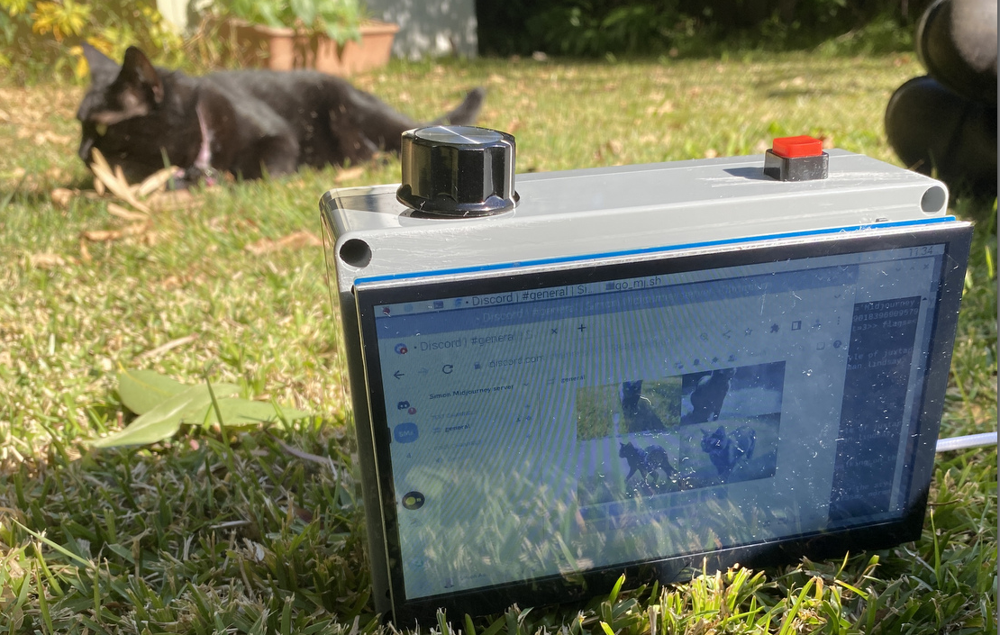*Taking still images of wildlife in the garden*

The photo is uploaded to Midjourney which starts with an existing photo and creates a text description prompts for the image. For the curious, I’m using some very inelegant bot interactions with PyAutoGUI to control the mouse and keyboard (as there’s no API) — let [this](https://github.com/saubury/GenPiCam/blob/main/midjourney.py) be an example of code you should never write.

Midjourney’s describe tool takes an image as input, then generates text prompts. This is a pretty clever service, reversing the usual process of “text to image” by doing the reverse, starting with the photo and then extracting text to describe the essence of the image. Here is Snowy, but Midjouney has a much more expressive description.

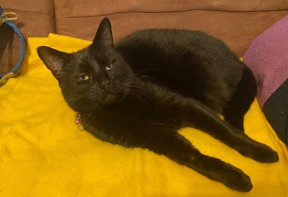*Snowy the cat — laying on bed under yellow blanket …*
> black cat laying on bed under yellow blanket, in the style of berrypunk, irridescent, glimmering, unpolished, symmetrical, rounded, chinapunk — ar 4:3 

The describe function actually returns four descriptions based on the image, but GenPiCam  arbitrarily selects the first description.

Now for the fun part. We can take that text prompt, and use it to create a brand new image with Generative AI with a new call to Midjouney imagine. Here is a image generate from the previous text prompt.

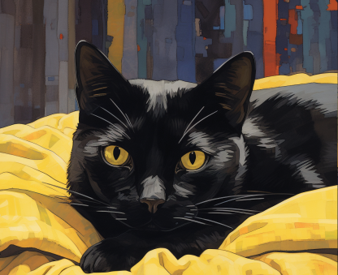*Midjouney imagine generated image from text prompt *

GenPiCam has a selection switch to update the prompt with stylistic instructions.

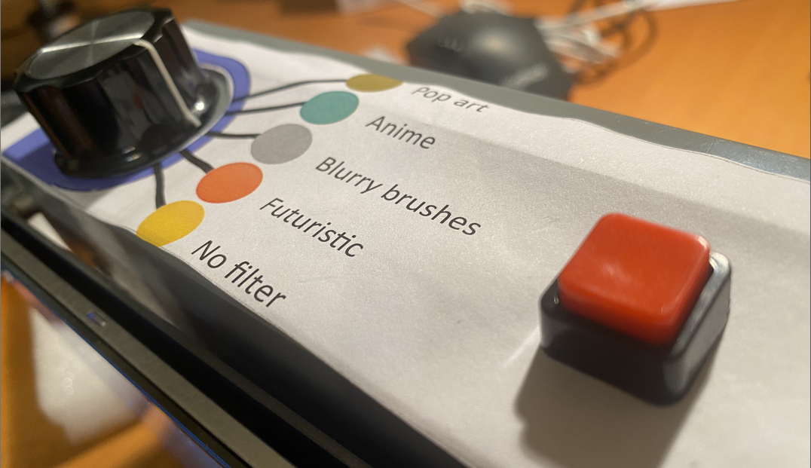*Scene selector*

This is a 12 way rotary switch connected to the Raspberry Pi GPIO pins. By reading the current “artistic selection” GenPiCam will add a prefix such as “**retro pop art-style illustration”** to the text prompt. A few of the other style prompts include

* Anime style 

* Hyper Realistic, whimsical with colourful hat and balloons, 

* Blurry brushstrokes,

* Futuristic, in a space station, hyper realistic

Let’s see the before and after “pop-art” images for Snowy.

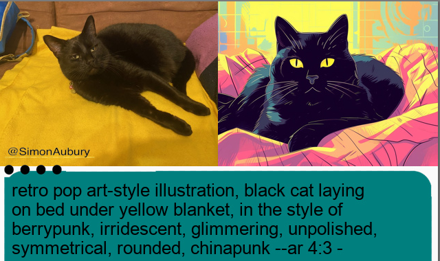*Final image with before and after photos along with text prompt *

The final image is a created using the [Pillow](https://github.com/python-pillow/Pillow/) Python imaging library, and is comprised of 

* Initial photo taken by the Raspberry Pi camera module, resized on the left

* Final Midjouney image — the first of four images is selected, composited to the right

* Text prompt — against a coloured background and icon signifying the style mode

Here’s the same process, but adding the text **“Hyper Realistic, whimsical with colourful hat and balloons”. **

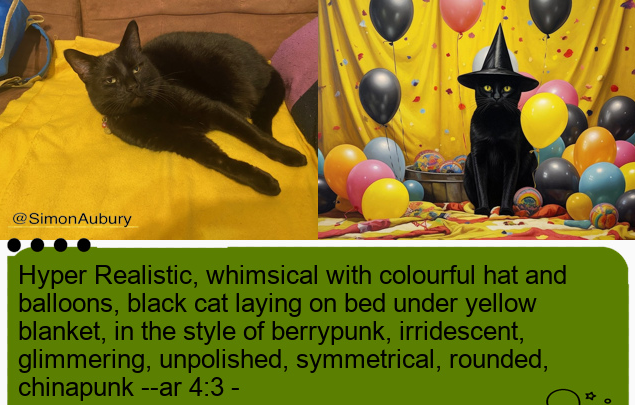

Even though the image on the right is a creation from Generative AI, there’s still still a sense of disappointment coming through Snowy’s judgmental eyes.

## Generative AI Images — Learnings

I had so much fun building the GenPiCam camera — and this was an interesting path for exploring prompt engineering for Generative AI. The better photos were the ones which had a simple composition — essentially images that were easy to put words to. For example, this scene is easy to describe with a colour and definitive objects.

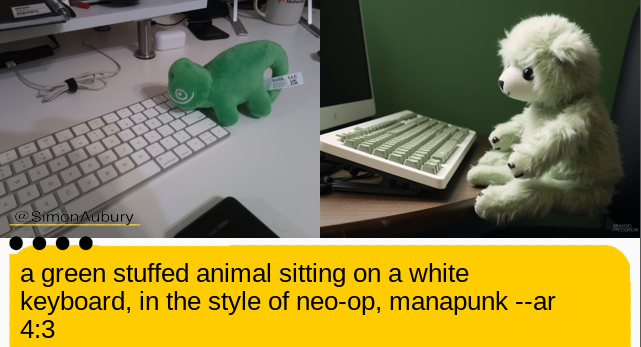*A green stuffed animal and white keyboard*

However, there were some very strange results while describing more unique scenes. I found the description of a classic Australian cloths line created a unusual image.

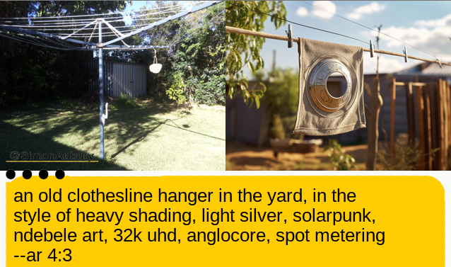*Australian cloths line*

One of my favourite reimagined images was the identification of my laser mouse. It turns out a laser mouse has multiple meaning leading to a striking result.

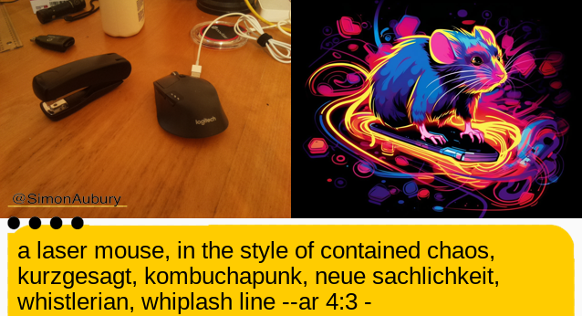*Laser mouse*

## The hardware

The least stylish part of GenPiCam is the hardware which I hastily assembled. If you want to build your own reality distorting camera, you’ll need the following.

* [RaspberryPi 4](https://www.raspberrypi.com/products/raspberry-pi-4-model-b/) running [Raspberry Pi OS](https://www.raspberrypi.com/software/)

* [Raspberry Pi camera module v2](https://www.raspberrypi.com/products/camera-module-v2/)

* [Touchscreen Monitor for Raspberry Pi](https://www.amazon.com.au/dp/B0BPP6MFFJ?ref_=pe_19115062_429603572_302_E_DDE_dt_1)

* [12 way PCB rotary switch](https://www.jaycar.com.au/1-pole-sealed-pcb-rotary/p/SR1210)

* [Pushbutton momentary](https://www.jaycar.com.au/pushbutton-push-on-momentary-spst-red-actuator/p/SP0716)

* [Polycarbonate enclosure](https://www.jaycar.com.au/sealed-polycarbonate-enclosure-171-x-121-x-55/p/HB6218)

* Rechargeable battery pack

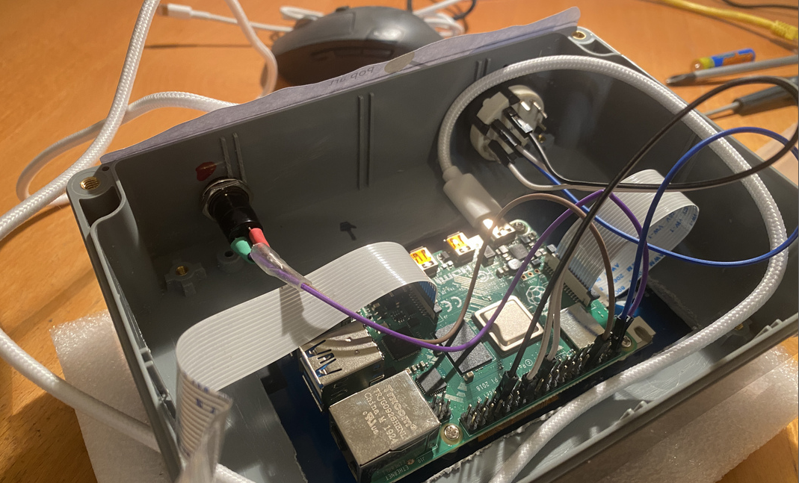*The inner workings of GenPiCam*

It isn’t the most beautiful of builds — but I’ll just excuse this as being highly functional

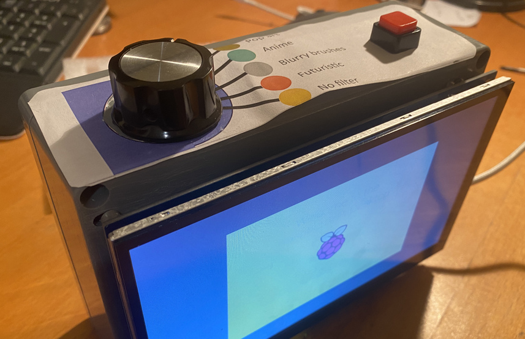*Boot image for GenPiCam camera*

## Summary, code & credits

The GenPiCam has been a fun way to explore Generative AI, transforming photos into stylised (and sometime surprising) images. 

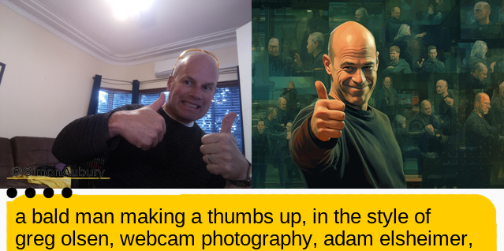*Photo of author on the left — and a stylised version of Simon on the right*

### Credits

* [Ned Letcher](https://twitter.com/nletcher) — who first got me inspired by showing off the Midjourney describe functionality and provided the concept of recreating images

* [How to Create a Discord Bot to Download Midjourney Images](https://medium.com/@neonforge/how-to-create-a-discord-bot-to-download-midjourney-images-automatically-python-step-by-step-guide-3e76d3282871) by Michael King — A great write up showing Python automation for interacting  with Midjourney along with Discord bot configuration.

* [Midjourney](https://docs.midjourney.com/docs/command-list) — Midjourney command syntax for bot channels

* [discord.py](https://discordpy.readthedocs.io/en/stable/) — Python API wrapper for Discord.

### Code

[https://github.com/saubury/GenPiCam](https://github.com/saubury/GenPiCam)
