# My data, your LLM — paranoid analysis of iMessage chats with OpenAI, LlamaIndex & DuckDB

_Can I safely combine my local personal data with a public large language model to understand my texting behaviour? A project combining natural language and generative AI models to explore my private data without sharing (too much of) my personal life with the robots._

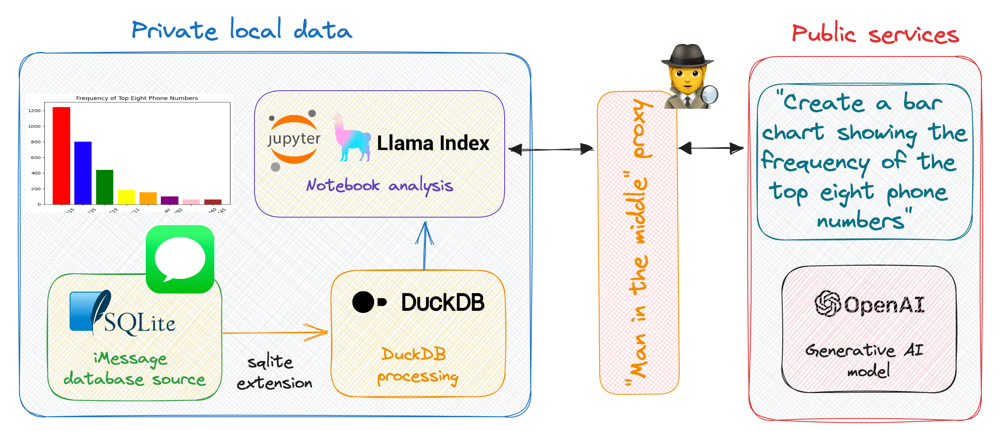*Data architecture — image by author*

✍️ A blog about exploratory data analysis of my private iMessage chats — with equal parts of wonder and paranoia.

## Motivation 🤔

[iMessage](https://en.wikipedia.org/wiki/IMessage) is an instant messaging service for text communication between users on Apple devices. Behind the scenes, iMessage uses a local [SQLite](https://en.wikipedia.org/wiki/SQLite) database to store a copy of message conversations. This means I have a complete local copy of all my messages in a relational database on my Mac laptop.

With 2 years of iMessage history I wanted to explore the text data to create data visualisations — with natural language prompts. The data however is very personal — so I needed to use a privacy preserving design to ensure my personal communications doesn’t leave my machine.

### Tech stack 🔧

To explore my text messages I’m using

* [DuckDB](https://duckdb.org/) open-source, embedded, in-process OLAP database. With the [SQLite extension](https://duckdb.org/docs/extensions/sqlite_scanner.html) to directly read from an iMessage SQLite database file

* [LlamaIndex](https://www.llamaindex.ai/) — framework for connecting custom data sources to large language models, allowing for natural language querying of my data

* [OpenAI gpt-3.5-turbo](https://platform.openai.com/docs/models/gpt-3-5) model for code generation to create the python to make the visualisations 

* [mitmproxy](https://mitmproxy.org/) — an open source interactive HTTPS proxy to view encrypted network traffic

### What am I working towards? 📈

My goal is explore my messaging behaviour, such as texting frequency and time of day usage. I want to “talk” to my data using generative AI — to create visualisations on top of my private data.

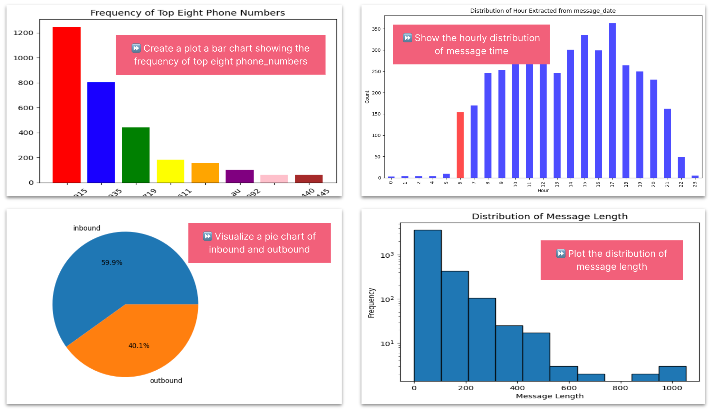*Image by author*

🎉 Tada! Creating charts locally on my private data from a natural language prompt. Let’s now see how I built this, breaking this down into three parts

* [Wrangling iMessage data ](#wrangling-imessage-data-with-duckdb-🦆)— with DuckDB to ingest and pre-process my iMessage history

* [Inspecting the network traffic](#inspecting-the-network-traffic-with-mitmproxy-🕵️‍♀️) — with a “Man in the Middle” proxy to view request and response encrypted traffic.

* [Prompted visualisations](#prompted-visualisations-with-pandasqueryengine-and-llamaindex-📊) — with PandasQueryEngine and LlamaIndex  connecting my local custom data iMessage data sources to a public large language models.

🛠️ The complete notebook is available at https://github.com/saubury/paranoid_text_LLM/

## Wrangling iMessage data with DuckDB 🦆

The first task is to extract my iMessages and transform into a sensible form for data analysis.

⏩ If you’re not interested in the data engineering step you can jump ahead to reading about [generative AI with Pandas and LlamaIndex](#talking-to-my-data--generative-ai-on-pandas-with-llamaindex-🗣️).

I’ve [written before](https://towardsdatascience.com/my-very-personal-data-warehouse-fitbit-activity-analysis-with-duckdb-8d1193046133) about [DuckDB](https://duckdb.org/why_duckdb) — a lightweight, free yet powerful analytical database designed to streamline data analysis workflows which runs locally. I’m using 🦆 DuckDB’s as a quick way to ingest and pre-process my iMessage history. My first task is to load the [SQLite Scanner DuckDB extension](https://duckdb.org/docs/extensions/sqlite_scanner) which allows DuckDB to directly read data from a SQLite database such as iMessage.

```
INSTALL sqlite_scanner;
LOAD sqlite_scanner;
```

If you are on a Mac, logged into your iCloud account you can copy the local iMessage SQLite database and load it. If you receive the error Operation not permitted you may need to run the command in a terminal and accept the prompts to interact with privileged files.

```bash
cp ~/Library/Messages/chat.db ./sql/chat.db
```

With DuckDB, we will open the iMessage SQLite database, with the [attach](https://duckdb.org/docs/sql/statements/attach.html) command. This will open the SQLite database file ./sql/chat.db in the schema namespace chat_sqlite chat.

```
ATTACH './sql/chat.db' as chat_sqlite (TYPE sqlite,  READ_ONLY TRUE);
```

### Load messages into table

We create the chat_messages DuckDB table by joining three tables from the iMessage SQLite database. Within the same query I also want to

* determine the message time by evaluating the interval (number of seconds since EPOC of `2001-01-01`)

* extract the phone number country calling code (eg, +1, +61)

* redact phone number like `+61412341234` to `+614...41234` (for screenshots in this blog)

```sql
CREATE OR REPLACE TABLE chat_messages AS
SELECT TIMESTAMP '2001-01-01' + INTERVAL (msg.date / 1000000000) seconds as message_date,
msg.text,
msg.attributedBody,
msg.is_from_me,
CASE WHEN ct.chat_identifier like '+1%' then SUBSTRING(ct.chat_identifier, 1, 2) when ct.chat_identifier like '+%' then SUBSTRING(ct.chat_identifier, 1, 3) end as phone_country_calling_code,
regexp_replace(ct.chat_identifier, '^(\+[0-9][0-9][0-9])([0-9][0-9][0-9])', '\1...\3') as phone_number
FROM chat_sqlite.chat ct
JOIN chat_sqlite.chat_message_join cmj ON ct."ROWID" = cmj.chat_id
JOIN chat_sqlite.message msg ON cmj.message_id = msg."ROWID";
```

I can peek at the chat_messages DuckDB table by querying it (with good old select * ).

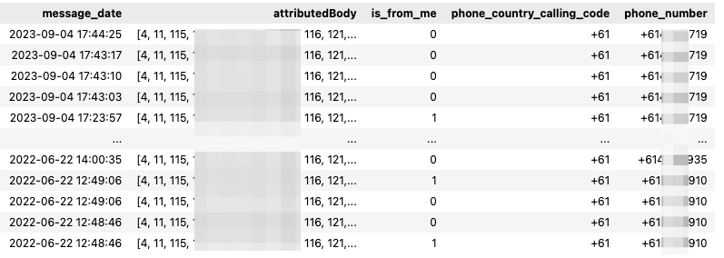*Sample of chat_messages — image by author*

I can now send the contents of the chat_messages DuckDB table into a chat_messages_df dataframe with `<<` within a sql magic.

```sql
%%sql
chat_messages_df <<
  SELECT *
  FROM chat_messages
  ORDER BY message_date DESC;
```

### Decoding attributedBody 🪄

The iMessage database has a mixture of encoding formats, with older messages as plain text in the text field, with newer messages encoded in the attributedBody field. Sometime around November 2022 the messages started coming in in new format which migh be related to a message upgrade related to the release of iOS 16. I’m thankful to the [iMessage-Tools](https://github.com/my-other-github-account/imessage_tools/) project which had the logic to extract the text content is hidden within the attributedBody field. The decode_message utility function extracts the text regardless of format. 

```python
import re

def decode_message(row):
  msg_text = row['text']
  msg_attributed_body = row['attributedBody']

  # Logic from https://github.com/my-other-github-account/imessage_tools
  body=''
  if not msg_text:
    body = msg_text
  elif msg_attributed_body is None:
    body = ''
  else:
    try:
      msg_attributed_body = msg_attributed_body.decode('utf-8', errors='replace')
    except AttributeError as err:
      pass

    if "NSNumber" in str(msg_attributed_body):
      msg_attributed_body = str(msg_attributed_body).split("NSNumber")[0]
      if "NSString" in msg_attributed_body:
        msg_attributed_body = str(msg_attributed_body).split("NSString")[1]
        if "NSDictionary" in msg_attributed_body:
          msg_attributed_body = str(msg_attributed_body).split("NSDictionary")[0]
          msg_attributed_body = msg_attributed_body[6:-12]
          body = msg_attributed_body

  body = re.sub(r'\n', ' ', body)
  return body
```
### Inline message extraction

We'll use a the [pandas apply()](https://pandas.pydata.org/docs/reference/api/pandas.DataFrame.apply.html) method to apply the decode_message function to the DataFrame. In short, we’ll set message_text to something readable, regardless of the format the text came in.

```python
chat_messages_df['message_text'] = chat_messages_df.apply(decode_message, axis=1)

chat_messages_df.head()
```

With the messages decoded, I can peek at the first few records.

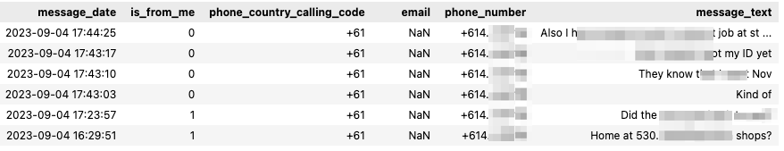*Sample of iMessage texts sent and received — image by author*

With my several thousand iMessages loaded into the chat_messages_df dataframe, I can move onto some prompted analysis.

## Talking to my data — Generative AI on Pandas with LlamaIndex 🗣️

I’ll be using [LlamaIndex](https://www.llamaindex.ai/) — a flexible data framework for connecting custom data sources to large language models. LlamaIndex uses [Retrieval Augmented Generation (RAG)](https://research.ibm.com/blog/retrieval-augmented-generation-RAG) systems that combine a large language model (such as those provided by OpenAI or Hugging Face) with a private data set (set as my personal copy of iMessages). 

The RAG pipeline retrieves the most relevant context for my query (such as the shape of my data), and passes that to the LLM to generate a response. The response should be the python code necessary to execute on my local data to visualise a result in response to my query. 

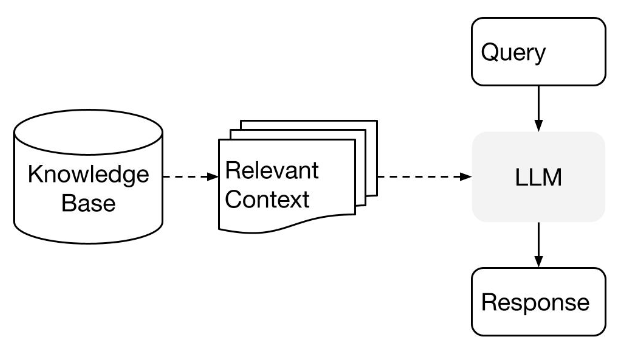*LlamaIndex — [High-Level Concepts](https://gpt-index.readthedocs.io/en/latest/getting_started/concepts.html)*

### LlamaIndex

I will be using the paid OpenAI service, and have created a [secret API key](https://platform.openai.com/account/api-keys) which is saved in the notebook.cfg configuration file.

```python
import pandas as pd
from llama_index.query_engine.pandas_query_engine import PandasQueryEngine
import openai
import configparser

config = configparser.ConfigParser()
config.read('notebook.cfg')
openai_api_token = config.get('openai', 'api_token')
openai.api_key =  openai_api_token
```

I can now take my chat_messages_dfdata frame — and ask a question like “What is the most frequent phone_number?”

```python
query_engine = PandasQueryEngine(df=chat_messages_df)
response = query_engine.query("What is the most frequent phone_number?")
print(response)
```

Which generates a small fragment of Python code, which can be applied to my data .. and gives me the value for the most frequently iMessaged user!

```
> Pandas Instructions:
eval("df['phone_number'].value_counts().idxmax()")

+61 412 321915
```

🎉 Whoa — that’s pretty amazing. By simply asking the query engine for a goal, the public LLM has generated the correct Python code that when run locally on my data frame gives me the correct answer. My wife will be happy to know she is the most frequently messaged from my phone 😅!

Let’s have a peek into the traffic to see what’s happening behind the scenes.

## Inspecting the network traffic with mitmproxy 🕵️‍♀️

I was curious to see what kinds of requests the code was making to OpenAI and what kind of responses it is getting back. 

⏩ This is an optional step for the paranoid, and if you’re not interested in the network analysis you can skip to [prompted visualisations](#prompted-visualisations-with-pandasqueryengine-and-llamaindex-📊) to analyse data.

I used a [great guide](https://earthly.dev/blog/mitmproxy/) to get started with [mitmproxy](https://mitmproxy.org/) to observe to capture encrypted  requests & responses. The short summary is the mitmproxy proxy sits between the local Python code and the internet, to intercept and inspect SSL/TLS-protected traffic.

To view the traffic, start mitmweb proxy and set the following environment variables to metwork traffic passes through the local proxy, signed with a local certificate (which is conveniently created when you first run mitmproxy).

```python
import os
os.environ['http_proxy'] = "http://127.0.0.1:8080" 
os.environ['https_proxy'] = "https://127.0.0.1:8080" 
os.environ['REQUESTS_CA_BUNDLE'] = "/Users/saubury/.mitmproxy/mitmproxy-ca-cert.pem"
```

With the proxy established, both network requests and responses are visible in the web dashboard.

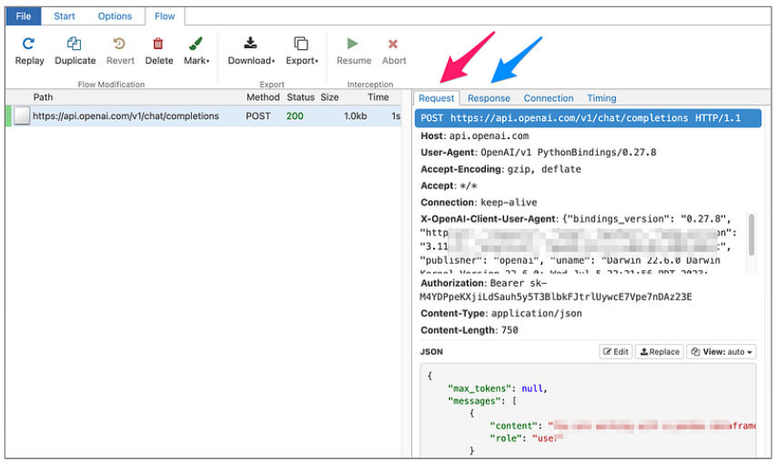*“Man in the Middle” HTTPS proxy — mitmproxy web page*

With the proxy running, I can start running some tests. 

## Prompted visualisations with PandasQueryEngine and LlamaIndex 📊

### When do I send and receive texts throughout the day?

Let’s try a query and see what requests and responses are seen by the proxy. I’ll use the [PandasQueryEngine](https://gpt-index.readthedocs.io/en/stable/examples/query_engine/pandas_query_engine.html) of LlamaIndex to query my iMessage data, and ask for the following visualisation to be created …
> Extract hour of day from message_date. Visualize a distribution of the hour extracted from message_date. Add a title and label the axis. Use colors and add a gap between bars. Colour the bars with an hour of 5 in red and the rest in blue.

LlamaIndex will compose a request to OpenAI, and I can capture the outward request

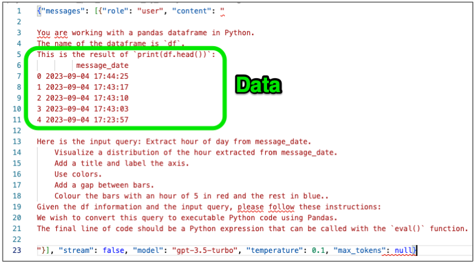*Request sent to OpenAI*

It appears that a sample (5 rows) of my data is sent outwards to describe the data. In this case I’m not all that worried as these are simply dates, but obviously sending a sample of something more personal would concern me more.

Within a few seconds, LlamaIndex will relay the response and we can peek at the code returned by OpenAI.

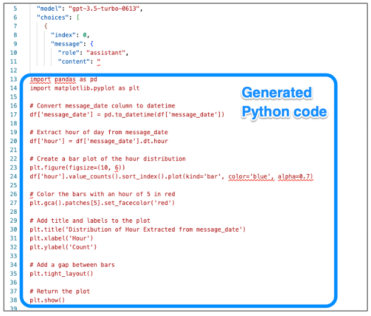*Response returned with python embedded*

The code is then automatically run against my entire local dataset. I was especially impressed the code to extract the “hour” from the timestamp field worked as expected. The result of the generated python code appears exactly as I had asked.

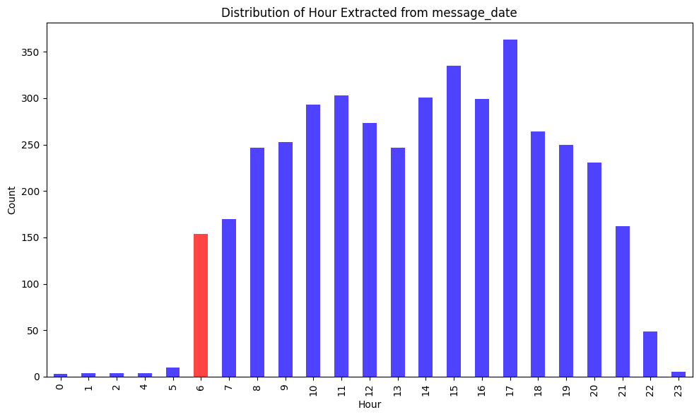*Message time distribution by hour of day — image by author*

🎉 Voilà — the code is correct — and generates and run code that renders a distribution shows most of my messages and sent between 6am and 9pm.

## Further experiments 🔬

Let’s see a few more examples of data queries, and the payloads which need to be sent to create working python code.

### Most frequent contacts
> Create a plot a bar chart showing the frequency of top eight phone_numbers. The X axis labels should be at a 45 degree angle. Use a different colour for each bar

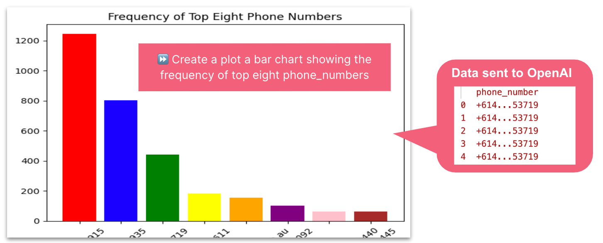*Most frequent contacts — image by author*

To build a bar chart of my most frequent contacts, LlamaIndex sent a sample of 5 phone numbers to OpenAI to describe the datatypes expected in the dataframe. The resulting Python code executed locally on my entire data set created the correct bar chart. I was impressed the request to turn the X-axis labels 45 degrees was honoured.

```python
import pandas as pd
import matplotlib.pyplot as plt

# Count the frequency of each phone_number
phone_number_counts = df['phone_number'].value_counts().head(8)

# Create a bar chart
plt.bar(phone_number_counts.index, phone_number_counts.values, color=['red', 'blue', 'green', 'yellow', 'orange', 'purple', 'pink', 'brown'])

# Add a title
plt.title('Frequency of Top Eight Phone Numbers')

# Rotate x-axis labels by 45 degrees
plt.xticks(rotation=45)

# Show the plot
plt.show()
```

### Message length
> Visualize a distribution of the length of message_text. Use a logarithmic scale. Add a title and label both axis. Add a space between bars.

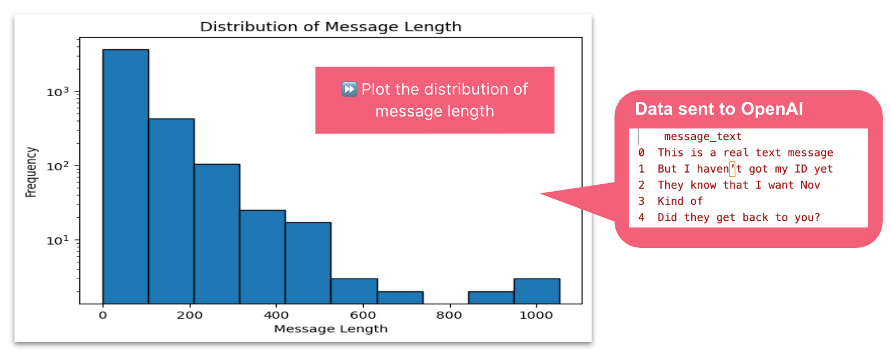

To display a distribution of the length of messages, LlamaIndex sent the contents of 5 sample messages t to OpenAI. The resulting Python code executed locally on my entire data set created a lambda function to run locally to determine message length. A logarithmic scale was created, however my prompt to add a space between bars was incorrectly misinterpreted as at plt.tight_layout.

```python
import matplotlib.pyplot as plt

# Calculate the length of each message_text
df['message_length'] = df['message_text'].apply(lambda x: len(x))

# Create a histogram of the message_length with a logarithmic scale
plt.hist(df['message_length'], bins=10, log=True, edgecolor='black')

# Add a title and label both axes
plt.title('Distribution of Message Text Length')
plt.xlabel('Message Length')
plt.ylabel('Frequency')

# Add a space between bars
plt.tight_layout()

# Show the plot
plt.show()
```

### Inbound vs., outbound messages
> Visualize a pie chart of the proportion of is_from_me. Label the value 0 as ‘inbound’. Add a percentage rounded to 1 decimal places.

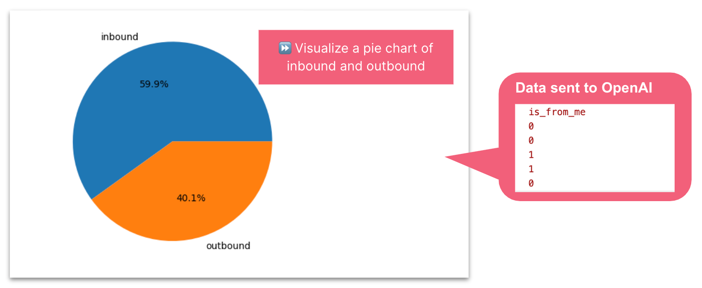*Pie chart of the proportion inbound and outbound messages — image by author*

To build a pie chart showing the proportion of inbound to outbound messages, LlamaIndex simply sent a sample of “is_from_me” boolean records to OpenAI. The resulting Python code executed locally on my entire data set created the correct pie chart. I was impressed the label of *outbound* to the value of *1*, which was a clever inference from me describing value *0* as *outbound*.

```python
import matplotlib.pyplot as plt

# Count the number of occurrences of each value in the 'is_from_me' column
value_counts = df['is_from_me'].value_counts()

# Create a pie chart using the value counts
plt.pie(value_counts, labels=['inbound', 'outbound'], autopct='%.1f%%')

# Display the pie chart
plt.show()
```

## Summary 

To answer the question “can I safely combine my local personal data with a public large language model”— well, kind of sort of.

I set a clear boundary between my personal iMessage data (kept private to my machine) and the public generative models to build the logic for my data analysis. I am satisfied with the compromises I made, with a handful of records shared outside of my network used to generate high-quality Python code quickly and effectively address my queries.

Yes, I could next time use dummy data, inspect the code, obfuscate the payloads or run the models locally. In fact — that’s what I might do in a future blog. 

For now, I’m happy with my paranoid analysis of iMessage chats.

🛠️ The complete notebook is available at https://github.com/saubury/paranoid_text_LLM/
