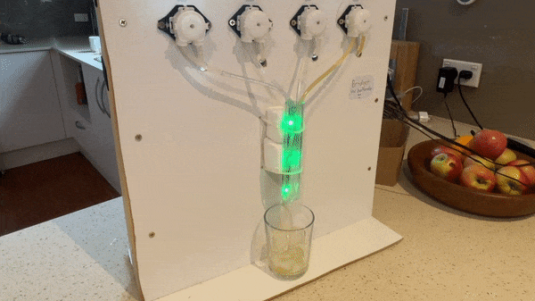
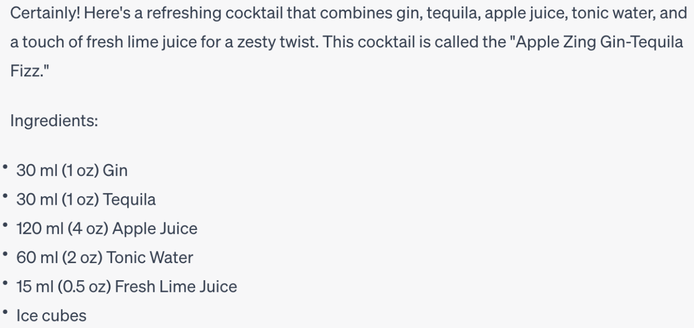
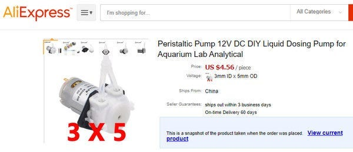
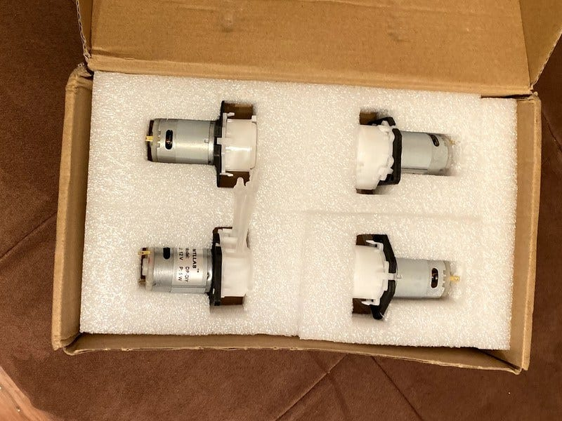
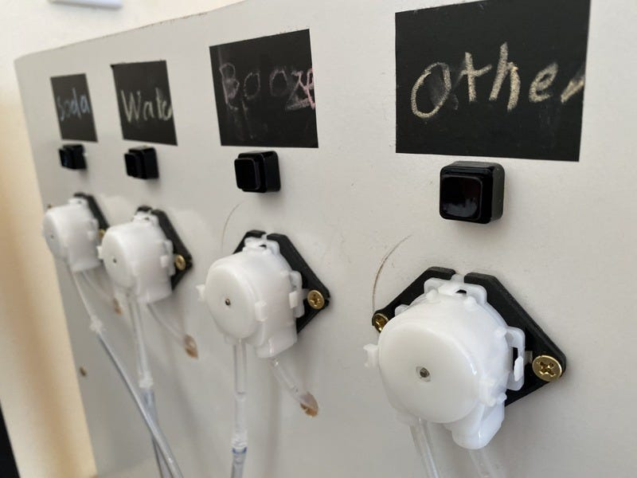
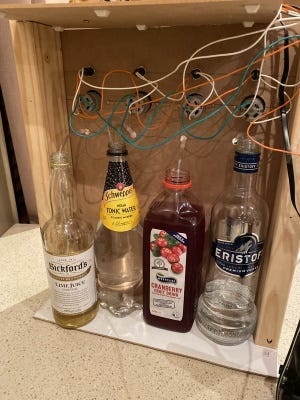
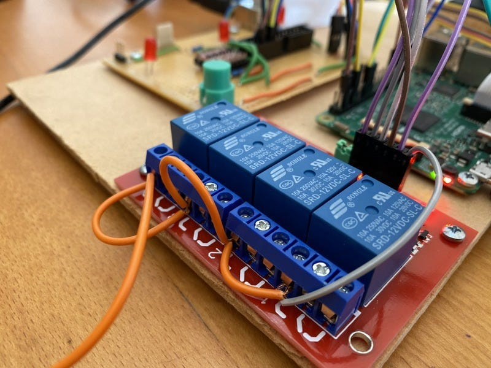
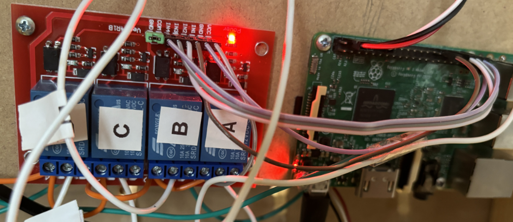
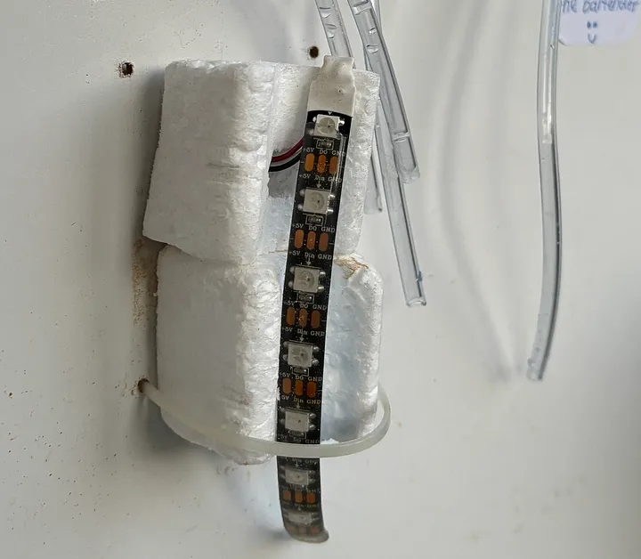
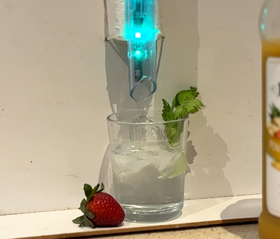

# 🍹GinAI - Cocktails mixed with generative AI

GinAI — a robotic bartender which can make a nice drink given a random collection of juices, mixers and spirits. Real cocktails created and music chosen by OpenAI — all mixed by a RaspberryPi bartender.

## I’m bored — can I get a video?

Here’s a quick video of GinAI in action.



## Starting at the end

Let me describe the finished project — and we can work backwards on how I built 🍹GinAI🍸. The GinAI bartender uses up to four ingredients — and when I press the dispense button, OpenAI [ChatGPT](https://chat.openai.com/) will “create” a drink, describe the cocktail creation and select an appropriate song 🎵.

A row of decorative lights look pretty during the creation and flash 🚨once the cocktail is ready. A Google Nest Mini is used as the speaker for both the spoken words 🗣️ and for playing the tunes 🎶.

## Cocktail inspiration from ChatGPT

I started my cocktail mixing adventure by simply asking OpenAI for a cocktail recipe from the random spirits and mixers I had available. For example, I prompted [ChatGPT](https://chat.openai.com/) to suggest a cocktail with this query
> create a cocktail from the ingredients gin, tequila, apple juice and tonic.

Which returns a helpful cocktail mixing recipe along with text instructions as a response.

*First experiment with ChatGPT console*

I quickly found a few limitations with my initial cocktail creations from the console.

* OpenAI would sometime suggest a cocktail with an ingredients I didn’t specify (and didn’t have). I corrected this with the added instruction to only use ingredients from the provided list. Results were more reliable with prompt instructions “You do not need to use all of the ingredients. You may only use a maximum of 4 ingredients.” I can now call myself a prompt engineer 😀

* Recipe suggestions used a variety of measurement unit — such as fluid ounce “a dash of” or other bizarre imperial measurement. I could coerce the output by simply adding the prompt “Only give quantities in metric units. Only give quantities in whole numbers”.

* There was no consistency with the total volume of cocktail produced. Some may not consider 2 litres of alcohol a problem — but at the very least it overflowed my available cocktail glassware. The prompt instruction to limit to a 250 millilitre volume reduced spillage and excessive drinking

With the prompt creation giving reasobale results, I moved onto building a reliable interface.

## Predictable OpenAI responses with function calling

The cocktail recipes created by ChatGPT were going to drive the automated drink dispensing — so I needed ensure OpenAI API would generate a predicable schema for the JSON responses. OpenAI recently added [**Function calling](https://openai.com/blog/function-calling-and-other-api-updates)** functionality to their API, which I could use to return a consistent JSON response. Function calling is primarily aimed at connecting GPT’s capabilities with external tools and APIs — and converts queries such as “Email Alice to see if she wants to get coffee next Friday” to a function call like **send_email(to: string, body: string)**.

I didn’t need to direct function calling, but I can use the technique (along with a dummy function) to ensure recipes suggested by OpenAI ChatGPT meet a my specification. Enforcing a predictable JSON output means the directions can be easily parsed and implemented by the RaspberryPi liquid dispensing pumps to make yummy cocktails based on the response from a `[gpt-3.5-turbo](https://platform.openai.com/docs/models/gpt-3-5)` model.

The easiest implementation I found was to use a [PyDantic](https://docs.pydantic.dev) class for my target schema — and use that as a parameter for the method call to “**ChatCompletion.create()**”. Here’s a fragment of the [GinAI Python classes](https://github.com/saubury/GinAI/blob/master/ginai_types.py) used.

    # create a PyDantic schema for output
    class Ingredient(BaseModel):
    ingredient_name: str
    quantity_ml: int
    
    class Cocktail(BaseModel):
    cocktail_name: str
    description: str
    inventor: str
    matching_song: str
    instructions: str
    ingredients: list[Ingredient]

This is a basic class, where an **Ingredient** class is the ingredient name and a quantity specified in millilitres. The **Cocktail** class has a list of the Ingredient objects, along with the name, description and appropriate song to compliment the drinking of the coctail

I followed [this guide](https://medium.com/dev-bits/a-clear-guide-to-openai-function-calling-with-python-dcbc200c5d70) as a great tutorial for using the new function calling feature from OpenAI to enforce a structured output from GPT models.

The OpenAI Python calling logic looks like this (or see the [whole openai_util.py module](https://github.com/saubury/GinAI/blob/master/openai_util.py)).

    completion = openai.ChatCompletion.create( 
        model='gpt-3.5-turbo',
        messages=[
            {'role': 'system', 'content': 'You are a helpful bartender.'},
            {'role': 'user', 'content': prompt},
        ],
        functions=[
            {
            'name': 'get_answer_for_user_query',
            'description': 'Get user answer in series of steps',
            'parameters': Cocktail.model_json_schema()
            }
        ],
        function_call={'name': 'get_answer_for_user_query'}
    )

OpenAI function calling ensured created recipes conformed to a strict JSON schema. For example, a typical response would look like this.

    {
        "cocktail_name": "Summer Breeze",
        "description": "A refreshing cocktail perfect for a hot day.",
        "inventor": "My Bartender",
        "matching_song": "Summertime by DJ Jazzy Jeff & The Fresh Prince",
        "instructions": "1. Fill a glass with ice.\n2. Combine the ingredients in the glass.\n3. Stir well.\n4. Garnish with a slice of orange.\n5. Enjoy!",
        "ingredients": [
            {
                "ingredient_name": "gin",
                "quantity_ml": 45
            },
            {
                "ingredient_name": "orange juice",
                "quantity_ml": 60
            },
            {
                "ingredient_name": "tonic",
                "quantity_ml": 15
            }
        ]
    }

With cocktail recipes consistently created, I could move onto building the drink dispensing hardware.

## GinAI — Hardware build

With the interfaces and software roughed out to imagine cocktails, the next job was to build the pouring hardware.

## Pumps

I used 4 [peristaltic pumps](https://en.wikipedia.org/wiki/Peristaltic_pump) to provide a “food safe” way to pump the liquids from the drink bottles. These pumps provide a steady rate of flow of liquids when powered. By carefully timing the “on” time for the pump I can precisely deliver the ideal amount of spirits or mixers for the perfect 🍸

*A quick search on AliExpress*

The pumps are pretty cheap — and provide an accurate way to dispense precise quantities of liquids.

*Pumps — straight from the post*

The pumps are mounted on a basic wooden frame higher than the tallest bottle. My children helped to build the frame, labelling and installing the pumps.

*The important task of adding labels to pumps*

A view from the rear show the placement of pumps and liquids. A manual electrical switch allow the pumps to be run independently from the Raspberry Pi (helpful for cleaning).

*Rear view of Cocktail maker*

The pumps use 12 volt motors. To operate them via the Raspberry Pi I used a [4 Channel 12V Relay Module](https://www.jaycar.com.au/arduino-compatible-4-channel-12v-relay-module/p/XC4440). This allows the pumps to be switched on and off independently with the 5 volt signals from the [GPIO pins](https://www.raspberrypi.org/documentation/usage/gpio/) of the Raspberry Pi.

*Relay board*

The Raspberry Pi is mounted with the relay board. The relays switch 12 volt power on and off for the pump motors. The signals for the relay board are taken directly from the GPIO header of the Raspberry Pi.

*Board placement*

Finally I added the mandatory RGB LED’s for some colourful lighting effects. I used a row of [WS2812B LED strip](https://www.jaycar.com.au/duinotech-arduino-compatible-w2812b-rgb-led-strip-2m/p/XC4390). This was installed behind the final collecting tube with a bit of soldering hidden by white heat shrink tubing.

A great bartended needs to be able to talk and entertain, so GinAI needed a speaker. I used a Google Nest Mini mounted to the frame as a speaker for spoken words and for playing the music.

*Google Nest Mini*

## 🍹 Cheers!

With a bit of coding and a *lot* of trust in my GinAI bartender I’m enjoying the surprising world of generative created cocktails

*Cheers*

## 🛠️ Code

The code for GinAI is available at

* [https://github.com/saubury/GinAI/](https://github.com/saubury/GinAI/)
