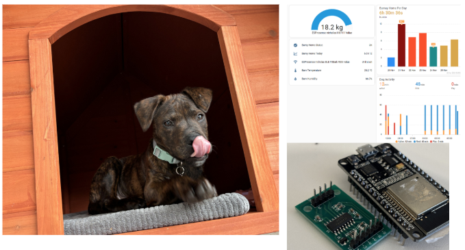
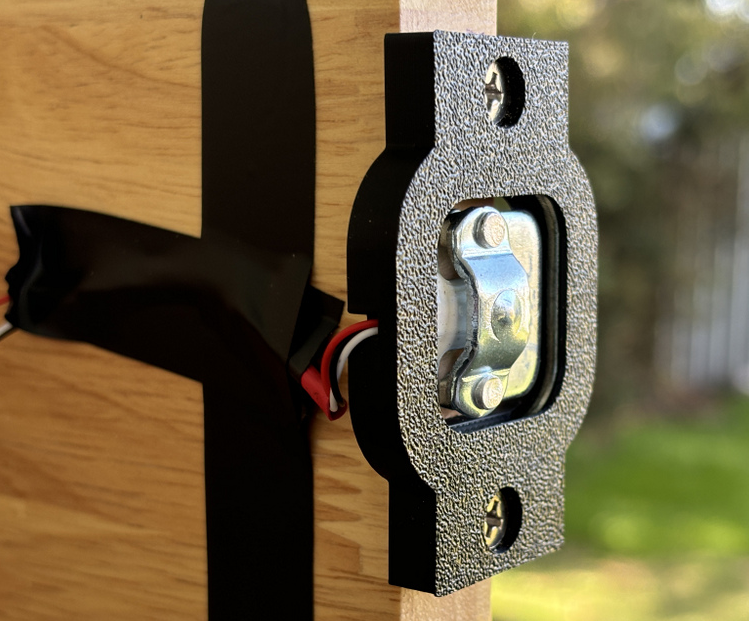
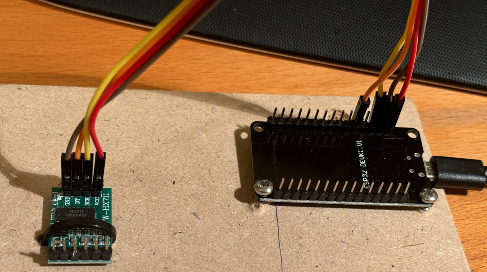
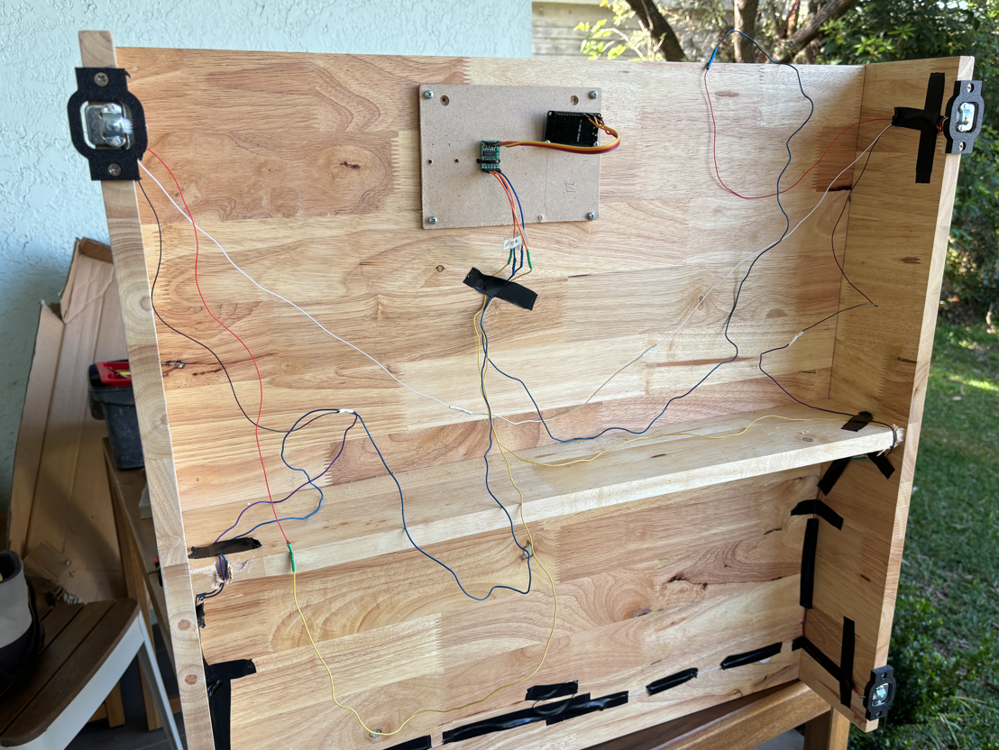
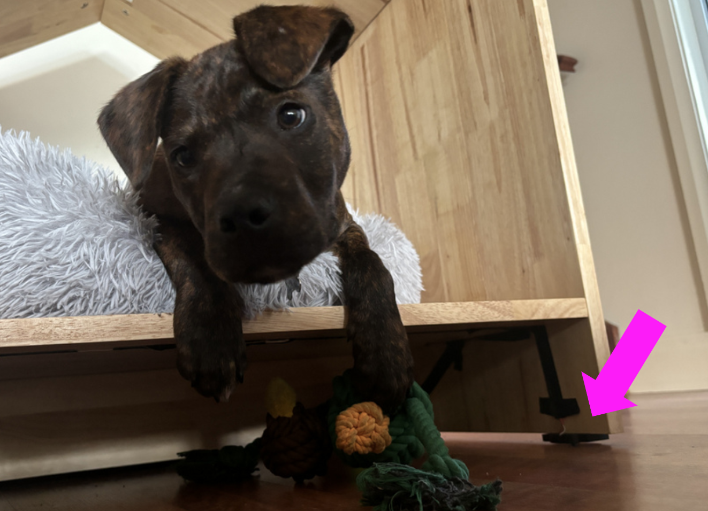
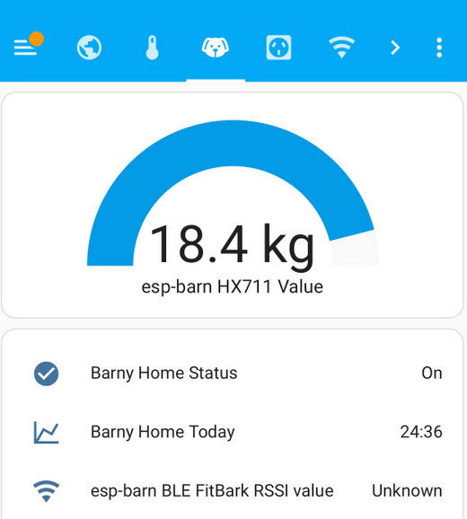
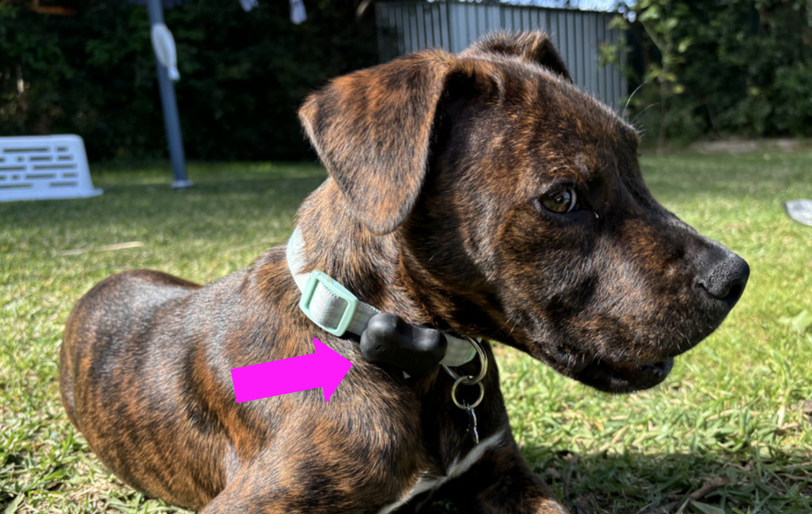
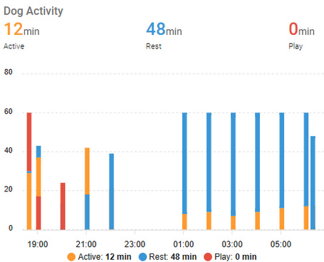
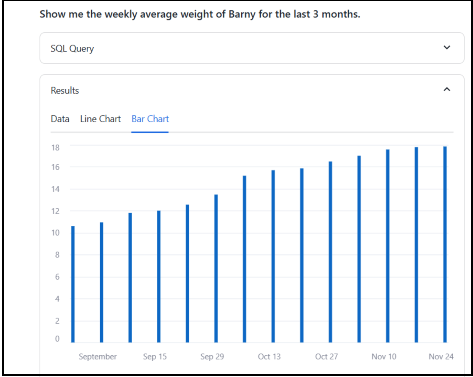
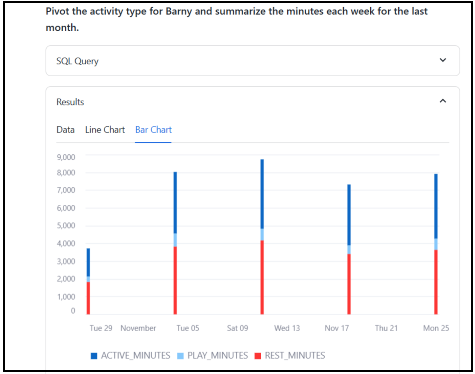

# Puppy data

🐾 Puppy Data 🐾 combines a love of data and dogs — a project to track Barney the puppy🐶! Using load-cells and low power motion tracking sensors I built an automated system to monitor Barney’s weight, sleep habits, and activity📊. Data is sent to Home Assistant for easy tracking via a slick interface 📱. CotexAI and a Streamlit application allows me to ask questions like “How much heavier is Barney this month?” or “When was he most active?” 🐕💡. A blend of IoT, DIY tech, and puppy love ❤️📈!

This is Barney — our (now) 6 month old “Staffy Cross” — adopted from a local shelter. We love Barney joining our family— and I love data. Barney has agreed (sort of) to help with a local bit of data gathering so we can watch him grow.

*Barney at home — along with sample analytics*

My goal with this project was to passively collect data on Barney’s activity — his sleeping habits, weight gain, sleep patterns and movements around our house. The data is fed into data warehouse where a conversational interface is used to interact with my Barney data to answer questions like “When was Barney the most active yesterday?”, “How much heavier is Barney this month?” or “Where did Barney put my shoe?” (okay — maybe it didn’t help with that last one).

## Puppy weight

Puppies grow quickly — and I wanted an automated way of measuring his weight each day. On the underside of Barney’s kennel ( the “Barn” ! ) I installed 4 load cell weighing sensors — one for each corner of the Barney’s Barn. By summing the combined weight across the 4 cells and subtracting the [tare weight](https://en.wikipedia.org/wiki/Tare_weight) (of the kennel itself and any cushions or toys dragged into the Barn overnight) I can determine an accurate daily weight for our puppy.

Load cells are pretty neat. They measure weight (or, more accurately, directional force). Each load cell is able to measure the electrical resistance that changes in response to (and is proportional to) the force applied. As Barney jumps into his Barn, we can instant weigh him — and as a bonus also measure the time he spends napping in his kennel.

*Close up a load cell and 3D printed mounting bracket*

The [50kg load cells and HX711](https://www.aliexpress.com/item/32968926628.html) amplifier module was around $5. The peculiar thing about these sensors is they don’t sit flush to a surface of the barn, and the centre of each sensor needs a gap for it to flex when a load is applied. Searching online I found you can 3D print [a bracket](https://www.thingiverse.com/thing:2274593) to help keep it clear of the underside to avoid this problem.

*HX711 amplifier module (left) and ESP32 (right)*

I wired the four load cells into a single circuit with the HX711 amplifier module in a [wheatstone bridge](https://en.wikipedia.org/wiki/Wheatstone_bridge) configuration — have a look at [this helpful blog](https://circuitjournal.com/50kg-load-cells-with-HX711) for the detailed steps.

*Underside of barn — with load cells and circuitry*

Finally I was ready to connect the load cells and HX711 amplifier module into an [ESP32](https://www.aliexpress.com/gcp/300000512/nnmixupdatev3?spm=a2g0o.productlist.main.1.30ec7404w2UU6n&productIds=1005006336964908&pha_manifest=ssr&_immersiveMode=true&disableNav=YES&channelLinkTag=nn_newgcp&sourceName=mainSearchProduct&utparam-url=scene%3Asearch%7Cquery_from%3A) microcontrollers with integrated Wi-Fi and Bluetooth. Everything was taped to the underside of the barn — and the delicate wires and circuit boards hidden from the curious pup.

*Barney — passionate data producer*

I flashed the ESP32 with [ESPHome](https://esphome.io/) and added the [HX711](https://esphome.io/components/sensor/hx711.html) sensor platform configuration.

    sensor:
      - platform: hx711
        name: "HX711 Value"
        dout_pin: GPIO14
        clk_pin: GPIO13
        gain: 128
        update_interval: 15s   
        filters: 
        - calibrate_linear:
            - -455742 -> 0
            - -550682 -> 4.404
        unit_of_measurement: kg
        accuracy_decimals: 1

The weight was captured “as-is” — and I did some SQL post processing to work out the tare weight. The final sensor then got added to [Home Assistant](https://www.home-assistant.io/), giving me monitoring, persistent storage and a nice use interface (and app) which I can use anywhere I’ve got an internet connection. Behind the scenes a local PostgreSQL database is used to store all the sensor measurements every minute.

*Home assistant dashboard*

With weight measurement sorted, I then set out to measure Barney’s activity tracking.

## Puppy activity

Barney rarely keeps still — so I wanted a way to track his movements during the day and sleep patterns at night. I got him [FitBark 2](https://www.fitbark.com/en-AU/store/fitbark2) and placed it on his collar to monitor his everyday activity. This is a small 3D accelerometer and Bluetooth transmitter that weights only 10 grams! This is a very cool device — and it has a [developer API](https://www.fitbark.com/en-AU/dev)!

*Barney with Fitbark on his collar*

I used the Home Assistant [rest sensor](https://www.home-assistant.io/integrations/rest) platform to consume the Fitbark RESTful API.

    rest:
      - authentication: digest
        verify_ssl: false
        # update every 1 hour
        scan_interval: 3600
        resource: https://app.fitbark.com/api/v2/activity_series
        method: POST
        payload_template: >-
          {   
            "activity_series":{"slug":"XXxxXXxx",           
              "from":"{{ now().strftime('%Y-%m-%d') }}",           
              "to":"{{ now().strftime('%Y-%m-%d') }}",           
              "resolution":"HOURLY"   
            }
          }
        headers:
          Authorization: !secret fitbark_bearer_token
          Content-Type: application/json
          User-Agent: Mozilla/5.0
        sensor:
          - name: "Fitbark_activityseries_activity_value"
            unique_id: fitbark_activityseries_activity_value
            value_template: "{{ value_json.activity_series.records[-2].activity_value | int }}" 
            
          - name: "Fitbark_activityseries_min_play"
            unique_id: fitbark_activityseries_min_play
            device_class: duration
            unit_of_measurement: min
            value_template: "{{ value_json.activity_series.records[-2].min_play | int }}"

The sensor has support for GET and POST requests, and I used the [Get Activity Series](https://documenter.getpostman.com/view/238826/2s8ZDbW1Gf#7cde488a-ff03-4401-9658-207f7531a6ee) API to get the recent hourly activity for Barney, giving me a breakdown of his active, play and rest minutes.

*Activity by hour*

Much like the weight measurements, the hourly activity measures are managed by Home Assistant which automatically stores the sensor measurements to a local PostgreSQL database.

With Barney weight and activity data captured let’s moved onto data analysis.

## Cortex Analyst in Snowflake

Barney had given me a lot of data — and now I wanted to do something with it! I’ve been using [Cortex Analyst](https://docs.snowflake.com/user-guide/snowflake-cortex/cortex-analyst) in [Snowflake](https://www.snowflake.com/en/) database in my “day job” and thought it was an ideal way of asking questions in natural language about Barney and receiving direct answers without writing SQL.

Cortex Analyst is a fully-managed, LLM-powered [Snowflake Cortex](https://www.snowflake.com/en/data-cloud/cortex/) feature that helps you create applications capable of answering questions based on your data stored in Snowflake. So Cortex Analyst wil be tasked with answering the “Is Barney playing more this week?” style of questions in natural language and receive direct answers without writing SQL.

Here’s a look at Streamlit conversational application.

I can start asking questioons such as
> What was Barney’s smallest weight and when was that measured?

Barney used be be such a tiny puppy! Let’s look at his growth
> Show me the weekly average weight of Barney for the last 3 months.

*Barney has grown a lot over 3 months*

Barney really has grown a lot over the last 3 months. Finally, let’s look at his activity
> Pivot the activity type for Barny and summarise the minutes each week for the last month.

*Lots of play time!*

I see Barney enjoys his naps — and loves to run around too

## Lessons & future enhancements

I’ve been happy with the Barney data collected so far — but a few things haven’t worked as expected

* The “food scale” which I initially created to weigh the food consumed was too impractical — as we kept moving the feeding bowl and Barney would often chew on the wires

* The FitBark API call from Home Assistant is a delicate— requiring me to request specific blocks of time and has no error or retry logic. I’d prefer to rework this as a proper backfill operator

* I originally wanted to use the signal strength (RSSI value) of the FitBark bluetooth as a proxy for location — however this was too imprecise for any meaningful measurements

* The data transfer from local PostgreSQL to cloud Snowflake was manual — I’d like to automate this (and perhaps play with [dlt](https://dlthub.com/))

What did work and I was happy with

* The weight scale worked better than expect — with (what appears to be) a smooth progressive and reliable weight measurement over the last few months

* FitBark has an impressive data logging mechanism — and the battery has only been charged once in 6 months!

In the end, *Puppy Data* showcases how IoT and puppy energy can turn a love for dogs and data into a fun way to track Barney’s growth and adventures, proving that even tech can have a heart ❤️🐾📊!

### Code

The code and example data is available at

* [https://github.com/saubury/puppy_data](https://github.com/saubury/puppy_data)

### References

* [Getting Started with ESPHome and Home Assistant](https://esphome.io/guides/getting_started_hassio.html)

* [Getting Started with Cortex Analyst in Snowflake](https://quickstarts.snowflake.com/guide/getting_started_with_cortex_analyst_in_snowflake/index.html)
