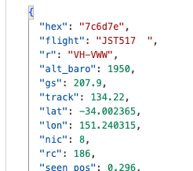
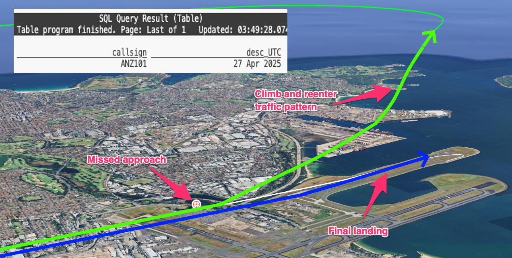
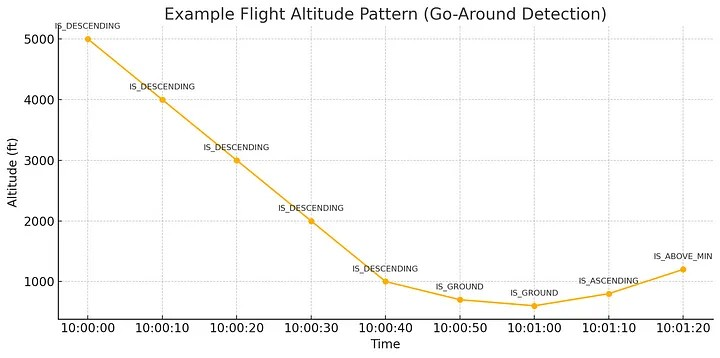
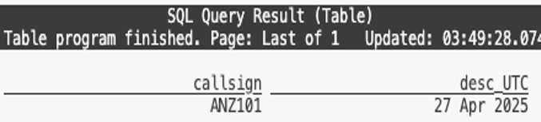
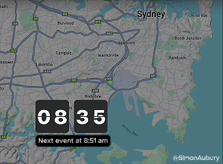
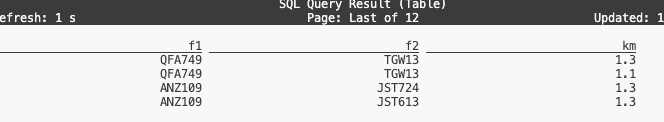
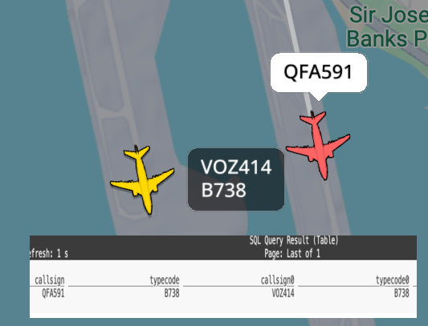

# When plans change at 500 feet: Complex event processing of ADS-B aviation data with Apache Flink

Using open-source Apache Flink stream processing to process real time aviation data to find missed approaches and paired runway landings. With some neat Flink SQL and custom functions, it’s possible to spot those rare times when planes pair in the sky or abort a landing at the last moment.
> Project code available on [https://github.com/saubury/plane_track](https://github.com/saubury/plane_track)

*Finding missed landing approaches and paired runway landings*

Aircraft determine their position using GPS; and periodically transmit that position along with an aircraft identity string, altitude, speed etc as [ADS-B signals](https://en.wikipedia.org/wiki/Automatic_Dependent_Surveillance%E2%80%93Broadcast). These signals are transmitted in clear text — and can be readily received with a small radio receiver. The event stream of data around a local airport is a fascinating source of data for complex event processing.

I wanted to see if I could determine when infrequent but noteworthy aviation situations occur at my local airport

* Missed approach (or go-around) during aircraft landing — an uncommon manoeuvre where a pilot discontinues the final approach to the runway and climbs away from the airport for another attempt at the landing.

* Paired flight landings where aircraft land (or takeoff) on parallel runways. I was especially interested in the golden photographic moments when the same commercial aircraft type were flying in close formation.

## Acquiring the flight data

My first attempt at acquiring aircraft transponder messages (ADS-B signals) was with a Raspberry Pi and a [RTL2832U](https://www.rtl-sdr.com/about-rtl-sdr/) — a USB dongle originally sold to watch digital TV on a computer. This approach (detailed [here](https://simonaubury.com/posts/201805_usingksqlapachekafkafindtheplanethatwakessnowy/)) was only partially successful. Although I got a rich feed of data as planes flew over my house — I was too far from the airport to receive transmissions when the aircraft were on the final descent into my local airport.

I then discovered [adsb.fi](https://adsb.fi/) — a community-driven flight tracker project with a free real-time API for personal projects. Their [API](https://github.com/adsbfi/opendata/tree/main?tab=readme-ov-file#public-endpoints) returns aircraft transponder messages within a nominated radius of a specified location point. You can get a glimpse at flights over Sydney with a curl command like this

    curl --silent https://opendata.adsb.fi/api/v2/lat/-33.9401302/lon/151.175371/dist/5 

For me this was an ideal way of receiving live flight location, track and altitude for aircraft within 5 nautical miles of Sydney airport.

*Sample of aircraft transponder messages (ADS-B signals)*

OK, now I’ve got a feed of data I need to analyse it to find some interesting flight events.

## Processing the flight data stream

I wrote a [python based aircraft monitor](https://github.com/saubury/plane_track/blob/main/monitor_opendata.py) which polls the adsb.fi feed for aircraft transponder messages, and publishes each location update as a new event into an Apache Kafka topic. I used [Apache Flink](https://flink.apache.org/) — and more specially [Flink SQL](https://nightlies.apache.org/flink/flink-docs-release-2.0/docs/dev/table/sql/overview/), to transform and analyse my flight data. The TL;DR summary is I can write SQL for my real-time data processing queries — and get the scalability, fault tolerance, and low latency managed by the Flink runtime.

## Identifying missed approach landings

A missed approach is a standard procedure where a pilot discontinues the final approach to landing and climbs away from the runway, typically due to poor visibility, an unstable approach or an unsafe runway condition.

*Google Earth mapping of missed approach landing*

Missed approaches are not rare but are still relatively uncommon in normal operations. I couldn’t find accurate statistics, but at busy airports (especially in poor weather) roughly 1–3% of approaches might result in a missed approach.

I needed to define a query for missed approach detection with a go-around-like patterns in flight altitude data. I wanted a SQL Flink statement to find a *sequence where an aircraft **descends**, **lands or nearly lands**, then **climbs again**, reaching a minimum safe altitude. *An example series of altitude measurements could be graphed over time like this:-

*Missed approach series of altitude measurements*

I classified a *is-descending* landing as seeing 5 consecutive decreasing values, followed by a *is_near_ground* event of descending below 800 ft, followed by an *is_ascending* event.

My final [Flink SQL](https://github.com/saubury/plane_track/blob/main/README.md#find-missed-approaches) query uses [MATCH_RECOGNIZE](https://nightlies.apache.org/flink/flink-docs-release-1.15/docs/dev/table/sql/queries/match_recognize/), a powerful pattern recognition feature in Flink SQL for complex event processing. It identifies specific flight altitude patterns in a stream of aircraft data, partitioned by callsign (i.e., individual aircraft).

    SELECT *
    FROM flight
    MATCH_RECOGNIZE(
        PARTITION BY callsign
        ORDER BY proc_time
        MEASURES
            IS_DESCENDING.flightts as desc_UTC,
            IS_GROUND.flightts as ground_UTC,
            IS_ASCENDING.flightts AS asc_UTC,
            IS_ABOVE_MIN.flightts AS abvm_UTC,
            IS_GROUND.altitude AS grd_altitude,
            IS_ASCENDING.altitude AS asc_altitude
        ONE ROW PER MATCH
        AFTER MATCH SKIP TO LAST IS_ASCENDING
        PATTERN (IS_DESCENDING{5,} IS_GROUND{1,} IS_ASCENDING IS_ABOVE_MIN)
        DEFINE
            IS_DESCENDING AS (LAST(altitude, 1) IS NULL AND altitude >= 1000) OR altitude < LAST(altitude, 1),
            IS_GROUND AS altitude <= 800,
            IS_ASCENDING AS altitude > last(altitude,1),
            IS_ABOVE_MIN AS altitude > 1000
    ) AS T
    where TIMESTAMPDIFF(second, desc_UTC, asc_UTC) between 0 and 1000;

When I originally wrote this query I got a number of false positives where planes would land, and take off a few hours later with the same flight code. To exclude these particular conditions I added an additional predicate to only return matches where the time between the descent and the subsequent ascent is within 1000 seconds.

With my query running it actually took a few days to identify the first missed approach. On a particularly stormy morning I managed to identify three occasions when a go-around was performed — and validated the result by looking up the flights historic path with [FlightRadar24](https://www.flightradar24.com/.).

*A flight identified as missed approach landing*

With my data acquisition successfully finding missed approach I wanted to move onto more complex event processing this time with multiple aircraft events.

## Identifying twin landings

Paired flight landings occur when aircraft land on parallel runways.

As I wanted to determine the distance between aircraft I used a [user-defined function](https://docs.confluent.io/cloud/current/flink/how-to-guides/create-udf.html) (UDF) to extend the capabilities of Apache Flink to implement custom logic beyond what is supported by built-in SQL functions. By adding a [distance scalar](https://github.com/saubury/plane_track/blob/main/java/example/Distance.java) Java function I could calculate distance between two aircraft.

        // Equirectangular approximation to calculate distance in km between two points 
        public float eval(float lat1, float lon1, float lat2, float lon2) {
            float EARTH_RADIUS = 6371;
            float lat1Rad = (float) Math.toRadians(lat1);
            float lat2Rad = (float) Math.toRadians(lat2);
            float lon1Rad = (float) Math.toRadians(lon1);
            float lon2Rad = (float) Math.toRadians(lon2);
    
            float x = (float) ((lon2Rad - lon1Rad) * Math.cos((lat1Rad + lat2Rad) / 2));
            float y = (lat2Rad - lat1Rad);
            float distance = (float) (Math.sqrt(x * x + y * y) * EARTH_RADIUS);
    
            return distance;
        }

Refer to the [readme](https://github.com/saubury/plane_track?tab=readme-ov-file#flink-udf) for jar build steps and the operations to add to Flink. But the short summary is compile the JAR with mvn clean package and then register the UDF function in Flink with

    ADD JAR '/target-jars/udf_example-1.0.jar';
    
    CREATE FUNCTION distancekm  AS 'com.example.my.Distance';

OK — with my Flink distance UDF available I can run a query that finds pairs of flights that were geographically close (within 1.5 km) of each other during overlapping or near-overlapping times (within 20 seconds), and reports their callsigns and distance.

    SELECT f1.callsign AS f1, 
    f2.callsign AS f2,
    CAST(ROUND(distancekm(f1.latitude , f1.longtitude, f2.latitude, f2.longtitude), 1) AS VARCHAR) as km
    FROM flight f1, flight f2
    WHERE f1.flightts BETWEEN f2.flightts - interval '20' SECOND AND f2.flightts
    AND f1.callsign < f2.callsign
    AND distancekm(f1.latitude , f1.longtitude, f2.latitude, f2.longtitude) < 1.5;

The query identifies flights that came close together in both space and time and reports the distance between them.

*Nearby flights*

This works — but is showing *any *paired aircraft movement*.* What I really wanted to do was find was the less common occurrence of the same aircraft type (such as two Boeing 737’s) flying in formation. I need a bit more data …

## Annotating ADS-B messages with aircraft type and routes

Peering into the ADS-B messages I have raw messages from the aircraft. Each payload comes with an ICAO 24-bit [transponder](https://en.wikipedia.org/wiki/Transponder_(aviation)) code specifically assigned to each aircraft (eg. 7c7a3d) and a flight route code (eg. 7VOZ518). What I want to do is load a static reference set of data to map

* Aircraft ICAO codes such as 7c7a3d to airframes such as Boeing,737NG 8FE

* Flight code such as 7VOZ518 a route from the Gold Coast (OOL) to Sydney (SYD)

A very convenient capability of Flink SQL is the ability to create a table directly from a CSV file. So I can populate the aircraft_lookup table with a command like this

    CREATE TABLE aircraft_lookup (
        icao24  varchar(100) not null,
        country  varchar(100),
        manufacturerName varchar(100),
        model varchar(100),
        owner varchar(100),
        registration varchar(100),
        typecode varchar(100)
    ) WITH ( 
        'connector' = 'filesystem',
        'path' = '/data_csv/aircraft_lookup.csv',
        'format' = 'csv'  
    );

I downloaded aircraft data from the [Opensky data](https://opensky-network.org/datasets/metadata/#metadata/) archive. With aircraft_lookup and route_lookup data loaded, I created a Flink view to supplement the data coming in from the flight Kafka topic

    CREATE OR REPLACE VIEW flight_decorated
    AS
    SELECT f.*, a.model, a.owner, a.typecode, r.route
    FROM flight f 
    LEFT JOIN aircraft_lookup a ON (f.icao = a.icao24)
    LEFT JOIN route_lookup r ON (f.callsign = r.flight);

With data loaded and the flight feed decorated with aircraft type and route information I can now search for the perfect photographic moment of twin planes landing.

## Twin landings

I now have a live feed of data with aircraft location, airframe type and route information. Along with my distance function I can query the stream to find the golden photographic moments when the same commercial aircraft type were flying in close formation.

    SELECT f1.flightts,
    f1.callsign || ' ('  || COALESCE(f1.route, '-') ||')' || ' ' || f1.typecode AS f1,
    CAST(ROUND(DISTANCEKM(f1.latitude , f1.longtitude, f2.latitude, f2.longtitude), 1) AS VARCHAR) AS km,
    f2.callsign || ' ('  || COALESCE(f2.route, '-') ||')' || ' ' || f2.typecode AS f2
    FROM flight_decorated f1, flight_decorated f2
    WHERE f1.flightts BETWEEN f2.flightts - interval '20' SECOND AND f2.flightts
    AND f1.callsign < f2.callsign
    AND f1.typecode = f2.typecode
    AND DISTANCEKM(f1.latitude , f1.longtitude, f2.latitude, f2.longtitude) < 1.5;

Which indeed finds the moment when two similarly typed aircraft land together

*Two Boing 737’s landing on parallel runways*

## Conclusions

This project was a fun exercise — and shows how Apache Flink can turn a stream of aircraft transponder pings into a hunt for interesting aviation moments like go-arounds and perfect twin landings.

With some neat Flink SQL and custom functions, it’s possible to spot those rare times when planes pair in the sky or wave off a landing at the last second.

✈️ Project code available on [https://github.com/saubury/plane_track](https://github.com/saubury/plane_track)
