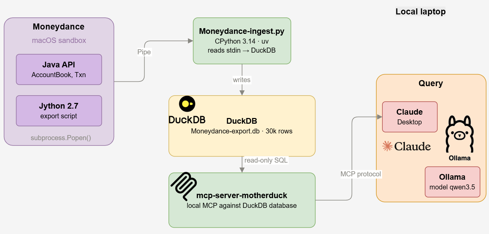
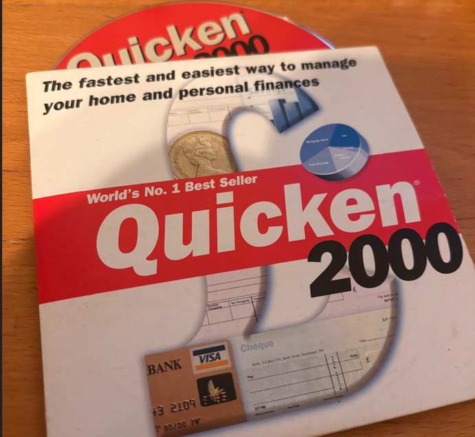
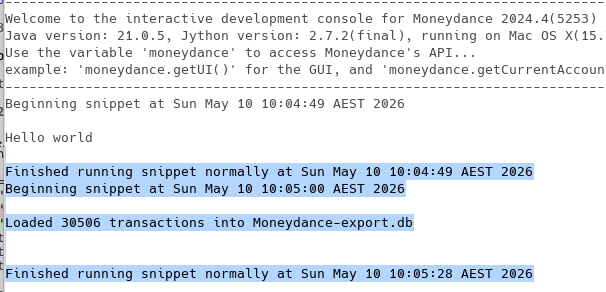
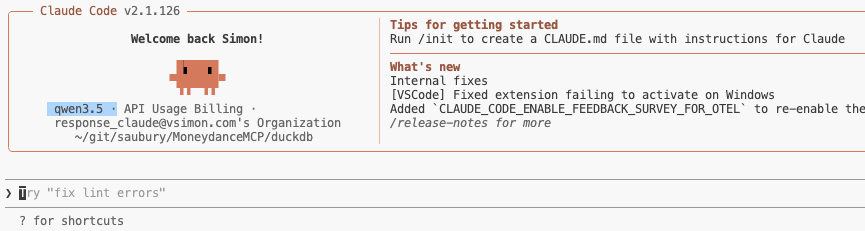
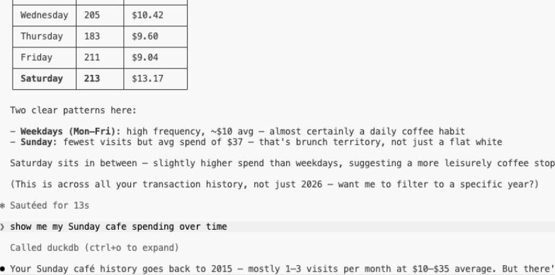

# I don’t need an untrusted LLM to tell me I’m spending too much on coffee

Analysing my personal spending data with a local large language model. Running open LLM models locally with Claude desktop, tool chaining and a local MCP server with data mastered in DuckDB.

*Sharing my dubious coffee habits with the world*

I’m so enjoying the power of getting agents take care of the dubious grunt work in my life. Need to buy a USB cable in a hurry? Sure I’ll offload that to my [OpenClaw](https://openclaw.ai/) server. Ditto I’m happy to get codex to upgrade some very old Java 11 code. But some tasks I’m just a little too wary of throwing my personal data into the void and hoping for the best. So in the spirit of [paranoid analysis](https://simon-aubury.medium.com/my-data-your-llm-paranoid-analysis-of-imessage-chats-with-openai-llamaindex-duckdb-60e5eb9e23e3) I’m continuing my adventures in using LLM’s to work on private data sets.

## So many transactions

I started using Quicken to track my money and spending since .. sometime in the mid 2000’s I’ve moved through a few personal finance manager applications — but never felt confident centralising all my financial records on a single cloud applications.

*Yes — really found this in my shed*

For the last few years I’ve been a very happy [Moneydance](https://moneydance.com/) user — but I’m still transacting on a bunch of specialised local data. I’ve some 30,506 (!) transactions with a lifetime of spending behaviour which I’ve always wanted to run some interesting analysis on. I got inspired to see what I could discover running an LLM locally — and wiring it through a local DuckDB

## Let’s LLM

[Ollama](https://ollama.com/) is the “easiest way to build with open models” — and it really is super convenient. A simple command line allows you to pull and run large language models such as gpt-oss, Gemma 3, DeepSeek-R1, Qwen3 etc.,.

One of the cool party-tricks of Ollama is the built in integration of open models with [other tools](https://docs.ollama.com/integrations#coding-agents) such as [Claude Code](https://docs.ollama.com/integrations/claude-code). That is, Ollama provides the model — and it gets integrated within the flow of another application such as coding, chat, automation or assistants. If both the model and the integration supports [tool calling](https://docs.ollama.com/capabilities/tool-calling) your model can invoke tools and incorporate their results into its replies. TL;DR — your simple request typed into Claude Code gets routed to a local LLM, and any data required to answer your query can be picked up by a locally configured tool.

Concepts aside — how did I get an agent to judge my coffee spending habits? Let’s break this down into data export, tool integration and analysis

## Mondeydance data export

I really do love [Moneydance](https://moneydance.com/) — it even has it’s own [Jython](https://www.jython.org/) console exposing the entire Java object framework of its financial database. With a bit of vibe’ed code (linked below) I manage to build an extractor which can dump all my financial data into a local [DuckDB](https://duckdb.org/) database.

This is a one-time export — I’m not keeping this export updated so I can close Moneydance once all my transactions have been loaded into DuckDB. Let’s now get into the tool chaining.

## Tool integration

The MotherDuck [DuckDB local MCP server](https://github.com/motherduckdb/mcp-server-motherduck) “connects AI assistants to your data using DuckDB’s powerful analytical SQL engine”. In short — my coding agent can be given a hook into my queryable snapshot of my financial data.

Adding this to `.claude/settings.json` is all that’s need to wire up the MCP server. SQL analytics processing with just a sprinkle of configuration magic, neat!

    {
      "mcpServers": {
        "duckdb": {
          "command": "uvx",
          "args": [
            "mcp-server-motherduck",
            "--db-path",
            "/Users/saubury/Library/Containers/com.infinitekind.MoneydanceOSX/Data/Moneydance-export.db",
            "--allow-switch-databases"
          ]
        }
      }
    }
    

To connect a local Ollama model to a MCP servers you need a “host” that implements the MCP client protocol and bridges it to the Ollama API. Claude Code fills that role: launched against a local Ollama model with tool-calling support, it acts as the MCP host. If during a query such as “*how much did I spend on coffee*” some data needs to be found … the request gets routed out to the MCP to locate. That’s what this configuration does — presenting a route between the model (which doesn’t know any of my financial secrets) to a MCP “router” that can go dig into data to get what’s required. Some SQL gets created on the fly — but TLDR; data gets extracted

Neat! Now we’ve got the plumbing sorted we’re set to do some data analytics …

## Analysis

We can launch Claude code with via ollama and a model with one pretty simple command

    ollama launch claude --model qwen3.5:27b

And yes, we’re now in Claude Code — but note the model is a local one …

And now we’re good to pester the agent will all sorts of silly queries.

It’s worth adding you can bust this local paranoia if your requests get a bit too complex for your local model. If you skip ollama you can run claude code “normally” with it’s more powerful cloud model. The MCP server is still there querying your data — but all bets are off at this point for where your data actually goes.

## So … what did I learn

Local models are slow — very very slow. I found as a proof of concept the idea of running LLM models locally with Claude desktop, throwing in tool chaining and hooking up a local MCP server for my DuckDB database was a blast. It’s so cool how accessible this tech is — but I think I need to go a bigger machine before I can turn off my Anthropic monthly subscription. At least I know where to put that transaction …

## MoneydanceMCP Code

[https://github.com/saubury/MoneydanceMCP](https://github.com/saubury/MoneydanceMCP)
