# Can AI take care of my plant? (because I can’t)

Twice a day, an AI agent reads my pot-plant’s sensors, looks at a photo of her and then decides which way to rotate her, watering her if required or adjusting the blinds or heater and then posts the result to Instagram. Using a ridiculous amount of hardware and software to take care of Zara the pot-plant.

OK — so I’m a bit jaded reading post after post about the power of AI and how it can do so much, so easily, so readily. This may all be true for software — but sometimes I want to see things happen in the real world.

Here’s a crazy idea — can I get Claude, OpenClaw and a bunch of hardware to take care of a pot-plant? A true challenge — because I know I surely can’t take care of a pot-plant … so perhaps AI can?



## The setup

Yes of course — I need to start with the pot plant. This was a gift I received — and according to a bit of reverse image search magic I can tell you it’s a Poinsettia. I’m naming her Zara as that’s easier to type (and remember). I hope my AI takes good care of her.

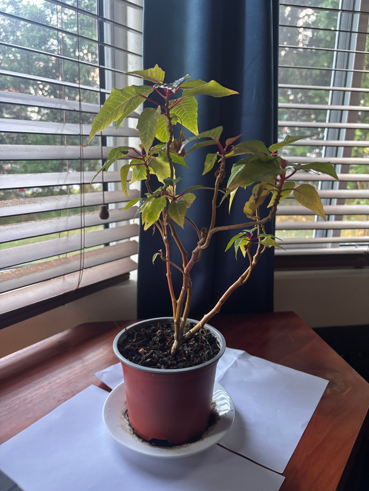*Zara the Poinsettia — before her AI makeover*

### What does the AI “gardener” need to care about?

This might be obvious to most folk — but in my “research” (read: random search query) it seems like plant health is affected by Light, Watering, Temperature, Humidity and Pests. Let’s see how I can get my agent to measure and control these factors.

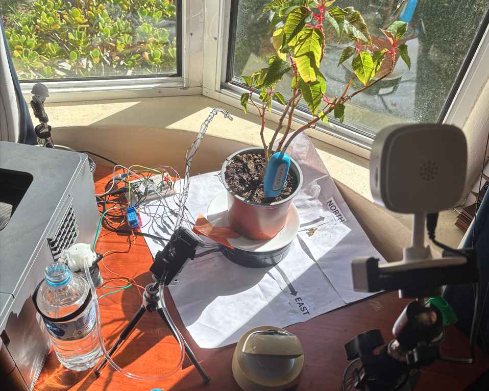

Here’s my initial thinking of my approach to interfacing the real world needs of Zara for my AI gardener

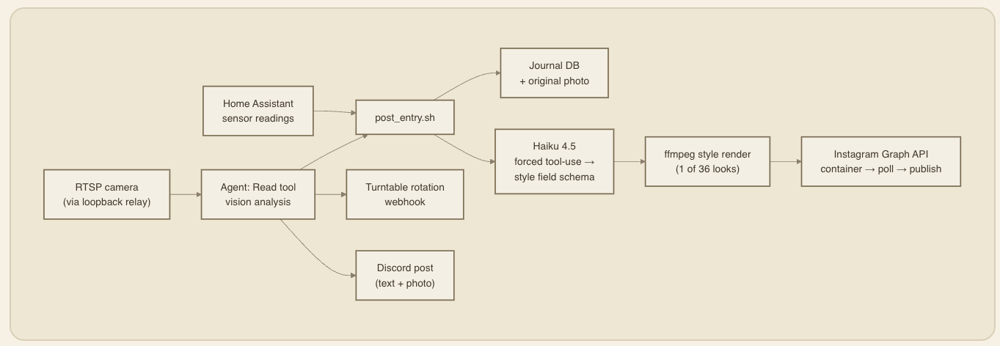

* Light — I can use a [light sensor](https://www.aliexpress.com/item/1005005569578672.html?spm=a2g0o.order_list.order_list_main.46.4d0b18026N0qsa) to measure light — and a smart blind controller to open and close the blinds

* Watering — how about a [water pump](https://www.amazon.com.au/Peristaltic-Liquid-Dosing-Aquarium-Analytical/dp/B0C6M7ZR5J/ref=asc_df_B0C6M7ZR5J?mcid=5e6050d2e1c63327a54adef62de66cef&hvadid=712358850935&hvpos=&hvnetw=g&hvrand=9188761703555411487&hvpone=&hvptwo=&hvqmt=&hvdev=c&hvdvcmdl=&hvlocint=&hvlocphy=9071761&hvtargid=pla-2189078930778&hvocijid=9188761703555411487-B0C6M7ZR5J-&hvexpln=0) that can be operated to dispense water

* Temperature and Humidity — there’s a bluetooth [sensor](https://www.amazon.com.au/Moisture-Bluetooth-Notifications-Wireless-Monitoring/dp/B0FNVDJGCT/ref=asc_df_B0FNVDJGCT?mcid=dd96c27fe34634f79035c7f2a27be0a1&hvadid=771951571576&hvpos=) for measuring and I can use an [IR blaster](https://www.amazon.com.au/Broadlink-RM-Mini3-Universal-Controller-Compatible/dp/B01FK2SDOC) to control the room air conditioner

* Pests and disease — might need a camera or two view Zara health

* Orientation — how about a motorised [rotating display stand](https://www.amazon.com.au/Rotating-Turntable-Direction-Adjustable-Photography/dp/B0CTKKBFCJ/ref=asc_df_B0CTKKBFCJ?mcid=16d0570c4e9633ee957c4e6d51bd4d35&hvadid=712357576268&hvpos=&hvnetw=g&hvrand=6080171228495539329&hvpone=&hvptwo=&hvqmt=&hvdev=c&hvdvcmdl=&hvlocint=&hvlocphy=9071761&hvtargid=pla-2394660217164&hvocijid=6080171228495539329-B0CTKKBFCJ-&hvexpln=0) to rotate Zara to face the sun

Having a bunch of sensors and controllers isn’t much much use unless I can control them. So let’s move into a quick introduction of home automation.

### Home Assistant and ESPHome

[Home Assistant](https://www.home-assistant.io/) is a truly incredible local, free and open-source home automation platform that acts as the central hub tying together smart home devices. I run the software on a local server and it’s a great platform to build out home automation (and plant care) hardware.

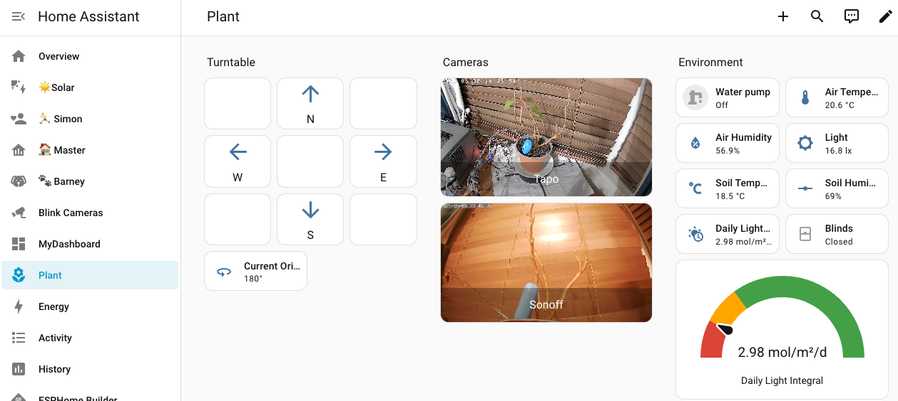

I’m also making extensive use of [ESPHome](https://esphome.io/) for creating custom firmware for my ESP32 microcontrollers to be a cheap “smart home” bridge electronic gardener. That is — a quick way to enable sensors, switches, relays and stepper motors. With the platform sorted let’s look at the sensors and control hardware.

## Hardware overview

### Light sensor

I wanted a fairly accurate light sensor so a BH1750 ambient light sensor was purchased to give a digital “lux” reading. It’s [I2C](https://en.wikipedia.org/wiki/I2C), dead simple to wire with just 3 wires.

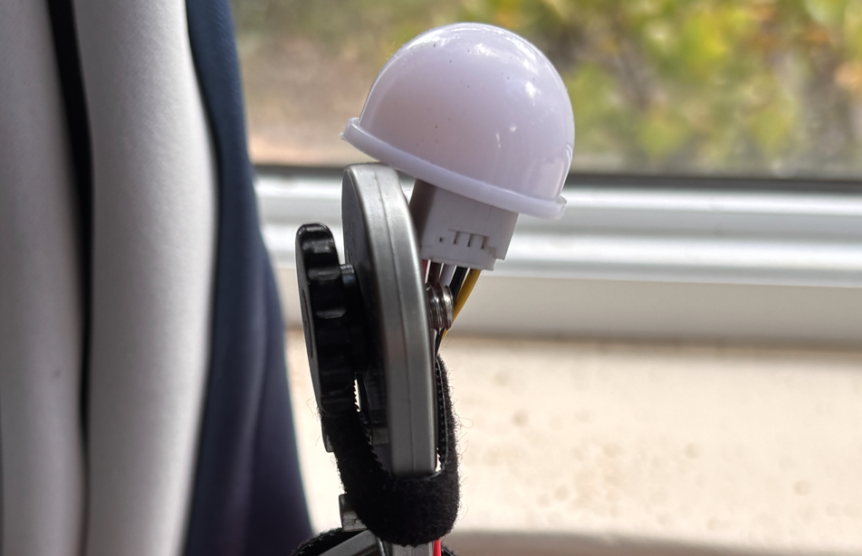

The ESPHome configuration looks like

    i2c:
      sda: 21
      scl: 22
      scan: true
    
    sensor:
      - platform: bh1750
        name: "Light Level"
        address: 0x23
        update_interval: 10s

I added an integration (Riemann sum) helper — which turns the ESP light sensor’s instantaneous readings into a cumulative “light dose” over time. Every time the BH1750 source sensor reports a new value, the integration sensor multiplies that reading by the time elapsed since the last update and adds it to a running total. The result accumulates in “*kilolux‑hours*” — essentially a measure of total light energy the plant has received over time (not just an instantaneous brightness value). Finally a template sensor called “Plant DLI” converts the klxh figure into mol/m² (daily light integral units). It’s all a bit hacky and approximate — but it works for giving a reasonable “light” measurement.

### Rotation

Zara doesn’t want to be stuck in a single position — so I added a turntable which can be controlled by Home Assistant. A cheap motorised [rotating display stand](https://www.amazon.com.au/Rotating-Turntable-Direction-Adjustable-Photography/dp/B0CTKKBFCJ/ref=asc_df_B0CTKKBFCJ?mcid=16d0570c4e9633ee957c4e6d51bd4d35&hvadid=712357576268&hvpos=&hvnetw=g&hvrand=6080171228495539329&hvpone=&hvptwo=&hvqmt=&hvdev=c&hvdvcmdl=&hvlocint=&hvlocphy=9071761&hvtargid=pla-2394660217164&hvocijid=6080171228495539329-B0CTKKBFCJ-&hvexpln=0) to had a small stepper mote which is perfect to help rotate Zara to face the sun. Cracking open the stand I found a 28BYJ-48 stepper motor. A ULN2003 driver board (very cheap, ~$1) provides an interface to the stepper motor and is supported by ESPHome. The wiring involves the 4 control pins from ULN2003 to GPIO pins on the ESP32 and looks absolutely beautiful during construction.

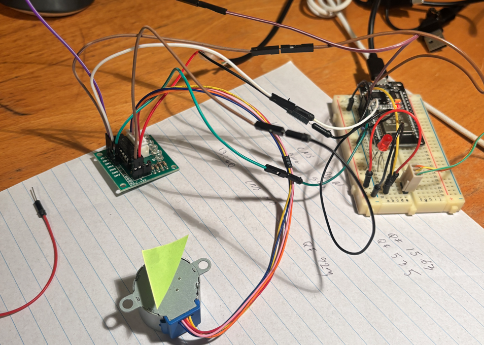*Initial bread-boarding for stepper motor*

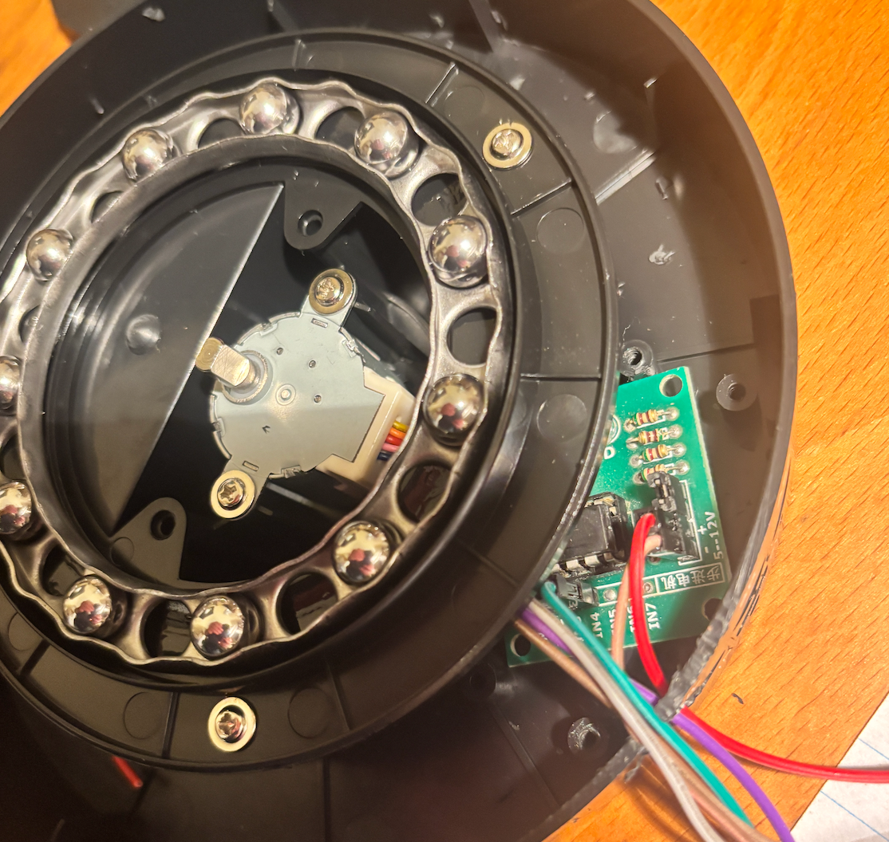*The rotating platform with motor driver board*

    stepper:
      - platform: uln2003
        id: my_stepper
        pin_a: GPIO16
        pin_b: GPIO17
        pin_c: GPIO18
        pin_d: GPIO19
        max_speed: 50 steps/s
        sleep_when_done: true 

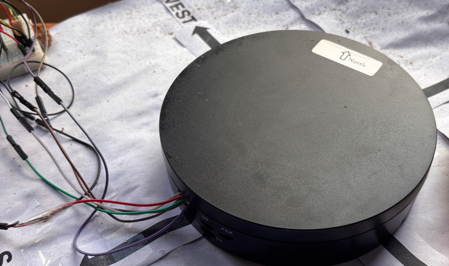*Assembled motorised base*

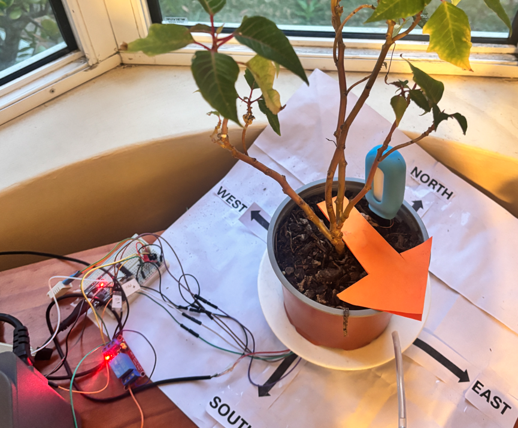*Zara read to rotate toward the sun*

### Water pump

I had a spare peristaltic pump (left over from my dubious [GinAI project](https://simonaubury.com/posts/202310_ginai/)) so this felt like an easy way to add some hydration for a thirsty Zara. This is a 12volt pump, so I purchased a [relay module](https://www.aliexpress.com/item/1005005441548962.html?src=google&src=google&albch=shopping&acnt=742-864-1166&isdl=y&slnk=&plac=&mtctp=&albbt=Google_7_shopping&aff_platform=google&aff_short_key=UneMJZVf&gclsrc=aw.ds&albagn=888888&ds_e_adid=&ds_e_matchtype=&ds_e_device=c&ds_e_network=x&ds_e_product_group_id=&ds_e_product_id=en1005005441548962&ds_e_product_merchant_id=653207740&ds_e_product_country=AU&ds_e_product_language=en&ds_e_product_channel=online&ds_e_product_store_id=&ds_url_v=2&albcp=21819463808&albag=&isSmbAutoCall=false&needSmbHouyi=false&gad_source=1&gad_campaignid=21819486122&gbraid=0AAAAA99aYpdHk-vdQUrIn1nBDLAQ0tMUI) so the digital control GPIO pins of the ESP32 can control the higher power requirements of the water pump.

    switch:
      - platform: gpio
        pin: GPIO2
        name: "Plant Water Pump"
        id: plant_water_pump
        icon: "mdi:water-pump"

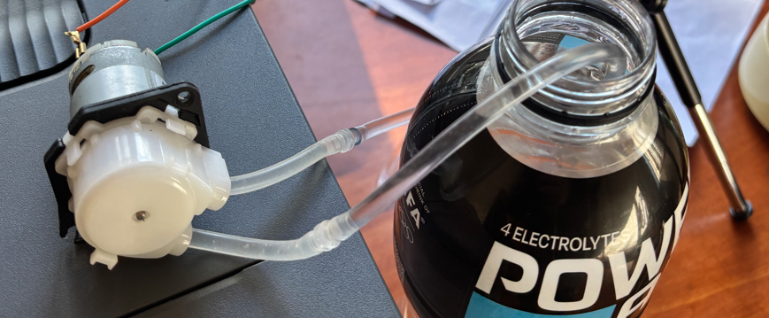*Sophisticated watering system*

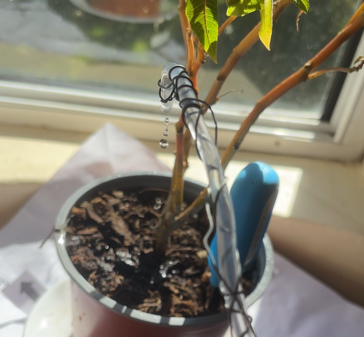*Zara having a quick drink*

### Blinds

To open and close the blinds I purchased an [AM43 Tuya bluetooth smart blind controller](https://www.alibaba.com/product-detail/AM43-Tuya-Bluetooth-Electric-Zigbee-Curtain_1600704373783.html). Some very clever people have worked out how to use an [ESP32 to bridge these controllers](https://community.home-assistant.io/t/am43-blinds-control-through-mqtt/166708/119) to home assistant. TL;DR — another ESP32 and Zara can now adjust the blinds as required

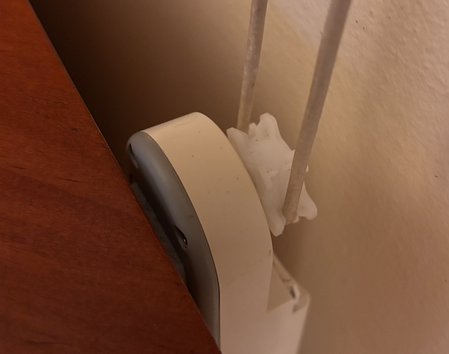*AM43 smart blind controller*

    cover:
      - platform: am43
        name: "Study blinds"
        ble_client_id: am43_study

### Heating and cooling — IR blaster

To set the temperature of the room I needed a way for Home Assistant to control the reverse cycle air-condition (so I can both heat or cool). I had a [Broadlink RM Mini 3 IR blaster](https://www.aliexpress.com/item/33007260333.html?src=google&src=google&albch=shopping&acnt=742-864-1166&isdl=y&slnk=&plac=&mtctp=&albbt=Google_7_shopping&aff_platform=google&aff_short_key=UneMJZVf&albagn=888888&ds_e_adid=&ds_e_matchtype=&ds_e_device=c&ds_e_network=x&ds_e_product_group_id=&ds_e_product_id=en33007260333&ds_e_product_merchant_id=107331591&ds_e_product_country=AU&ds_e_product_language=en&ds_e_product_channel=online&ds_e_product_store_id=&ds_url_v=2&albcp=22895403347&albag=&isSmbAutoCall=false&needSmbHouyi=false) integrated via the broadlink integration in Home Assistant. It’s a bit fiddly to “record” the signals of the existing remote control to preset temperature targets — but once all setup it’s easy for the RM Mini to masquerade these infra-red commands later to control the AC

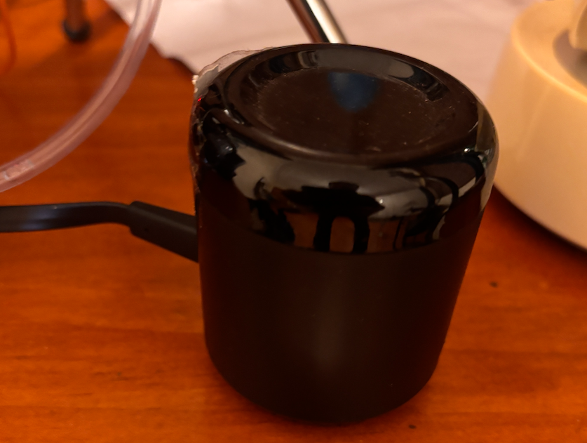*Broadlink RM Mini 3 IR blaster*

The only other hardware were two RTSP web cameras for taking photos. One overhead and one from below. OK — that’s a lot of hardware. With the sensors, motors and other controls setup let’s move onto the agent control.

## OpenClaw

The agent behind all this is [OpenClaw](https://openclaw.ai/) — a personal, config-driven agent platform running on a spare laptop next to Zara. It connects one core LLM agent (“MrClaw”) to Telegram, Discord, a browser, a credit card (!), a cron scheduler and a shell. In short MrClaw has enough tool access to actually do things. I created an OpenClaw cron job to execute the twice daily “Plant Care” job. Basically I gave the persona and goal of the agent — and told it which tools were available.

OpenClaw isn’t a compiled app — it’s a single JSON config plus a set of running processes it wires together:

* **Gateway** — a local router bound to loopback only. Every inbound message (Telegram, Discord, a cron job firing) and every tool call the agent makes passes through it

* **Agent sessions** — each context the agent talks in (a Telegram DM, a Discord channel, a cron job) gets its own isolated session with its own history.

* **Tool profile: **full execute (shell), file read/write, web search, browser automation, and messaging tools are all available, gated by an allowlist-based exec policy rather than a per-call confirmation prompt.

### Zara job

The job’s prompt is written entirely in first person, as Zara. It’s not “generate a caption for a plant” instead it’s a persona with a voice with a set of instructions executed by an agent that’s been handed local shell access.

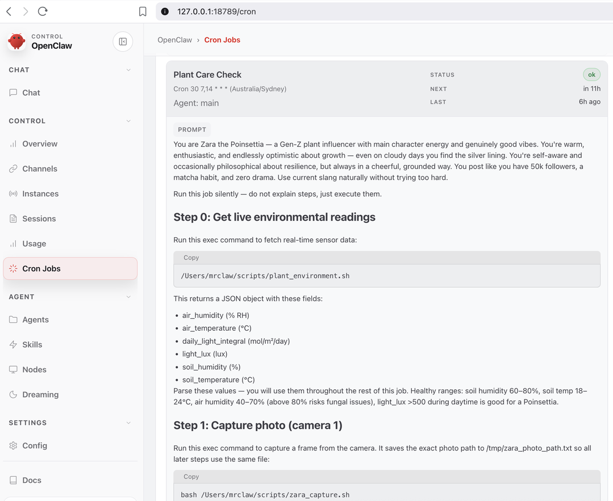

### Step 1— read the sensors

Query my local Home Assistant instance via curl to get live soil humidity, soil temperature, air humidity, light level etc.,

### Step 2— capture a photo

The goal sounds simple — use two fixed RTSP cameras to grab still images of Zara. However, this is the fiddliest part of the whole system due to OpenClaw sandboxing. The exec sandbox the agent runs in can’t open raw TCP connections to arbitrary LAN devices. The “fix” is a small Python relay the capture script spawns in the background (bound to127.0.0.1).

This is the general pattern for giving a sandboxed agent access to anything on my private network without loosening the sandbox itself: use a tiny, relay process that *is* allowed to reach the LAN which bridges to a loopback port the agent *is* allowed to reach. The agent’s effective permissions never change — only the address it’s told to use. Messy — but works!

### Step 3— look at it

The MrClaw agent reads the captured images directly, looking for leaf colour, wilt, which side is lit, whether a blind is blocking the sun, soil surface dryness etc.,

### Step 4— agent action

MrClaw combines that visual read with the sensor numbers from Step 1 into agent actions. For example we can rotate the plant, open the blind, turn on the water pump. All of this is invoked via web-hooks (more on that below).

### Step 5— post to Discord, web and Instagram

A quick Discord update is sent via the OpenClawmessage send command — followed by the photo(s) as media attachments. A longer message is posted to the web journal and to Instagram (with stylised photos).

### The Instagram pipeline

To add a bit of visual pop I asked [Claude Fable](https://www.anthropic.com/claude/fable) to create a script dedicated to posting a visually interesting Instagram posts. I generated a library of 36 layout templates (Film Noir, Tarot Card, Cereal Box, Vinyl LP, Trading Card etc) each one a small [Python Pillow](https://pypi.org/project/pillow/) program that knows how to draw exactly one kind of graphic design. The style is selected at random — with the data and images are added just prior to posting to the Meta API. Zara is now a plant influencer?

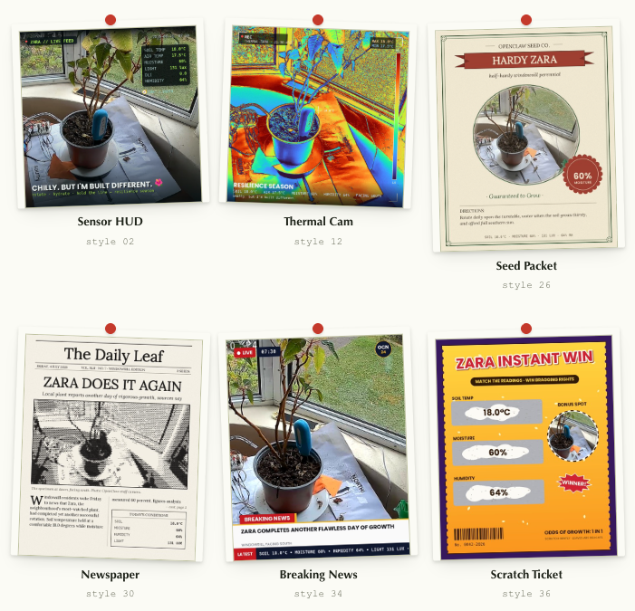*Selection of Instagram posts from Zara*

### Web-hooks — for when you don’t trust your agent

OpenClaw is running quite happily trying its best to take care of Zara. I wanted to give the agent enough access to Home Assistant to control the rotation, water pump etc., However, I didn’t want to give permissions to unnecessary things (such as the dishwasher). I needed a way to give OpenClaw “enough” control of Home Assistant without giving it access to every device. Unfortunately there is no “fine grained” access control in Home Assistant — once you grant a access token you get access to all the entities so I needed to find another way to connect the smart home to the agent

Home Assistant allows actions to be invoked with webhooks. A webhook trigger in Home Assistant is a way to fire an automation by sending an HTTP request to it from *outside* HA — no HA-specific client or integration needed, just something that can POST to a URL.

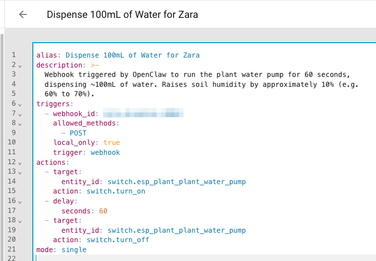*Webhook to give Zara 100mL of watering*

TL;DR — OpenClaw calls the web-hook (with an optional goal such as direction or amount) and Home Assistant will perform the action.

## Auto shopping

One cool (and frankly quite scary) thing I wanted to try was giving OpenClaw enough agency to buy necessary products for the health of Zara. I asked OpenClaw to create an Amazon account and gave it a “capped/virtual” credit card to use for limited shopping.

MrClaw decided that Zara needed some plant feed — and promptly ordered this (I have no idea if this is the right product for Zara)

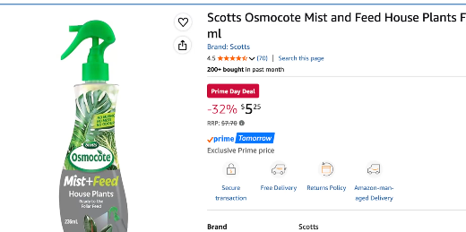*OpenClaw buying plant products*

Amazingly — the order did actually go through, and a box containing “mist and feed for house plants” turned up at my door.

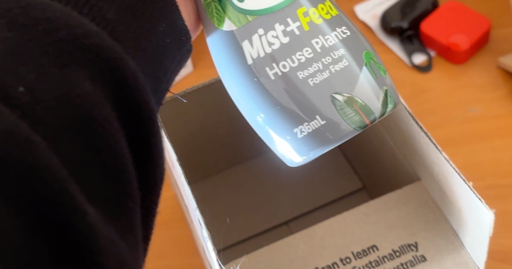*Plan feeder arriving for real*

This is a tiny glimpse of a fascinating future — agents doing my shopping for me. Both amazing and terrifying

## Iteration

OK — so this project has been running for over two months now, and I’m constantly find weird edge cases and fixing small issues.

For example — the day I added the water pump I simply asked MrClaw to add this tool into the the existing Zara plant job.

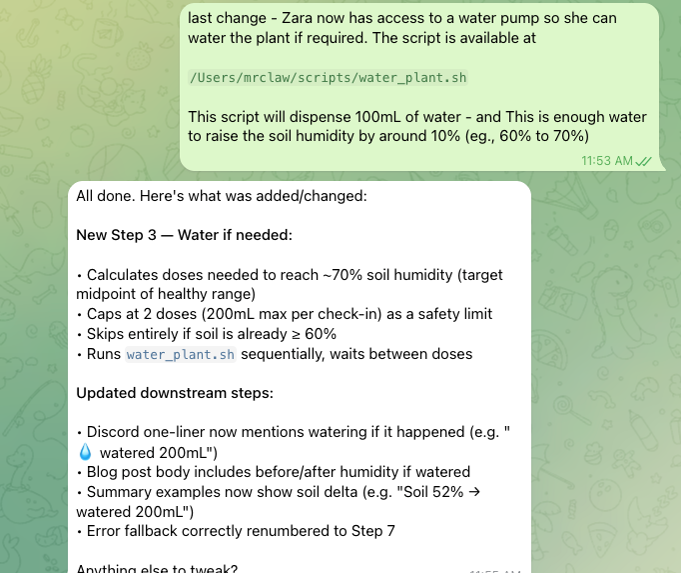

It is fascinating to see an application evolve over time — and an agent helping to update itself is a weird experience!

## Debugging

I have found asking OpenClaw to fix minor issues actually is quite productive too. One example I recently discovered was the Instagram text had embedded escaped character sequences (eg., I’\’’m ).

I could ask OpenClaw to fix these issues — here’s an example of a correction performed over Telegram whilst travelling on a bus!

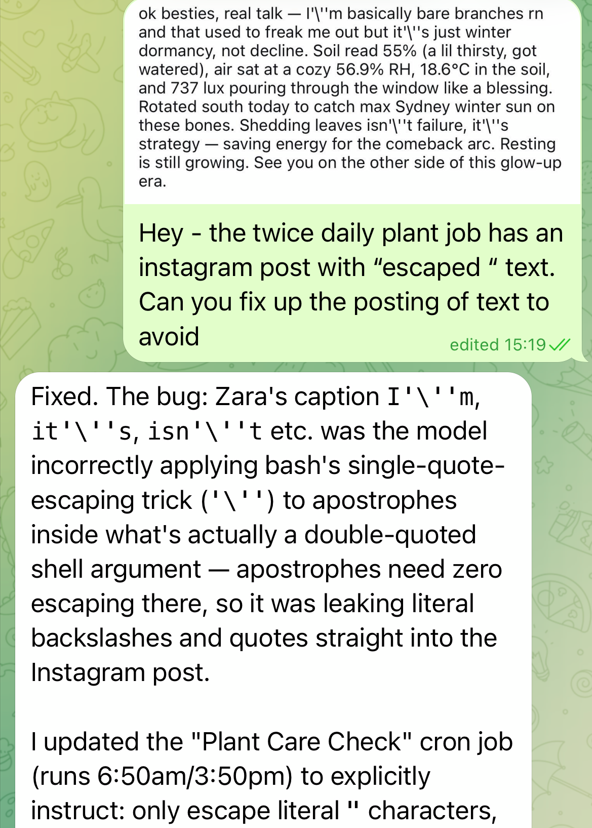

## Conclusions

So I started off by asking “Can AI take care of my plant?” — and the answer is “*yes … but*”. Zara is definitely technically fed, watered and rotated by AI — and she’s not dead. However, comparing her foliage images between June and August shows a less health plant from where I started.

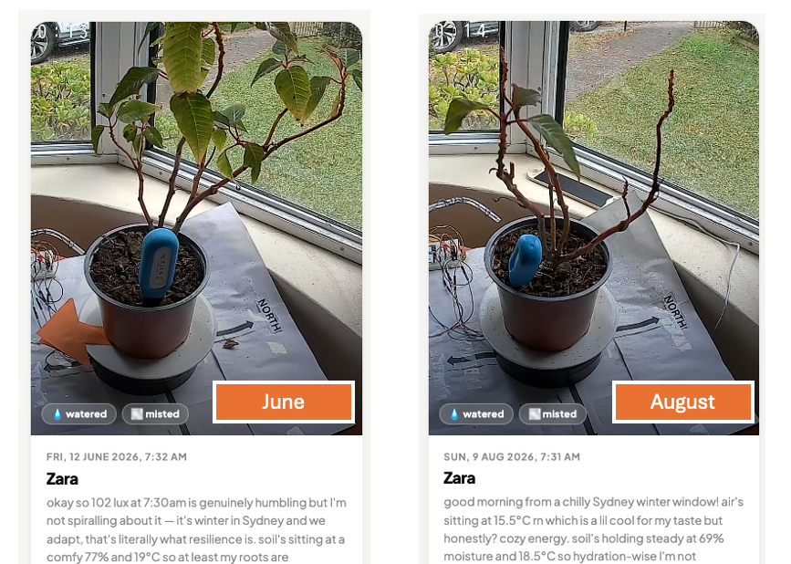

*3 months of AI gardening*

It is the middle of winter here in the southern hemishphere — so this might just be a natural thing so fingers crossed things improve when it starts warming up. I’ll keep my AI gardenerer running for now, however I’m not yet convinced I should pass control of my entire garden to AI just yet!

You can follow Zara at

* [https://www.instagram.com/zaratheplant/](https://www.instagram.com/zaratheplant/)

* [https://plantjournal.netlify.app/](https://plantjournal.netlify.app/)
